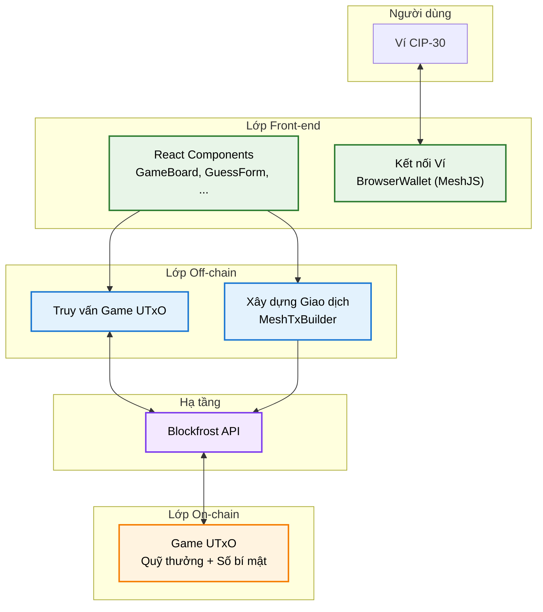
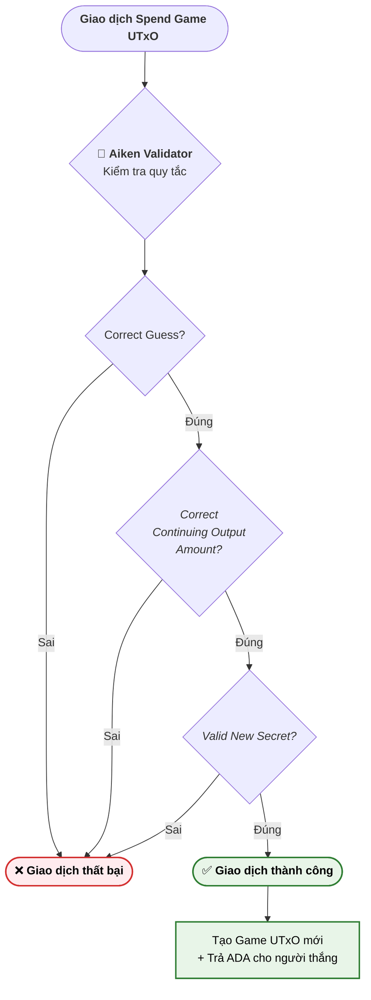
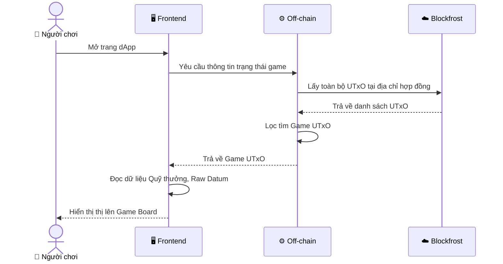
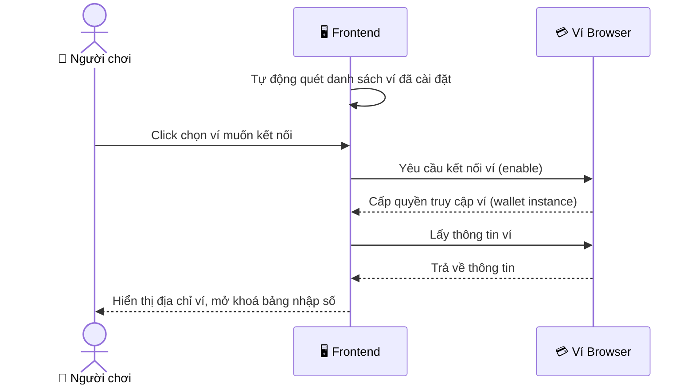
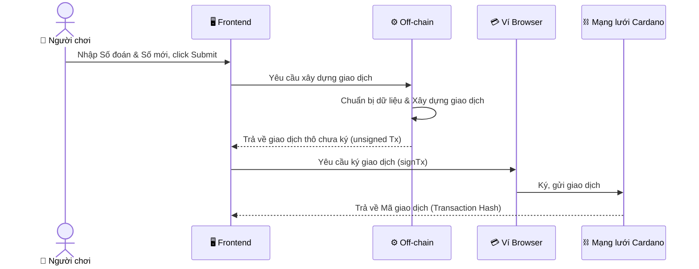
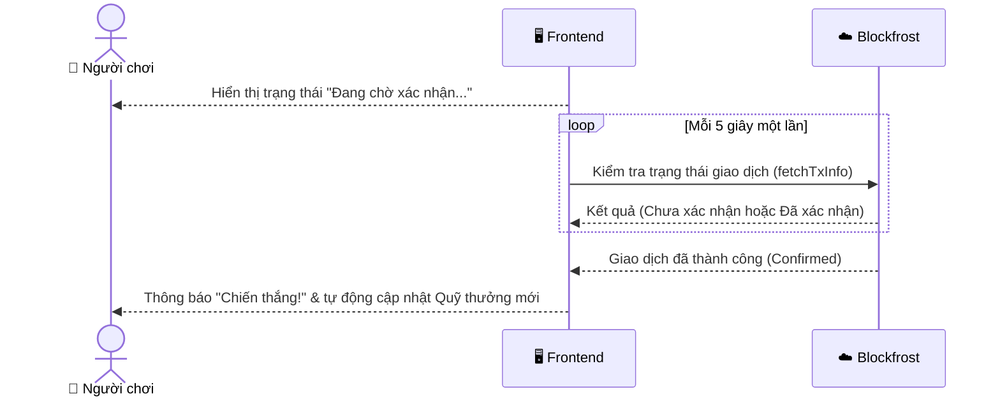

# Module 1: Secret Number

---

# Bài 1: Tổng quan dApp

> **Mục tiêu:** Hiểu cách game hoạt động, kiến trúc tổng thể của dApp, và sự khác biệt giữa Wallet Address và Script Address.

---

## 1.1 Mô tả game

Một kho tiền thưởng chứa **5000 ADA** đang chờ người chơi đến thử vận may.

Trong kho có một **con số bí mật**. Ai đoán đúng sẽ nhận về **10 ADA** ngay lập tức. Sau mỗi lần có người thắng, trò chơi tiếp tục với quỹ thưởng là số tiền còn lại và con số bí mật mới do chính người vừa chiến thắng đặt ra, trở thành thử thách cho người chơi kế tiếp.

**Game kết thúc khi quỹ thưởng cạn kiệt.**

---

## 1.2 Luồng hoạt động một ván chơi

```
[TRƯỚC VÁN CHƠI]
  Kho bạc: 5000 ADA
  Con số bí mật: 100

  Người chơi gửi giao dịch:
    guess      = 100     ← phải đoán đúng
    new_secret = 88888   ← người chơi tự đặt ra cho ván tiếp theo

[SAU VÁN CHƠI]
  Kho bạc mới: 4990 ADA         ← giảm 10 ADA
  Con số bí mật mới: 88888      ← thử thách kế tiếp
  Ví người chơi: +10 ADA        ← phần thưởng
```

Toàn bộ logic kiểm tra — *đoán đúng chưa, tiền trả đủ chưa, số mới hợp lệ chưa* — đều chạy on-chain trong một Aiken validator. Không có backend, không có admin kiểm duyệt.

---

## 1.3 Kiến trúc 3 lớp

dApp Secret Number được tổ chức thành 3 lớp phân tách rõ ràng:

```
┌─────────────────────────────────────────┐
│  FRONTEND  (Next.js + Framer Motion)    │  ← Giao diện người dùng
│  Kết nối ví, thu thập input, hiển thị   │
└───────────────────┬─────────────────────┘
                    │
┌───────────────────▼─────────────────────┐
│  OFFCHAIN  (TypeScript + MeshJS)        │  ← Xây dựng giao dịch
│  Query UTxO, build tx, ký, submit       │
└───────────────────┬─────────────────────┘
                    │
┌───────────────────▼─────────────────────┐
│  ONCHAIN   (Aiken → Plutus V3)          │  ← Luật chơi bất biến
│  Validator kiểm tra 3 điều kiện         │
└─────────────────────────────────────────┘
```

### Biểu đồ kiến trúc mức cao



> Lớp Frontend và Offchain chạy trên trình duyệt người chơi. Lớp Onchain đóng vai trò kiểm tra (validate). Trạng thái game được lưu trữ hoàn toàn trên chuỗi.

---

## 1.4 Wallet Address và Script Address

### Lý thuyết

Nếu phân loại theo **chủ thể có quyền chi tiêu**, Cardano có hai loại địa chỉ cốt lõi với cơ chế bảo vệ hoàn toàn khác nhau:

**Wallet Address** — được dẫn xuất từ public key của người dùng. Để tiêu ADA tại đây, bạn chỉ cần ký giao dịch bằng private key tương ứng.

**Script Address** — được dẫn xuất từ hash của validator script. Để tiêu ADA tại đây, giao dịch phải thoả mãn logic của validator. Node Cardano sẽ chạy validator script để kiểm tra giao dịch.

| | Wallet Address | Script Address |
|---|---|---|
| Tạo từ | Public key | Hash của validator |
| Bảo vệ bởi | Chữ ký số (private key) | Logic validator |
| Ai tiêu được | Chỉ chủ sở hữu key | Bất kỳ ai gửi giao dịch đáp ứng điều kiện validator |
| Ai gửi vào được | Bất kỳ ai | Bất kỳ ai |
| Trong dApp Secret Number | Địa chỉ ví của người chơi | Địa chỉ chứa quỹ thưởng và số bí mật |

### Trong code

Script Address được **tính toán** từ validator script đã được biên dịch:

```typescript
// Validator Script → Script Address
export const SCRIPT_ADDRESS = resolvePlutusScriptAddress(SCRIPT, NETWORK_ID);
// → "addr_test1w..."
```

> **Tính tất định (Deterministic):** Cùng một script luôn cho ra cùng một địa chỉ, trên bất kỳ máy nào. Thay đổi dù một dòng code Aiken → địa chỉ hoàn toàn khác.

---

# Bài 2: On-chain Logic — Validator

---

## 2.1 Tổng quan Validator

### On-chain và Off-chain trên Cardano

Một trong những điểm khác biệt lớn nhất trong mô hình smart contract của Cardano so với các blockchain khác (như Ethereum) là cách phân chia công việc giữa **On-chain** (chạy trên mạng lưới blockchain) và **Off-chain** (chạy trên máy khách/server).

**Trên Cardano (eUTxO):** Toàn bộ việc tính toán, query dữ liệu blockchain và xây dựng giao dịch (Build Tx) đều được thực hiện **off-chain** trên máy người dùng hoặc back-end ứng dụng. Nghĩa là toàn bộ nội dung giao dịch (tiêu UTxO nào, tạo ra UTxO mới nào, đúc/đốt token nào, ...) được xây dựng ngoài chuỗi. Sau đó, giao dịch đã hoàn thiện này mới được gửi lên mạng lưới, chờ được xác thực trên chuỗi.

Chính vì kiến trúc này, "Smart Contract" trên Cardano mang một ý nghĩa rất khác. Thay vì thực thi tính toán để *tạo ra* kết quả, nó chỉ làm một nhiệm vụ duy nhất: **Kiểm tra (Validate)** xem giao dịch mà người dùng gửi lên có hợp lệ hay không.

Đó là lý do vì sao smart contract (hay đúng hơn là on-chain code) trên Cardano được gọi với cái tên đúng với nhiệm vụ của nó là **Validator**. Nếu đúng luật (trả về `True`), giao dịch được ghi vào block. Nếu sai luật (trả về `False`), giao dịch bị từ chối.

Trên Ethereum:
  "Smart Contract thực hiện hành động"
Trên Cardano:
  "Transaction thực hiện hành động, Validator là người phê duyệt"

### Script Purpose

**Script Purpose** chỉ mục đích sử dụng khi một validator được gọi trong transaction. Nó cho biết validator này đang được chạy để kiểm tra hành động gì.

Hiện tại, Cardano hỗ trợ 6 loại script purpose:

| Purpose | Kích hoạt khi |
|---|---|
| `spend` | Giao dịch tiêu thụ UTxO tại Script Address |
| `mint` | Giao dịch đúc hoặc đốt native token |
| `withdraw` | Giao dịch rút staking reward |
| `publish` | Giao dịch đăng ký / ủy quyền / huỷ chứng chỉ trên chuỗi như stake, DRep |
| `vote` | Giao dịch bỏ phiếu các đề xuất quản trị |
| `propose` | Giao dịch đệ trình các đề xuất quản trị|


### Cấu trúc Aiken Validator

Validator trong ngôn ngữ Aiken được định nghĩa bằng từ khóa `validator`. Trong mỗi khối `validator`, chúng ta lần lượt triển khai các hàm xử lý (**handlers**) cho từng Script Purpose.

Tương ứng với 6 loại script purpose, chúng ta có 6 loại handler. Tên của chúng không được đặt tùy ý mà bắt buộc phải khớp chính xác: `spend`, `mint`, `withdraw`, `publish`, `vote`, `propose`.

Mỗi **handler** là một **predicate function** (hàm trả về giá trị boolean).

```rust
validator validator_name {
  spend(datum, redeemer, output_reference, transaction) {
    // Logic kiểm tra chi tiêu UTxO
  }

  mint(redeemer, policy_id, transaction) {
    // Logic kiểm tra mint / burn token
  }

  else(_) {
    // BẮT TẤT CẢ purpose không được khai báo ở trên
    fail  // Từ chối giao dịch ngay lập tức
  }
}
```

> `else` là một handler đặc biệt (**fallback / catch-all**) có nhiệm vụ *bắt tất cả* các purpose không được định nghĩa trong validator để xử lý chung. Trong trường hợp không khai báo đầy đủ 6 handler, bạn bắt buộc phải có `else` trong validator.

---

## Spending Validator

Trên Cardano, `spend` là loại validator phổ biến nhất, chịu trách nhiệm kiểm soát việc mở khóa và sử dụng UTxO bị khóa tại địa chỉ của nó.

```rust
spend(datum: Option<DatumType>, redeemer: RedeemerType, utxo: OutputReference, tx: Transaction)
```

`spend` validator nhận vào 4 đối số:

**Datum** (`Option<DatumType>`): Dữ liệu được gắn vào Script UTxO, đại diện cho *trạng thái hiện tại* của smart contract. Datum tồn tại trên blockchain cùng UTxO.

> **Tại sao `Option<DatumType>`?** Trong Aiken, `Option` là kiểu dữ liệu đại diện cho một giá trị có thể tồn tại, hoặc có thể vắng mặt. Trong Cardano bất kỳ ai cũng có thể gửi UTxO vào địa chỉ hợp đồng mà không bị bắt buộc phải đính kèm datum. Đối với Plutus V1/V2, validator bắt buộc đối số datum phải có mặt, nghĩa là script UTxO mặc định không thể chi tiêu nếu không có datum. Kể từ phiên bản Plutus V3, datum có kiểu `Option`, thêm khả năng xử lý trường hợp datum vắng mặt cho validator. Trong trường hợp của Secret Number, nếu UTxO không có datum → validator fail ngay — đây là hành vi đúng đối với dApp này.

**Redeemer**: Dữ liệu người dùng đính kèm *trong giao dịch* khi muốn tiêu Script UTxO. Thường thể hiện ý định hoặc hành động của họ. Redeemer không tồn tại trên blockchain trước đó — chỉ xuất hiện trong giao dịch.

**OutputReference**: Đối tượng mục tiêu của hành động spend. Nó chứa "mã tham chiếu" chỉ đích danh script UTxO nào đang được chi tiêu, bao gồm mã băm của giao dịch tạo ra nó (Transaction ID) và vị trí của nó trong đầu ra giao dịch đó (Output Index)

**Transaction (Script Context)** — toàn bộ thông tin của giao dịch đang thực thi: inputs, outputs, fee, validity range...

---

## 2.3 Secret Number validator

Đây là một Spending validator. Các giao dịch có mục đích khác đêu bị tư chối. 

Khi ai đó muốn mở khóa (spend) UTxO chứa tiền thưởng, giao dịch mở khóa phải chứng minh nó thỏa mãn **3 điều kiện**.



---

### Điều kiện 1 — Lời giải phải chính xác (Correct Guess)

```rust
let correct_guess = redeemer.guess == own_datum.secret
```

Validator kiểm tra trực tiếp số đoán của người chơi (`redeemer.guess`) có khớp với số bí mật thực tế đang được giấu bên trong kho bạc (`own_datum.secret`). Nếu sai, giao dịch thất bại ngay lập tức.

---

### Điều kiện 2 — Quỹ thưởng phải được hoàn trả (Correct Continuing Output Amount)

Mỗi lần có người đoán đúng, **10 ADA** được trả về cho người thắng. Hợp đồng đảm bảo phần còn lại được hoàn trả đầy đủ về quỹ thưởng — không ai có thể rút vượt quá số tiền quy định.

```rust
expect [continuing_output] = transaction.outputs
      |> list.filter(fn(output) { output.address == own_address })
...      
let correct_continuing_output = output_lovelace == input_lovelace - reward_amount_lovelace
```

Đây là **Continuing Output Pattern** — một trong những pattern quan trọng trên Cardano.

Vấn đề cốt lõi: trong mô hình eUTxO (Extended UTxO), một UTxO chỉ được tiêu **một lần duy nhất** và biến mất. Vậy kho bạc tồn tại thế nào sau 1 ván chơi?

Giải pháp: validator ép buộc giao dịch phải tạo ra **đúng một** UTxO mới *gửi lại về đúng địa chỉ hợp đồng*. UTxO này gọi là **Continuing Output**. Nó phải chứa đúng số ADA còn lại.

---

### Điều kiện 3 — Thử thách kế tiếp phải được đặt ra (Valid New Secret)

```rust
expect InlineDatum(datum_data) = continuing_output.datum
expect new_datum: MyDatum = datum_data
let new_secret = new_datum.secret

let valid_new_secret = new_secret >= min_secret && new_secret <= max_secret
```

Người thắng không chỉ nhận tiền là xong — họ còn có trách nhiệm đặt con số bí mật mới để game tiếp tục. Validator đảm bảo:
- Continuing output phải có **Inline Datum** (lưu trực tiếp trên chain, không phải chỉ hash)
- Datum mới phải đúng kiểu `Datum { secret: Int }`
- Số bí mật mới phải trong khoảng hợp lệ `[1, 999_999]`

**Inline Datum vs Datum Hash:** Cardano hỗ trợ 2 cách đính kèm datum vào UTxO:

| | Datum Hash | Inline Datum |
|---|---|---|
| Lưu trên chain | Chỉ hash 32 bytes | Toàn bộ nội dung |
| Ai đọc được | Chỉ người biết nội dung gốc | Tất cả mọi người |
| Chi phí | Rẻ hơn | Đắt hơn một chút |

Hiện nay, Inline Datum gần như là tiêu chuẩn vì tính tiện dụng của nó.

---

## 2.4 Từ khóa `expect` trong Aiken

`expect` là một từ khóa đặc biệt trong Aiken. Nó được dùng phổ biến và có nhiều tác dụng, trong bài này chúng ta dùng nó để:
- Khớp mẫu không đầy đủ (Non-exhaustive pattern-matching): Khớp 1 mẫu duy nhất cho dữ liệu, các trường hợp còn lại fail ngay lập tức
- Ép kiểu từ `Data` sang một kiểu cụ thể : Thường dùng để ép giá trị *datum* đính kèm trong output về giá trị kiểu Aiken tùy chỉnh để sử dụng

```rust
// Khớp mẫu: Nếu datum là None → validator fail
expect Some(own_datum) = datum
// Khớp mẫu: Nếu target UTxO không thấy trong danh sách inputs (list.find trả vê None) → validator fail
expect Some(own_input) = transaction.inputs
  |> list.find(fn(input) { input.output_reference == output_reference })

// Khớp mẫu: Nếu không có đúng 1 continuing output → validator fail
expect [continuing_output] = transaction.outputs
  |> list.filter(fn(output) { output.address == own_address })

// Khớp mẫu: Nếu không phải InlineDatum → validator fail
expect InlineDatum(datum_data) = continuing_output.datum

// Ép kiểu: Nếu cấu trúc datum không khớp → validator fail
expect new_datum: MyDatum = datum_data
```

---

# Bài 3: Frontend và Off-chain

---

## 3.1 Cấu trúc Frontend (Giao diện người dùng)

Trong dApp Secret Number, giao diện (Frontend) được xây dựng bằng **Next.js** và **Framer Motion**, là cầu nối trực tiếp giữa người dùng và blockchain. Bằng việc tích hợp SDK của **MeshJS**, frontend không chỉ vẽ giao diện mà còn trực tiếp xử lý các tác vụ Web3.

Các components chính:

- `WalletConnect`: Quản lý kết nối ví chuẩn CIP-30.
- `GameBoard`: Hiển thị trạng thái quỹ thưởng và thông tin Game UTxO lấy từ blockchain.
- `GuessForm`: Nơi người chơi nhập dự đoán và thiết lập con số bí mật mới.
- `TransactionStatus`: Hiển thị trực quan từng trạng thái trong quá trình xử lý giao dịch.
- `DatumDecoder`: Khu vực dành cho bài tập thực hành giải mã con số bí mật.

### Kết nối ví (Connect Wallet)

Để dApp tương tác được với ví Cardano của người chơi, chúng ta sử dụng class `BrowserWallet` từ package `@meshsdk/wallet`.

```typescript
// 1. Trong WalletConnect.tsx: Lấy danh sách ví đã cài đặt trên trình duyệt
useEffect(() => {
  const wallets = BrowserWallet.getInstalledWallets();
  setInstalledWallets(wallets as InstalledWallet[]);
}, []);

// 2. Trong WalletConnect.tsx: Kết nối vào một ví cụ thể mà người dùng chọn
const handleConnect = async (walletId: string) => {
  const connectedWallet = await BrowserWallet.enable(walletId);
  onConnect(connectedWallet);
};

// 3. Trong page.tsx: Nhận instance ví đã kết nối, lấy địa chỉ và kiểm tra collateral
const handleWalletConnect = async (connectedWallet: BrowserWallet) => {
  setWallet(connectedWallet);
  
  // Lấy địa chỉ ví người chơi để làm đích đến cho phần thưởng 10 ADA
  const addr = await connectedWallet.getChangeAddress();
  setWalletAddress(addr);
  
  // Kiểm tra xem ví đã thiết lập UTxO thế chấp (collateral) chưa
  const collateral = await connectedWallet.getCollateral();
  setHasCollateral(collateral && collateral.length > 0);
};
```

Khi ví được kết nối thành công, dApp có quyền yêu cầu ví ký (sign) các giao dịch. Người chơi nhập mật khẩu chi tiêu và bấm Sign trên pop-up của ví.

### Chờ xác nhận giao dịch (Transaction Polling)

Một đặc điểm cốt lõi của công nghệ blockchain là khi bạn nhấn "Submit", giao dịch không có mặt trên chuỗi ngay lập tức. Nó phải vào mempool chờ các Node kiểm tra và đồng thuận đưa vào block. Do đó, frontend xây dựng một cơ chế "chờ đợi" cho đến khi xác nhận giao dịch đã có dữ liệu trên Blockfrost.

Cách dApp xử lý điều này là thông qua vòng lặp kiểm tra định kỳ (Polling):

```typescript
// Bước 3: Gửi giao dịch lên mạng lưới và lấy về txHash
const hash = await wallet.submitTx(signedTx);
setTxStatus("confirming");

// Bước 4: Chờ xác nhận (Confirming)
setTxStatus("confirming");
// Polling để kiểm tra xác nhận (mỗi 5 giây, tối đa 150 giây)
let confirmed = false;
for (let i = 0; i < 30; i++) {
  await new Promise((r) => setTimeout(r, 5000));
  try {
    const txInfo = await provider.fetchTxInfo(hash);
    if (txInfo) {
      confirmed = true;
      break;
    }
  } catch {
    // Chưa confirmed, tiếp tục chờ
  }
}

```

Sau khi người chơi ký giao dịch, họ sẽ nhìn thấy trạng thái "Confirming..." trên màn hình cho đến khi giao dịch chắc chắn thành công, mà không cần tra cứu thủ công trên explorer.

### Biểu đồ luồng Frontend & Off-chain

Các biểu đồ dưới đây thể hiện 4 luồng cơ bản của một ván chơi — từ khi người dùng mở trang web đến khi giao dịch được xác nhận trên blockchain:

**Luồng 1 - Khởi tạo & Truy vấn quỹ thưởng**


**Luồng 2 - Kết nối ví**


**Luồng 3 - Gửi giao dịch**


**Luồng 4 - Chờ xác nhận (Transaction Polling)**


---

## 3.2 Giới thiệu Off-chain

Off-chain là phần code tương tác với blockchain. Nó làm 2 nhiệm vụ chính:

```
[1] QUERY   → Đọc UTxO và Datum từ blockchain qua Blockfrost API
[2] BUILD   → Xây dựng giao dịch đúng cấu trúc validator yêu cầu
```

Secret Number dùng **MeshJS** — một TypeScript SDK.

---

## 3.2 Logic Off-chain trong code

### 3.2.1 Truy vấn dữ liệu (Querying)

Trước khi người dùng có thể đoán số, chúng ta phải tìm được vị trí kho tiền đang nằm ở đâu. File `offchain/src/queries.ts` xử lý việc này:

```typescript
// 1. Lấy tất cả UTxO đang có ở địa chỉ script
const utxos = await provider.fetchAddressUTxOs(scriptAddress);

// 2. Lọc ra các UTxO hợp lệ có chứa Datum đúng cấu trúc game
const validGameUtxos = utxos.filter((utxo) => isValidGameDatum(utxo.output.plutusData));

// 3. Tìm UTxO có giá trị ADA lớn nhất để làm mục tiêu
const highestAdaUtxo = validGameUtxos.reduce((prev, current) => {
    const prevAda = prev.output.amount.find(a => a.unit === "lovelace")?.quantity || "0";
    const currentAda = current.output.amount.find(a => a.unit === "lovelace")?.quantity || "0";
    return BigInt(prevAda) > BigInt(currentAda) ? prev : current;
});
```

Điều này ngăn chặn lỗi do kẻ tấn công spam các UTxO rác vào địa chỉ hợp đồng. 

### 3.2.2 Xây dựng giao dịch (Building)

File `offchain/src/transactions.ts`:

```typescript
// 1. Redeemer: số người chơi đoán → ánh xạ sang Plutus Data
//    Aiken: type Redeemer { guess: Int }
//    Plutus Data: Constr(0, [Int(guess)])
const redeemerData = mConStr0([BigInt(guess)]);

// 2. Datum mới: số bí mật kế tiếp
//    Aiken: type Datum { secret: Int }
//    Plutus Data: Constr(0, [Int(newSecret)])
const newDatumData = mConStr0([BigInt(newSecret)]);

// 3. Tính số ADA trả về hợp đồng
const newScriptLovelace = currentScriptLovelace - REWARD_AMOUNT_LOVELACE;

// 4. Build giao dịch — mỗi dòng tương ứng một yêu cầu của validator
await txBuilder
  .spendingPlutusScriptV3()             // Giao dịch này tiêu Script UTxO (Plutus V3)
  .txIn(txHash, outputIndex, ...)       // Input: UTxO kho bạc hiện tại
  .txInInlineDatumPresent()             // UTxO có Inline Datum sẵn trên chain
  .txInRedeemerValue(redeemerData)      // Đính kèm Redeemer (lời đoán)
  .txInScript(SCRIPT_CBOR)             // Cung cấp bytecode validator để node chạy
  .txOut(SCRIPT_ADDRESS, [...])         // Continuing output: ADA về lại hợp đồng
  .txOutInlineDatumValue(newDatumData)  // Datum mới (số bí mật tiếp theo)
  .changeAddress(userAddress)           // ADA thừa (phần thưởng) về ví người chơi
```

Mỗi method trên trực tiếp phản ánh một yêu cầu của validator on-chain. Xây dựng sai bất kỳ bước nào → validator reject → giao dịch thất bại.

---

## 3.3 CBOR là gì?

### Lý thuyết

Khi bạn query UTxO từ blockchain, dữ liệu không trả về dạng `{ secret: 888 }` mà là một chuỗi hex như:

```
d8799f190378ff
```

Đây là **CBOR** — định dạng Cardano dùng để encode mọi dữ liệu on-chain.

> **CBOR (Concise Binary Object Representation)** là một định dạng serialization nhị phân, tương tự JSON nhưng compact hơn nhiều (tiết kiệm bytes → tiết kiệm chi phí lưu trữ). Toàn bộ giao dịch, datum, redeemer và bytecode validator đều được encode bằng CBOR trước khi ghi lên chain.

### CBOR trong dự án Secret Number

| Thành phần | Ví dụ CBOR (hex) |
|---|---|
| Validator bytecode (`plutus.json`) | `5902ff010100298...` (rất dài) |
| Datum `{ secret: 888 }` | `d8799f190378ff` |
| Redeemer `{ guess: 888 }` | `d8799f190378ff` |

### Giải mã CBOR của Datum `{ secret: 888 }`

Khi Aiken compile type `Datum { secret: Int }`, dữ liệu được encode theo pipeline:

```
Aiken type            →  Plutus Data          →  CBOR (hex)
──────────────────────────────────────────────────────────
Datum { secret: 888 } →  Constr(0, [Int(888)]) →  d8799f190378ff
```

Phân tích từng byte của `d8799f190378ff`:

| Bytes | Ý nghĩa |
|---|---|
| `d879` | CBOR tag 121 → Constructor index 0 (kiểu đầu tiên trong type Aiken) |
| `9f` | Bắt đầu indefinite-length array |
| `19 0378` | Tag `19` chỉ định số nguyên 2 bytes tiếp theo. `0378` là 888 trong hệ thập lục phân |
| `ff` | Kết thúc array |

### `mConStr0` — cầu nối giữa TypeScript và Plutus Data

Hàm `mConStr0([BigInt(888)])` trong MeshJS tạo ra đúng cấu trúc `Constr(0, [Int(888)])` này ở phía TypeScript trước khi serialize sang CBOR gửi lên chain.

```typescript
// TypeScript (offchain)
mConStr0([BigInt(888)])
// → Plutus Data: Constr(0, [Int(888)])
// → CBOR: d8799f190378ff
// → Được lưu on-chain như là Datum { secret: 888 }
```

---

## 3.4 Lỗ hổng tiềm ẩn — UTxO giả (Tham khảo)

### Vấn đề

Script Address là địa chỉ công khai — **bất kỳ ai** cũng có thể gửi một UTxO đến đó với Datum có cấu trúc giống hệt `Datum { secret: Int }`:

```
Script Address có thể chứa:
  UTxO A: 5000 ADA, Datum { secret: 42069 }  ← treasury thật
  UTxO B: 3 ADA,    Datum { secret: 1 }      ← UTxO giả do kẻ tấn công tạo
```

Offchain hiện xử lý bằng cách chọn UTxO có ADA cao nhất, nhưng không đảm bảo hoàn toàn trong mọi tình huống.

### Giải pháp: NFT Identity Token

Pattern chuẩn để xác thực UTxO chính thống là đính kèm một **NFT duy nhất** vào treasury khi deploy:

```
Game UTxO hợp lệ:
  ├── Value: 5000 ADA + 1 GAME_NFT
  └── Datum: { secret: 42069 }
```

Validator thêm điều kiện: input phải chứa NFT này. Kẻ tấn công không thể giả mạo NFT (policy ID duy nhất, không thể tự mint thêm).

Đây là nền tảng của nhiều pattern nâng cao hơn trong Cardano — sẽ được xây dựng trong các bài giảng tiếp theo.

---

## 3.5 Bài tập thực hành

**Nhiệm vụ:** Implement hàm `decodeDatum` trong file `offchain/src/decode.ts`.

```typescript
export function decodeDatum(rawDatumHex: string): number {
    // TODO: BÀI TẬP THỰC HÀNH!
    // Hãy giải mã chuỗi rawDatumHex (CBOR Hex) từ Game UTxO
    // để lấy ra giá trị Secret Number.
    //
    // Gợi ý: Sử dụng `parseDatumCbor` từ `@meshsdk/core-cst`
    //
    throw new Error("TODO_DECODE_DATUM: Hãy implement hàm này");
}
```

**Mục tiêu:** Sau khi implement, component **Datum Decoder** trên giao diện sẽ hiển thị con số bí mật hiện tại khi bạn nhấn "Decode Datum".

---

## Tổng kết Module

| Khái niệm | Vai trò trong Secret Number |
|---|---|
| **Wallet Address** | Địa chỉ người chơi — nhận 10 ADA phần thưởng |
| **Script Address** | Địa chỉ kho bạc — tính từ hash bytecode validator |
| **Script Purpose** | `spend` — validator kích hoạt khi ai tiêu UTxO tại script address |
| **Datum** | `{ secret: Int }` — trạng thái game lưu trên blockchain |
| **Redeemer** | `{ guess: Int }` — lời đoán người chơi gửi trong giao dịch |
| **Script Context** | `Transaction` — validator dùng để kiểm tra inputs/outputs |
| **Continuing Output** | UTxO mới gửi lại hợp đồng — game tiếp tục sau mỗi ván |
| **Inline Datum** | Datum lưu trực tiếp on-chain, đọc được qua explorer |
| **CBOR** | Định dạng binary encode mọi dữ liệu Cardano |
| **`expect` trong Aiken** | Pattern matching + fail ngay nếu không khớp |

---


