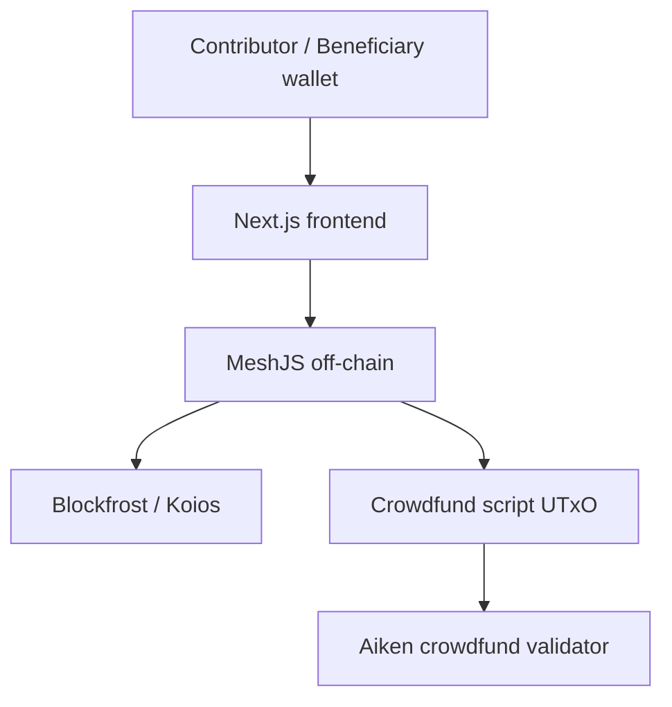

# Kiến trúc Tổng thể (System Architecture)

Crowdfund là dApp quản lý một campaign duy nhất trên script UTxO. Datum lưu beneficiary, goal, deadline và số tiền đã góp của từng contributor.

## 1. Kiến trúc 3 lớp



Frontend chọn campaign và hiển thị tiến độ. Off-chain query datum, cập nhật cặp contributor/amount, dựng output và validity interval. Validator kiểm tra mọi thay đổi trên-chain.

## 2. Trạng thái campaign

```text
Datum {
  beneficiary: Address,
  goal: Int,
  deadline: Int,
  contributions: Pairs<Address, Int>
}
```

Tổng đóng góp được tính từ `contributions`, không phải từ một biến tổng riêng. Campaign có hai kết quả: đạt goal thì beneficiary withdraw; không đạt goal sau deadline thì contributor reclaim phần của mình.

## 3. Luồng dữ liệu

1. Contributor tạo hoặc tìm campaign và gọi `Donate`.
2. Validator yêu cầu thời điểm kết thúc transaction không vượt deadline, số dư script tăng đúng delta, và từng contribution cũ không giảm.
3. Nếu campaign thất bại, contributor ký `Reclaim`; output trả đúng amount và datum loại contributor đó.
4. Nếu đạt goal, beneficiary ký `Withdraw` để nhận quỹ.

## 4. Tính nhất quán

`beneficiary`, `goal` và `deadline` là dữ liệu bất biến trong mọi continuing output. Reclaim nhiều người là nhiều lần state transition trên cùng campaign UTxO; mỗi lần chỉ contributor đã ký mới được xóa khỏi danh sách.
