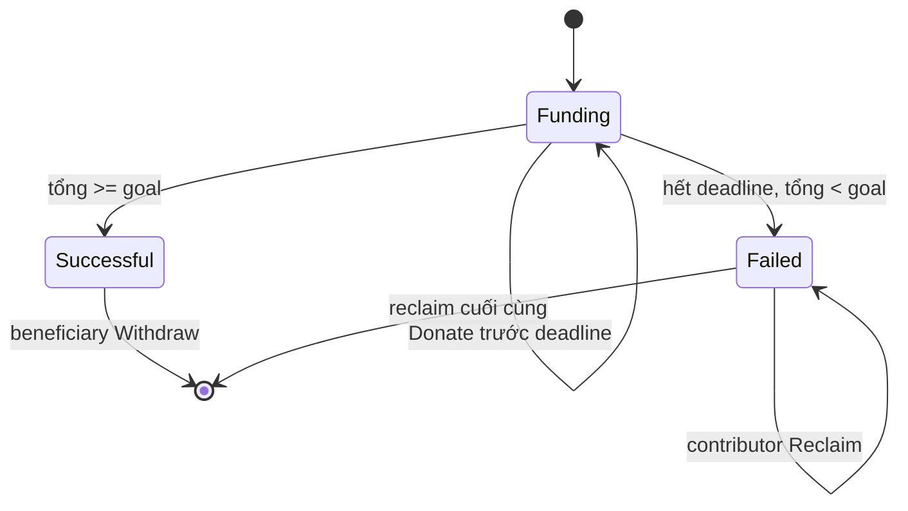

# Module: Crowdfund

## Bài 1: Campaign như một quỹ có điều kiện

Trạng thái Funding/Failed/Successful được suy ra từ datum, tổng đóng góp và thời gian; không có enum status riêng.

## Bài 2: Lũy kế contribution

Khi contributor góp lần nữa, off-chain builder gộp amount vào cặp địa chỉ cũ. Khi reclaim, builder tạo output trả amount cho ví và xóa cặp đó khỏi datum. Validator kiểm tra cả số dư ADA lẫn cấu trúc danh sách, nên chỉ sửa datum mà không chuyển tiền sẽ fail.

## Bài 3: Deadline và validity range

Donate dùng upper bound để chứng minh giao dịch kết thúc trước deadline. Reclaim dùng lower bound để chứng minh campaign đã hết hạn. Beneficiary không được withdraw khi chưa đạt goal.

## Bài tập

1. Donate với delta bằng 0 và quan sát validator fail.
2. Thay đổi goal trong continuing datum.
3. Reclaim một contributor nhưng giữ contributor đó trong datum.
4. Kiểm thử hai contributor reclaim tuần tự và kiểm tra remaining balance.
