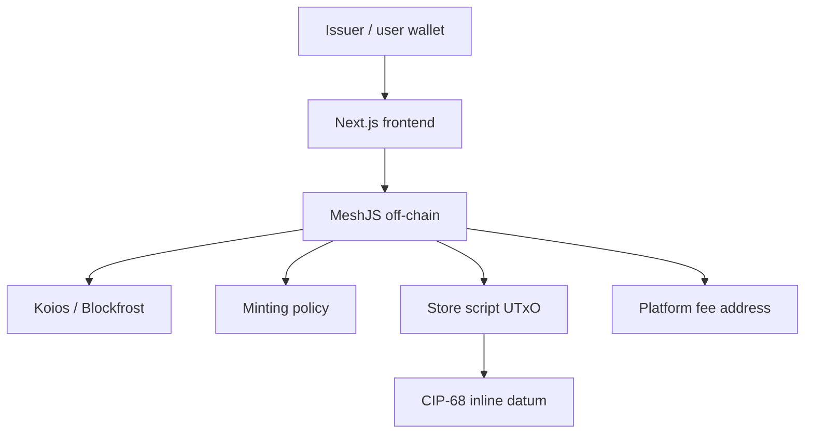

# Kiến trúc Tổng thể (System Architecture)

CIP-68 Minting tách tài sản người dùng khỏi reference asset chứa metadata. DApp có minting policy, store validator và frontend/off-chain dùng MeshJS.

## 1. Kiến trúc

- **Mint policy** kiểm tra issuer ký và transaction có output trả platform fee.
- **Store validator** kiểm tra update/remove metadata, issuer signature và platform fee.
- **Off-chain** mã hóa metadata theo CIP-68, ghép cặp token, tạo output/reference UTxO và query metadata.

## 2. Cặp tài sản CIP-68

Một asset name có hai dạng:

- `100 + name`: reference token, thường quantity 1, nằm tại store UTxO cùng metadata datum.
- `222 + name`: user token, nằm trong ví người dùng và đại diện cho tài sản có thể chuyển.

Cả hai dùng cùng policy ID và cùng phần tên logic sau prefix. Reference token giữ metadata; user token là tài sản mà người dùng sở hữu.

## 3. Luồng nghiệp vụ

1. **Mint**: issuer ký, mint reference token và user token, đặt reference token cùng datum tại store, trả phí platform.
2. **Update**: tiêu store UTxO, tạo lại reference token cùng metadata mới và trả phí.
3. **Burn**: burn user token; khi hết user token có thể burn cả reference token và remove store UTxO.
4. **Query**: off-chain lấy asset tại store, giải mã CIP-68 datum và ghép với asset info để hiển thị.

## 4. Tách quyền

Issuer signature là quyền sửa metadata và mint policy trong demo. User token không tự động cấp quyền update metadata; quyền này thuộc issuer theo validator parameter.
