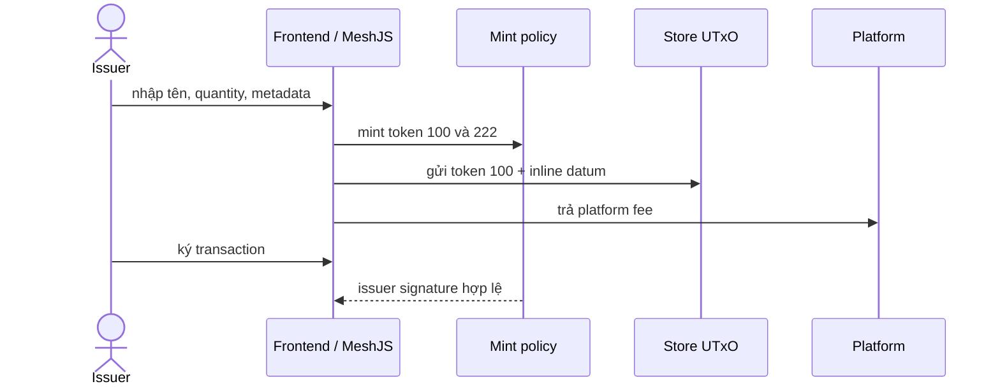

# Module: CIP-68 Minting

## Bài 1: Vì sao tách reference token và user token?

NFT truyền thống thường gắn metadata với token một lần. CIP-68 dùng reference token ở store UTxO để metadata có thể cập nhật mà không cần phát hành lại user token. User token vẫn có thể chuyển giữa các ví; ứng dụng đọc metadata từ reference UTxO.

## Bài 2: Một transaction mint

`100name` thường quantity 1 và ở store. `222name` được gửi cho receiver với quantity do user chọn. Metadata được chuyển thành CIP-68 datum bằng MeshJS.

## Bài 3: Update và burn

Update tiêu reference UTxO, tạo output mới tại store với cùng reference token và datum mới. Burn dùng redeemer `Burn`; khi toàn bộ user supply bị burn, reference token cũng có thể bị burn và store UTxO bị remove.

## Bài tập

1. Mint cùng một logical name hai lần và kiểm tra reference token.
2. Update metadata nhưng không ký bằng issuer.
3. Thay prefix `100`/`222` hoặc quantity reference.
4. Burn một phần user token rồi burn phần còn lại; kiểm tra khi nào reference token được remove.
