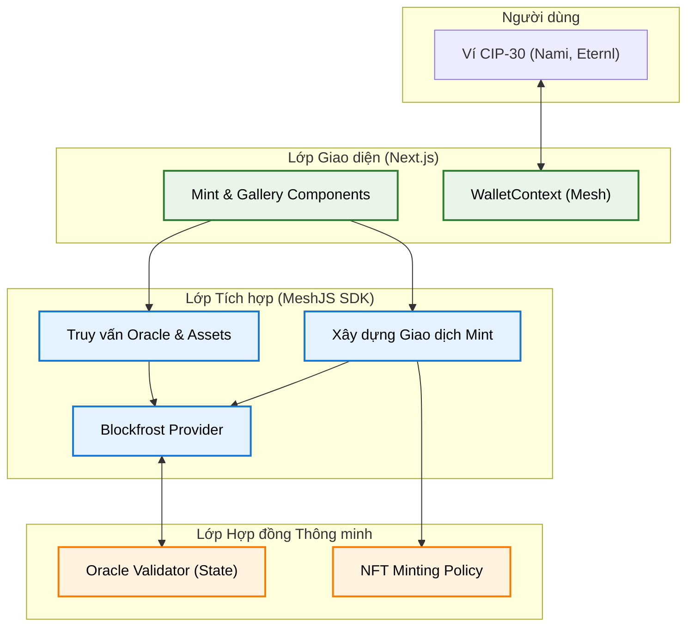

# Kiến trúc Tổng thể (System Architecture)

Tài liệu này cung cấp cái nhìn toàn cảnh về cấu trúc và các luồng tương tác của dự án **Membership NFT** trên mạng lưới Cardano.

## 1. Sơ đồ Kiến trúc Mức cao (High-Level Architecture)

Hệ thống được thiết kế theo mô hình 3 lớp phân tách rõ ràng để đảm bảo tính bảo mật và khả năng mở rộng:

1.  **Lớp Giao diện (Frontend - Next.js)**: Xử lý trải nghiệm người dùng, hiển thị bộ sưu tập NFT và quản lý kết nối ví thông qua chuẩn CIP-30.
2.  **Lớp Tích hợp (Offchain - MeshJS)**: Thư viện TypeScript đóng vai trò làm cầu nối, xây dựng các giao dịch phức tạp (Multi-script interaction) và xử lý metadata chuẩn CIP-25.
3.  **Lớp Hợp đồng thông minh (Onchain - Aiken)**: Nơi thực thi các quy tắc nghiêm ngặt về việc phát hành NFT dựa trên số thứ tự từ Oracle.

## 2. Chi tiết các Thành phần (Core Components)

### 2.1. Frontend (`/frontend`)
- **Framework**: Next.js (App Router).
- **Styling**: TailwindCSS & Framer Motion (Glassmorphism UI).
- **Trách nhiệm**:
    - Quản lý trạng thái ví toàn cục thông qua `WalletContext`.
    - Hiển thị trạng thái của Collection.
    - Gọi logic Mint, submit và chờ xác nhận on-chain.
    - Hiển thị hình ảnh từ IPFS thông qua Gateway ổn định.

### 2.2. Offchain Library (`/offchain`)
- **Công nghệ**: TypeScript, MeshJS.
- **Nhiệm vụ**:
    - `getOracleData()`: Truy vấn Blockchain để tìm UTxO chứa Oracle Token và giải mã Datum để lấy số thứ tự NFT tiếp theo.
    - `buildMintNftTx()`: Xây dựng giao dịch đồng thời tương tác với cả Hợp đồng Oracle (để cập nhật index) và Hợp đồng Minting (để tạo NFT).
    - **Metadata Processor**: Lấy chuỗi IPFS để hiển thị hình ảnh NFT.

### 2.3. Smart Contract (`/onchain`)
- **Ngôn ngữ**: Aiken (Plutus V3).
- **3 Validators**:
    - **`one_shot.ak`** — One-Shot Minting Policy: Tạo Oracle NFT duy nhất dùng để định danh Oracle UTxO.
    - **`oracle.ak`** — Oracle Validator: Kiểm soát việc cập nhật số thứ tự NFT và xác nhận phí mint được trả đủ cho Admin.
    - **`nft_mint.ak`** — NFT Minting Policy: Đảm bảo chỉ mint đúng 1 token với tên khớp với Index lấy từ Oracle.

## 3. Luồng Dữ liệu khi Mint NFT

1.  **Truy vấn**: Frontend gọi Offchain để lấy `nextIndex` hiện tại từ Oracle UTxO.
2.  **Xây dựng**: `MeshTxBuilder` tạo giao dịch bao gồm:
    - Input: Oracle UTxO + Phí Mint (ADA).
    - Mint: Lệnh Mint NFT với tên là `C2VN Membership #{Index}`.
    - Output 1: Oracle UTxO mới (Index + 1) gửi về địa chỉ Oracle.
    - Output 2: NFT mới gửi về ví người dùng.

3.  **Ký & Gửi**: Người dùng ký giao dịch, Blockfrost đẩy lên mạng lưới.
4.  **Xác nhận**: Frontend thực hiện polling đến khi Blockfrost xác nhận giao dịch đã được ghi vào chuỗi (On-chain confirmed).
