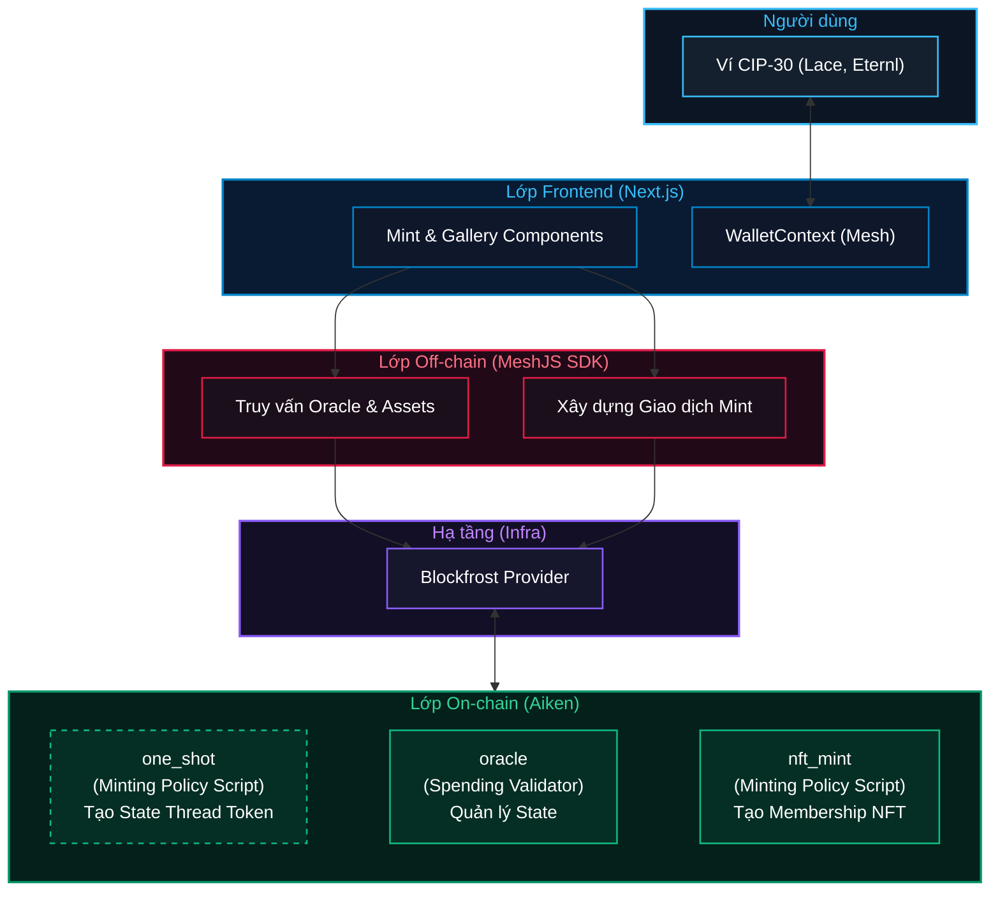
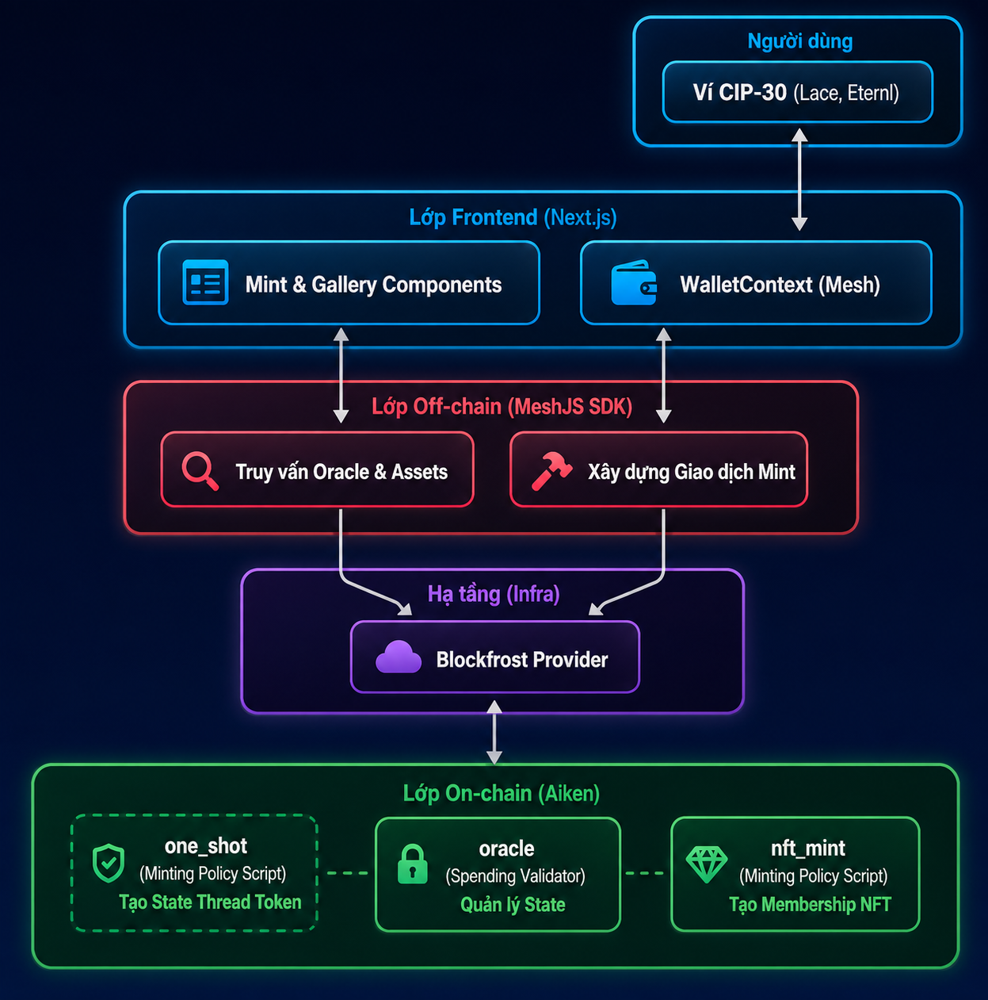
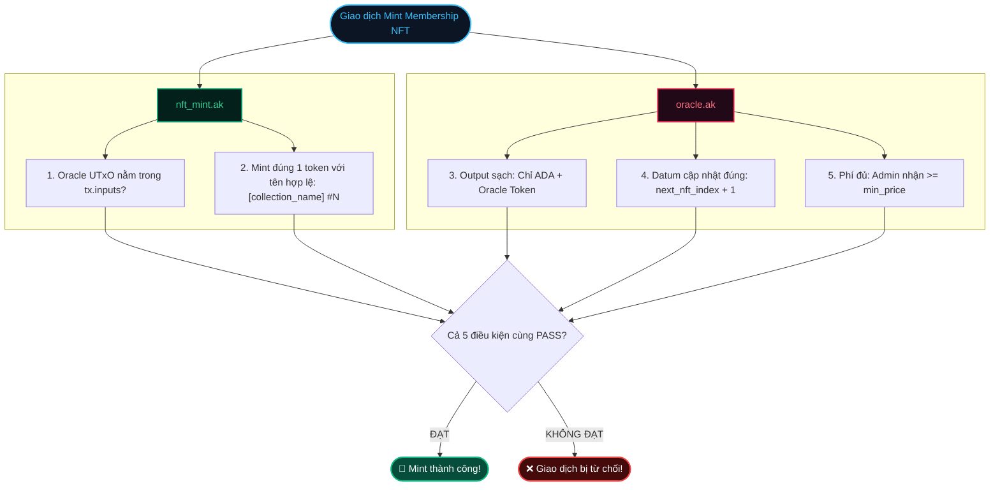
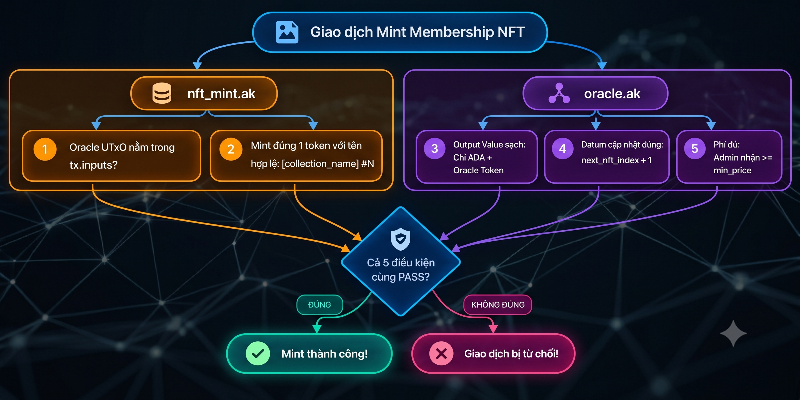
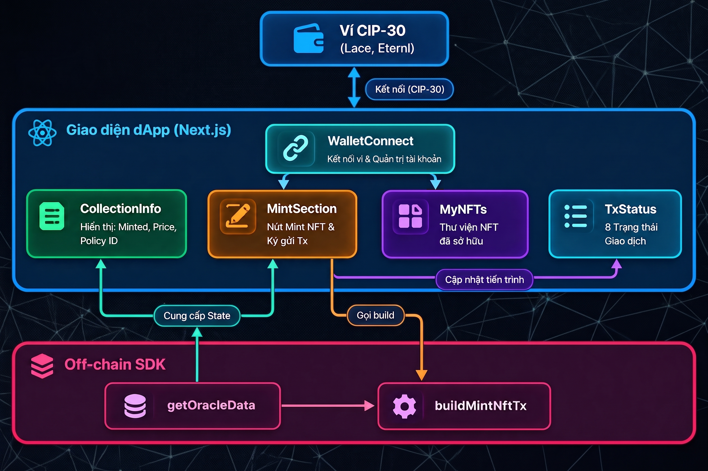

# Module 04: Membership NFT — Phát hành NFT có số thứ tự tuần tự

# Bài 1: Kiến trúc Membership NFT & Các Pattern Cốt lõi

> ### Mục lục bài học
> 1. [Ứng dụng Thực tế của Membership NFT](#1-ứng-dụng-thực-tế-của-membership-nft)
> 2. [Trải nghiệm dApp](#2-trải-nghiệm-dapp)
> 3. [Kiến trúc 3 Lớp của dApp](#3-kiến-trúc-3-lớp-của-dapp)
> 4. [Tại sao cần Oracle Validator đi kèm?](#4-tại-sao-cần-oracle-validator-đi-kèm)
> 5. [State Thread Token (STT) - "Sợi chỉ" liên kết trạng thái](#5-state-thread-token-stt---sợi-chỉ-liên-kết-trạng-thái)
> 6. [Parameterized Script (Script Tham số hóa)](#6-parameterized-script-script-tham-số-hóa)
> 7. [One-Time (One-Shot) Minting Policy](#7-one-time-one-shot-minting-policy)

---

## 1. Ứng dụng Thực tế của Membership NFT

Trong thế giới Web3 và blockchain, **NFT (Non-Fungible Token)** không chỉ đơn thuần là các tác phẩm nghệ thuật kỹ thuật số để sưu tầm hay đầu tư. Một trong những ứng dụng thực tế và mạnh mẽ của NFT là làm **Thẻ thành viên số (Membership NFT)** hoặc **Vé điện tử (Event Pass / Token-Gated Access)**.

### Các bài toán thực tế giải quyết bằng Membership NFT:
1. **Chương trình Khách hàng Thân thiết (Loyalty Program / VIP Membership)**: Doanh nghiệp phát hành thẻ khách hàng thân thiết/thẻ VIP số hóa. Khách hàng nắm giữ sẽ được hưởng các quyền lợi tùy theo cấp độ như ưu đãi giảm giá, tích điểm, quà tặng...
2. **Quyền truy cập Độc quyền (Token-Gated Access)**: Người dùng sở hữu NFT có thể truy cập vào nội dung, sản phẩm, dịch vụ hoặc cộng đồng độc quyền.
3. **Vé tham dự Sự kiện (Event Pass)**: Phát hành vé ca nhạc, xem phim, hội thảo, ...
4. **Chứng chỉ On-chain (Certificate)**: NFT có thể đại diện cho chứng chỉ hoàn thành khóa học, đạt thành tích hoặc tham gia một chương trình. Chứng chỉ được lưu trên blockchain, minh bạch và dễ dàng xác minh.

### Điểm đặc biệt của dApp Membership NFT:
- **Số thứ tự tự động tăng**: Tên của mỗi NFT khi mint sẽ được tự động gán số thứ tự kế tiếp một cách tuần tự (ví dụ: `C2VN Membership #1`, `C2VN Membership #2`, `C2VN Membership #3`, ...).
- **Không thể trùng lặp, không thể tự ý lựa chọn**: Không ai có thể mint trùng số thứ tự của người khác hoặc tự ý *lựa chọn* số thứ tự.
- **Cơ chế phi tập trung (Trustless)**: Admin không thể can thiệp vào số thứ tự hay phát hành NFT "chui". Mọi quy tắc đều được thực thi và kiểm tra bởi Smart Contract.

> Trong thế giới thực, các số thứ tự đặc biệt hoặc thấp thường được ưa chuộng và có thể có giá trị cao hơn. DApp Membership NFT đảm bảo phân bổ công bằng: không ai có quyền lựa chọn số thứ tự cho riêng mình.

---

## 2. Trải nghiệm dApp

> [!NOTE]
> Chi tiết các bước cài đặt và chạy dApp có trong tài liệu [README.md](../README.md).

1. Mở dApp, kết nối ví
2. Nhấn Mint → Ký giao dịch
3. Nhận C2VN Membership NFT
4. Kiểm tra trên ví

---

## 3. Kiến trúc 3 Lớp của dApp





DApp Membership NFT tuân thủ kiến trúc **3 lớp** (Front-end, Off-chain, On-chain) giống các dApp trước đây. Tuy nhiên, lớp On-chain có sự tham gia của **3 validators**: trong đó có **1 Spending Script** (`oracle.ak`) và **2 Minting Policy Scripts** (`one_shot.ak`, `nft_mint.ak`).

---

### Minting Policy Script là gì?

**Minting Policy Script** là loại script sử dụng để kiểm soát việc **Đúc (Mint)** hoặc **Đốt (Burn)** các Native Tokens. Nó định nghĩa các quy tắc tạo nên **chính sách đúc tiền**.

- **Policy ID (Mã định danh chính sách)**: Chính là **mã băm (Hash)** của Minting Script. 

  Đây là thành phần quan trọng để định danh tài sản, đại diện cho "họ" tài sản được tạo bởi chính sách đó. Thành phần còn lại là `Asset Name`, đại diện cho từng loại tài sản trong "họ" tài sản đó. Hai thành phần này tạo nên 1 định danh đầy đủ của tài sản ( `PolicyId` + `AssetName` ). 
  
  Bất cứ khi nào một giao dịch muốn đúc hoặc đốt token, node Cardano sẽ bắt buộc phải chạy Minting Policy Script tương ứng với policy ID của token đó để verify giao dịch.

- **Điều kiện kích hoạt**: Kích hoạt khi trường **Mint (`tx.mint`)** của giao dịch có số lượng token khác 0 ($>0$ là đúc, $<0$ là đốt với số lượng tương ứng).

- **Không có Datum**: Minting Policy Script chỉ nhận `Redeemer`, `PolicyId` và `Transaction` làm tham số. Vì không quản lý việc chi tiêu UTxO, nó **hoàn toàn không có tham số Datum**. 

> Trong mô hình eUTxO, trạng thái (state) được lưu giữ cục bộ tại UTxO (thông qua Datum). Trong các loại script, chỉ có Spending validator quản lý UTxO, nên chỉ có nó mới có khả năng quản lý trạng thái.

---

## 4. Tại sao cần Oracle Validator đi kèm?

### Vấn đề: Minting Policy không thể tự nhớ số thứ tự
Yêu cầu của dApp là mỗi Membership NFT đúc ra phải mang số thứ tự tăng dần (`#1`, `#2`, `#3`...) và nhiệm vụ này phải được giải quyết ở on-chain 1 cách tin cậy và minh bạch. Tuy nhiên, vì Minting Policy là một hợp đồng **phi trạng thái**, nếu sử dụng nó một cách đơn lẻ thì không giải quyết được yêu cầu này.

### Giải pháp: Dùng thêm một Spending Validator làm "Bộ nhớ trạng thái"
Với vai trò là "nguồn sự thật" chúng ta gọi nó là **Oracle Validator**. Validator này sẽ khóa một **Oracle UTxO** với Datum lưu giữ số thứ tự tiếp theo cần mint, cùng với các thông tin thanh toán.

```rust
pub type OracleDatum {
  next_nft_index: Int,    // Số thứ tự tiếp theo cần mint (1, 2, 3, ...)
  min_price: Int,         // Phí mint cố định trả cho Admin (Lovelace)
  admin_address: Address, // Địa chỉ nhận phí của Admin
}
```

### Cơ chế phối hợp trong cùng một giao dịch:
1. **Spending Validator (`oracle.ak`)**: Cho phép chi tiêu Oracle UTxO cũ (Datum `next_nft_index = N`) và bắt buộc tạo ra Oracle UTxO mới với số thứ tự được cập nhật `next_nft_index = N + 1`.
2. **Minting Validator (`nft_mint.ak`)**: Đọc số N từ Oracle UTxO đầu vào và chỉ cho phép mint đúng 1 NFT mang tên `"C2VN Membership #N"`.

Sự kết hợp này cho phép dApp sở hữu một bộ đếm tuần tự hoàn toàn phi tập trung và minh bạch!

> Chúng ta tiếp tục đến với 1 vấn đề quan trọng khác đã được chỉ ra ở module 1: Làm thế nào để chống giả mạo Oracle UTXO? Làm sao để định danh nó một cách chính xác?

> Trên Cardano, một mẫu thiết kế phổ biến để giải quyết vấn đề này là sử dụng **State Thread Token**.

---

## 5. State Thread Token (STT) - "Sợi chỉ" liên kết trạng thái

> Tham khảo thêm: [Aiken Design Patterns - State Thread Tokens](https://aiken-lang.org/fundamentals/common-design-patterns#state-thread-tokens-aka-stt)

Để đảm bảo **State UTxO** không bị "giả mạo", chúng ta gắn một **NFT** vào nó để đánh dấu, NFT này chính là **State Thread Token (STT)**. Chỉ có UTxO nào chứa STT thì mới được coi là State UTxO chính thức, nắm giữ trạng thái hợp lệ của dApp.

> 💡 Để dễ hình dung, hãy tưởng tượng STT như một ***"chiếc gậy tiếp sức"*** trong một cuộc thi chạy tiếp sức. Chỉ người đang cầm chiếc gậy mới có quyền tiếp tục cuộc đua. Và khi hoàn thành lượt chạy, họ phải trao gậy cho người tiếp theo.

Trong dApp này, **State UTxO** là UTxO chứa dữ liệu Oracle (**Oracle UTxO**), và chúng ta gọi State Thread Token là **Oracle NFT** hay **Oracle Token**.

> Làm thế nào để tạo ra được NFT định danh độc nhất mà không ai có thể mint thêm token thứ hai y hệt? 

Chúng ta đến với một mẫu thiết kế phổ biến tiếp theo trên Cardano: **One-time (One-shot) minting policy**. Nhưng trước khi đến với mẫu thiết kế này, hãy cùng tìm hiểu một kỹ thuật nền tảng trong Plutus: **Parameterized Script**.

---

## 6. Parameterized Script (Script Tham số hóa)

Trong mô hình smart contract của Cardano, một validator có thể được định nghĩa để nhận các tham số khởi tạo. Điều này tạo ra sự linh hoạt và khả năng tái sử dụng chỉ với một lần code. Với mỗi bộ tham số khác nhau, chúng ta sẽ có một phiên bản script khác nhau, và do đó script hash (hay policy Id) và địa chỉ script cũng sẽ khác nhau.

Trong Aiken, một parameterized script được định nghĩa như sau:
```rust
// one_shot là 1 parameterized script, nhận vào 1 tham số
validator one_shot(utxo_ref: OutputReference) {
  // logic của one-shot minting policy
}
```

**Sử dụng**: Parameterized script sau khi biên dịch sẽ được *apply* tham số ở off-chain code, thu được script cbor đầy đủ để truyền vào giao dịch.

```typescript
// apply tham số utxo_ref vào one_shot script
const oneShotCbor = applyParamsToScript(compiledOneShotCode, [
  mOutputReference(paramUtxo.txHash, paramUtxo.outputIndex),
]);
```

---

## 7. One-Time (One-Shot) Minting Policy

> Tham khảo thêm: [Aiken Design Patterns - One-Shot Minting Policies](https://aiken-lang.org/fundamentals/common-design-patterns#one-shot-minting-policies)

### Vấn đề đặt ra:
Trên Cardano, chúng ta có các chuẩn NFT như CIP-25, CIP-68, ... Tuy nhiên, đây chủ yếu là các quy ước về cách tạo và quản lý NFT, mà không có rào cản kỹ thuật nào ngăn nhà phát hành âm thầm mint thêm token thứ 2 giống hệt. Vậy có giải pháp kỹ thuật nào để tạo ra token độc nhất trên Cardano mà không phụ thuộc vào bất kỳ ai không?

### One-Shot Policy: Cơ chế tạo NFT thực sự
One-shot Minting Policy được **tham số hóa bằng một UTxO** (thông qua mã tham chiếu của nó `utxo_ref: OutputReference`). Chúng ta gọi UTxO này là **param UTxO**. Trong giao dịch mint token, script cần đảm bảo 2 điều kiện:
1. Chỉ có 1 token dưới policy ID này được mint ra.
2. Param UTxO phải được tiêu thụ trong giao dịch.

Với thiết kế này, sau lần mint đầu tiên, **param UTxO bị tiêu thụ**, không còn tồn tại trên blockchain. Do đó điều kiện 2 của phiên bản script này sẽ không thể thỏa mãn thêm bất kỳ 1 lần nào nữa.

> 💡 Param UTxO như một chiếc “vé dùng một lần”. Sau khi sử dụng, nó sẽ bị tiêu hủy và không dùng lại được nữa.

Nếu nhà phát hành cố gắng mint thêm, họ sẽ phải tiêu thụ một UTxO khác có `OutputReference` khác. Khi đó, họ đang sử dụng **một parameter khác** -> tạo ra **một phiên bản minting policy khác** và do đó có **policy ID khác**.

Kết quả là, minting policy với `param UTxO` ban đầu chỉ có thể mint **đúng 1 lần duy nhất** trong toàn bộ lịch sử blockchain.

Đó chính là lý do nó được gọi là **One-Shot (One-Time) Minting Policy**. Và đây là giải pháp để tạo ra **NFT thực sự** trên Cardano, được **đảm bảo bởi chính mã nguồn Minting Script!**

---

# Bài 2: On-chain Code & Cơ chế Multi-Validator

> ### Mục lục bài học
> 1. [Chi tiết One-Shot Minting Policy Script (`one_shot.ak`)](#1-chi-tiết-one-shot-minting-policy-script-one_shotak)
> 2. [Cơ chế phối hợp Multi-Validator](#2-cơ-chế-phối-hợp-multi-validator)
> 3. [Chi tiết NFT Minting Policy (`nft_mint.ak`)](#3-chi-tiết-nft-minting-policy-nft_mintak)
> 4. [Chi tiết Oracle Validator (`oracle.ak`)](#4-chi-tiết-oracle-validator-oracleak)
> 5. [Mở rộng: Thảo luận về Bảo mật và Kiến trúc](#5-mở-rộng-thảo-luận-về-bảo-mật-và-kiến-trúc)
> 6. [Vấn đề chọn lựa vị trí để lưu dữ liệu: Datum hay Tham số Hợp đồng?](#b-vấn-đề-chọn-lựa-vị-trí-để-lưu-dữ-liệu-datum-hay-tham-số-hợp-đồng)


Smart Contract của Membership NFT được thiết kế với 2 hợp đồng chính phối hợp hoạt động (`oracle.ak`, và `nft_mint.ak`) và 1 hợp đồng phụ (`one_shot.ak`) để mint Oracle NFT định danh của Oracle UTxO (State Thread Token). Bây giờ chúng ta sẽ đi vào chi tiết từng validator.

## 1. Chi tiết One-Shot Minting Policy Script (`one_shot.ak`)

Hợp đồng này có nhiệm vụ: Cho phép ***mint*** Oracle NFT và ***burn*** token này khi cần đóng hệ thống.

Hai hành động này được định nghĩa trong kiểu `Action` của redeemer:

```rust
pub type Action {
  Minting
  Burning
}
```

Khai báo validator với tham số là mã OutputReference của một param UTxO (`utxo_ref`). Trong validator triển khai duy nhất handler `mint`:

```rust
validator one_shot(utxo_ref: OutputReference) {
  mint(redeemer: Action, policy_id: PolicyId, self: Transaction) {
    // Logic `mint` handler
  }

  else(_) {
    fail
  }
}
```

#### Logic `mint` handler:
- Dùng `expect` để đảm bảo rằng có đúng 1 loại token được mint thuộc `policy_id` và trích xuất ra được số lượng mint `quantity`.

  ```rust
      expect [Pair(_asset_name, quantity)] =
        self.mint
          |> assets.tokens(policy_id)
          |> dict.to_pairs()
  ```
  - Hàm `assets.tokens` trích xuất từ trường `mint` của giao dịch, trả về các token thuộc `policy_id` dưới dạng một Dictionary ánh xạ giữa `asset_name` và số lượng (`quantity`).
  - Dictionary này được chuyển đổi sang dạng Pairs (nghĩa là một danh sách `List<Pair<AssetName, Int>>`).
  - Từ khóa `expect` đảm bảo rằng danh sách này chỉ có **đúng một phần tử**, đồng thời bóc tách số lượng mint vào biến `quantity`. Lưu ý rằng policy này hoàn toàn không quan tâm đến tên token (`_asset_name`), bất kỳ tên token nào cũng được chấp nhận.


- Kiểm tra xem UTxO tham số (`utxo_ref`) có nằm trong danh sách UTxO đầu vào (`inputs`) sẽ bị tiêu thụ trong giao dịch hay không.

  ```rust
  let is_utxo_consumed = list.any(self.inputs, fn(input) { input.output_reference == utxo_ref })
  ```

- Pattern matching để phân nhánh hành động theo `redeemer`:
  - `Minting`: Chỉ cho phép mint đúng 1 token và tiêu thụ UTxO tham số.
  - `Burning`: Chỉ cho phép burn đúng 1 token (quantity bằng `-1`).
  ```rust
    when redeemer is {
      Minting -> is_utxo_consumed? && (quantity == 1)?
      Burning -> (quantity == -1)?
    }
  ```

> [!NOTE]
> Tại sao ở nhánh `Burning` chúng ta chỉ kiểm tra số lượng **-1**, mà có vẻ như bỏ quên việc **kiểm tra quyền của người ký (yêu cầu chữ ký Admin)**? Lý do là vì **Oracle NFT** luôn nằm trong **Oracle UTxO** dưới sự giám sát của Oracle Validator. Bất kỳ ai muốn đốt token này thì trước tiên phải mở khóa được UTxO đó, và chốt chặn chữ ký Admin được đặt tại `oracle.ak`!

---

## 2. Cơ chế phối hợp Multi-Validator

Trước khi đi vào chi tiết mã nguồn của 2 hợp đồng chính, chúng ta sẽ cùng xem xét cách phối hợp hoạt động của chúng trong cơ chế multi-validators.

### 2.1. Cấu trúc Oracle Datum

Yêu cầu của dApp là có cơ chế tính phí mint.

Do đó, `OracleDatum` ngoài lưu trữ số thứ tự sắp được mint, còn có thêm các thông tin thanh toán bao gồm phí mint và địa chỉ nhận thanh toán. Cụ thể:

```rust
pub type OracleDatum {
  next_nft_index: Int,      // Số thứ tự của NFT tiếp theo sẽ mint
  min_price: Int,           // Mức phí mint tối thiểu tính bằng lovelace
  admin_address: Address,   // Địa chỉ ví Admin nhận phí mint
}
```

### 2.2. Các điều kiện then chốt

Khi người dùng thực hiện mint NFT, cả hai hợp đồng `nft_mint.ak` và `oracle.ak` được kích hoạt **đồng thời trong cùng một giao dịch**, cùng kiểm tra 5 chốt chặn:





> [!IMPORTANT]
> **Cầu nối Multi-Validator:**

> ***Điều kiện số 1: Oracle UTxO nằm trong `tx.inputs`*** chính là **cầu nối then chốt** giữa hai validator.
> - Bằng việc bắt buộc **`tx.inputs` phải chứa Oracle UTxO** (có một UTxO ***nằm trên chính xác `oracle_address`*** và ***chứa `oracle_nft_policy`***), `nft_mint.ak` **chắc chắn 100% rằng `oracle.ak` cũng phải được kích hoạt** trong cùng giao dịch. Nhờ đó, `nft_mint.ak` an tâm **ủy quyền các tác vụ kiểm tra quan trọng khác** cho `oracle.ak`.
> - Để thiết lập *"sợi dây kết nối"* này, `nft_mint` nhận các tham số cấu hình gồm `oracle_nft_policy` và `oracle_address`.

| # | Validator | Điều kiện kiểm tra | Ý nghĩa |
|---|---|---|---|
| **1** | `nft_mint.ak` | Oracle UTxO nằm trong tx.inputs | Đảm bảo Oracle UTxO được chi tiêu trong giao dịch -> kích hoạt `oracle.ak`. |
| **2** | `nft_mint.ak` | Mint đúng 1 token với tên hợp lệ: [collection_name] #N | Đảm bảo token sinh ra là một NFT với tên đúng theo quy định. |
| **3** | `oracle.ak` | Output sạch: Chỉ ADA + Oracle Token | Đây là bước kiểm tra phụ, đảm bảo Oracle UTxO mới trả về script không bị pha lẫn token rác, gây nhiễu hệ thống. |
| **4** | `oracle.ak` | Datum cập nhật đúng: `next_nft_index + 1` | Đảm bảo số thứ tự tăng tuần tự, bảo toàn nguyên vẹn `min_price` và `admin_address` trong Oracle Datum mới. |
| **5** | `oracle.ak` | Phí đủ: Admin nhận >= min_price | Người dùng trả đủ phí tối thiểu (`min_price`) vào ví của Admin. |

Bây giờ, chúng ta sẽ lần lượt mổ xẻ mã nguồn Aiken chi tiết của từng validator để xem 5 chốt chặn trên được hiện thực hóa như thế nào.

---

## 3. Chi tiết NFT Minting Policy (`nft_mint.ak`)

Hợp đồng này quy định quy tắc phát hành Membership NFT (hiện thực các chốt chặn **1, 2** của logic mint).

### Khai báo Tham số Validator & Redeemer

> **Quyết định Thiết kế:** DApp Membership NFT được thiết kế chỉ với chức năng đúc thẻ thành viên mới mà **không hỗ trợ hành động đốt** để bảo toàn tính liên tục của bộ sưu tập (tránh việc tự do đốt làm khuyết số thứ tự trong bộ sưu tập). 
>
> Do đó, hợp đồng không cần phân nhánh và sử dụng redeemer (`_redeemer: Data`).

Validator nhận vào 3 tham số:
* `collection_name: ByteArray`: Tiền tố tên bộ sưu tập (`"C2VN Membership"`).
* `oracle_nft_policy: PolicyId`: Policy ID của Oracle Token (dùng để định vị Oracle UTxO).
* `oracle_address: Address`: Địa chỉ của hợp đồng `oracle.ak`.

```rust
validator nft_mint(
  collection_name: ByteArray,
  oracle_nft_policy: PolicyId,
  oracle_address: Address,
) {
  mint(_redeemer: Data, policy_id: PolicyId, tx: Transaction) {
    let Transaction { inputs, mint, .. } = tx

    // Các logic kiểm tra chi tiết bên dưới...
  }

  else(_) {
    fail
  }
}
```

### Logic validator

- **Chốt chặn 1: Đảm bảo sự có mặt của Oracle UTxO**
  ```rust
  // Tìm input chứa Oracle Token tại chính xác oracle_address
  expect [oracle_input] =
    inputs_at_with_policy(inputs, oracle_address, oracle_nft_policy)
  ```
  Tìm trong danh sách `tx.inputs` xem có UTxO nào vừa nằm tại `oracle_address`, vừa chứa token mang `oracle_nft_policy` hay không. Kết quả khớp với danh sách đúng 1 phần tử (`[oracle_input]`), khẳng định giao dịch tiêu thụ chính xác Oracle UTxO duy nhất.

  > [!NOTE]
  > 1. **Định danh tài sản với One-Shot Token:** Thông thường trên Cardano, để định danh đầy đủ một tài sản, chúng ta cần cả hai thành phần: `PolicyId` và `AssetName`. Tuy nhiên với Oracle Token (STT), chúng ta chỉ cần dựa vào `PolicyId` là đã đủ để định vị nó. Đây là điểm đặc biệt của One-Shot Policy: nó đảm bảo trên toàn bộ blockchain chỉ có đúng một token duy nhất tồn tại dưới policy ID này.
  > 2. **Sự đánh đổi về mặt kiến trúc:** Việc kiểm tra đồng thời cả địa chỉ (`oracle_address`) lẫn Policy ID (`oracle_nft_policy`) là một phép kiểm tra chặt chẽ. Trên thực tế, nếu Oracle token được khởi tạo đúng cách (gửi vào đúng địa chỉ hợp đồng `oracle` ngay từ đầu), thì bản thân sự hiện diện của Oracle Token đã đủ để nhận diện Oracle UTxO. Việc kiểm tra thêm cả `oracle_address` ở đây sẽ tạo nên một sự ràng buộc kiến trúc thú vị mà chúng ta sẽ phân tích thêm ở Mục 5.


- **Đọc số thứ tự từ Oracle Datum:**
  ```rust
  expect InlineDatum(input_datum) = oracle_input.output.datum
  expect OracleDatum { next_nft_index, .. }: OracleDatum = input_datum
  ```
  Trích xuất `InlineDatum` từ Oracle UTxO vừa tìm được để đọc giá trị `next_nft_index` làm số thứ tự cho NFT sắp mint.

- **Chốt chặn 2: Mint đúng 1 NFT với tên hợp lệ**
  ```rust
  let asset_name =
    collection_name
      |> concat(" #")
      |> concat(convert_int_to_bytes(next_nft_index))

  only_minted_token(mint, policy_id, asset_name, 1)
  ```
  - Ghép chuỗi tên NFT theo quy tắc: `<collection_name>` + `" #"` + `<next_nft_index>` (ví dụ: `"C2VN Membership #1"`).
  - Hàm tiện ích `only_minted_token` kiểm tra trường `mint` của giao dịch có đúng 1 tài sản dưới `policy_id`, với đúng tên `asset_name` và đúng số lượng mint bằng 1.

> [!NOTE]
> Nhờ có **Chốt chặn 1**, `nft_mint.ak` hoàn toàn yên tâm giao phó các kiểm tra trạng thái và thanh toán còn lại cho `oracle.ak`!

---

## 4. Chi tiết Oracle Validator (`oracle.ak`)

Đây là trung tâm quản lý trạng thái của dApp, chịu trách nhiệm lưu giữ biến đếm `next_nft_index`, bảo vệ việc chuyển đổi trạng thái (State Transition) và đảm bảo tiền phí mint được thanh toán cho Admin (hiện thực các chốt chặn **3, 4, 5**).

Hai hành động khi tương tác với validator được định nghĩa trong `OracleRedeemer`:

```rust
pub type OracleRedeemer {
  MintNFT    // Hành động mint NFT
  StopOracle // Hành động đóng hệ thống, hủy Oracle token
}
```

### Logic validator
Để có thể nhận biết chính xác UTxO đang được chi tiêu là Oracle UTxO, `oracle.ak` được tham số hóa bởi Policy ID của Oracle NFT `oracle_nft_policy`. Validator triển khai duy nhất handler `spend`:

```rust
validator oracle(oracle_nft_policy: PolicyId) {
  spend(
    datum_opt: Option<OracleDatum>,
    redeemer: OracleRedeemer,
    out_ref: OutputReference,
    tx: Transaction,
  ) {
    // Bóc tách dữ liệu giao dịch và tìm target input
    let Transaction { mint, inputs, outputs, extra_signatories, .. } = tx
    expect Some(OracleDatum { next_nft_index, min_price, admin_address }) = datum_opt
    expect Some(own_input) = find_input(inputs, out_ref)
    
    // Các logic kiểm tra chi tiết bên dưới...
  }

  else(_) {
    fail
  }
}
```

**Đảm bảo `own_input` chứa Oracle Token:** Trích xuất trực tiếp tài sản thuộc `oracle_nft_policy` từ `own_input.output.value` và đảm bảo có đúng 1 token trong giá trị được trích ra này:

```rust
expect [Pair(oracle_nft_name, 1)] =
  own_input.output.value
    |> assets.tokens(oracle_nft_policy)
    |> dict.to_pairs()
```

**Bảo vệ State Transition:** Với hành động `MintNFT`, cần đảm bảo giao dịch có đúng 1 Oracle UTxO đầu ra tại địa chỉ script. Với hành động `StopOracle`, cần đảm bảo không còn Oracle UTxO đầu ra tại địa chỉ script (Oracle Token sẽ bị đốt trong giao dịch). Gộp biểu thức kiểm tra này với `redeemer` vào một tuple để khớp mẫu 1 lần:
  ```rust
  let own_address = own_input.output.address

  when
    (
      redeemer,
      outputs_at_with_policy(outputs, own_address, oracle_nft_policy),
    )
  is {
    (MintNFT, [only_output]) -> {
      // Có đúng 1 UTxO chứa đầu ra Oracle token tại địa chỉ script
      // Xác thực 3 chốt chặn 3, 4, 5
    }
    (StopOracle, []) -> {
      // Không còn UTxO đầu ra chứa Oracle token tại địa chỉ script
      // Xác thực điều kiện dừng hệ thống
    }
    _ -> False
  }
  ```

- **Nhánh `MintNFT`:**
  Khi người dùng mint NFT, cả 3 điều kiện sau bắt buộc phải đồng thời thỏa mãn:

  - **Chốt chặn 3: Output value sạch (`is_output_value_clean`)**
     ```rust
     let is_output_value_clean = list.length(flatten(only_output.value)) == 2
     ```
     Đây là điều kiện phụ đảm bảo Oracle UTxO mới chỉ chứa đúng 2 loại tài sản: ADA và Oracle Token. Ngăn chặn kẻ xấu gửi kèm nhiều token rác vào Oracle UTxO gây nhiễu hệ thống.

  - **Chốt chặn 4: Cập nhật Datum chính xác (`is_index_updated`)**
     ```rust
     let is_index_updated =
       only_output.datum == InlineDatum(
         OracleDatum {
           next_nft_index: next_nft_index + 1,
           min_price,
           admin_address,
         },
       )
     ```
     Bắt buộc biến đếm `next_nft_index` tăng đúng $+1$, đồng thời giữ nguyên vẹn `min_price` và `admin_address`.

  - **Chốt chặn 5: Admin nhận đủ phí mint (`is_fee_paid`)**
     ```rust
     let is_fee_paid =
       get_all_value_to(outputs, admin_address)
         |> value_geq(from_lovelace(min_price))
     ```
     Dùng hàm tiện ích `get_all_value_to` để tính tổng tài sản chuyển tới địa chỉ `admin_address` trong `outputs`, đảm bảo $\ge$ giá trị $\text{min\_price}$ Lovelace.

  Ba chốt chặn phải cùng thỏa mãn trong biểu thức kiểm tra cuối cùng:
  ```rust
  is_output_value_clean? && is_index_updated? && is_fee_paid?
  ```

- **Nhánh `StopOracle`: Đóng hệ thống & Thu hồi Oracle Token**

  Khi Admin muốn dừng dApp, giao dịch phải thỏa mãn 2 điều kiện:
  - Admin phải ký vào giao dịch (`is_admin_signed`)
  - Oracle NFT phải bị đốt (`is_oracle_nft_burnt`)
  ```rust
  // outputs_at_with_policy(outputs, own_address, oracle_nft_policy) == []: 
  // -> Không có output tại địa chỉ script chứa Oracle token
  // -> Oracle UTxO không còn tồn tại
  (StopOracle, []) -> {
    let is_oracle_nft_burnt =
      only_minted_token(mint, oracle_nft_policy, oracle_nft_name, -1)
    let admin_key = address_payment_key(admin_address)
    let is_admin_signed = key_signed(extra_signatories, admin_key)

    is_oracle_nft_burnt? && is_admin_signed?
  }
  ```

---

## 5. Mở rộng: Thảo luận về Bảo mật và Kiến trúc

### A. Kịch bản khai thác tiềm ẩn: Spam tăng index không mint NFT

#### Giải thích Kịch bản
Thiết kế hiện tại của cơ chế multi-validator là tham chiếu 1 chiều: `oracle` $\rightarrow$ `nft_mint`.

`nft_mint` biết về `oracle` (thông qua tham số `oracle_address`). Nó có thể kiểm tra để biết chắc `oracle` cũng cùng chạy trong giao dịch. 

Tuy nhiên, ở chiều ngược lại, `oracle` không biết gì về `nft_mint`. Nó không biết chắc rằng `nft_mint` có được chạy cùng nó không.

Một ai đó có thể gửi giao dịch chỉ kích hoạt `oracle.ak` mà không chạy `nft_mint.ak`:
* Tiêu thụ Oracle UTxO, trả đủ 10 ADA cho Admin, trả Oracle UTxO về script với `next_nft_index = next_nft_index + 1`.
* **Không gọi mint bất kỳ NFT nào từ `nft_mint.ak`** (`tx.mint` rỗng).

```text
Giao dịch "Spam Tăng Index":
- Inputs:  Oracle UTxO (index = 2) + 10 ADA của Attacker
- Outputs: Oracle UTxO mới (index = 3) + Admin nhận 10 ADA
- Mint:    [RỖNG] (Không có NFT nào được phát hành)
```

#### Đánh giá Mức độ Rủi ro
* **Kinh tế:** Thấp. Kẻ tấn công tự chịu mất tiền thật (10 ADA/lượt), Admin vẫn nhận đủ 100% doanh thu mà không cần trao lại tài sản nào.
* **Toàn vẹn dữ liệu:** Cao. Bộ sưu tập bị nhảy cóc số thứ tự (`#1`, `#3`, `#5`...), biến đếm `next_nft_index` không còn phản ánh đúng tổng số NFT đang lưu hành thực tế (số lượng NFT thực tế = `next_nft_index - 1`).

#### Giải pháp khắc phục

* **Thiết lập cơ chế tham chiếu 2 chiều**: Để khắc phục, `oracle.ak` cần phải biết `nft_mint_policy` để kiểm tra giao dịch có mint token thuộc `nft_mint_policy` không.

* **Vấn đề con gà & quả trứng (Circular Dependency):**  
  Nếu tham số hóa hai chiều: `oracle(nft_mint_policy)` ⇄ `nft_mint(oracle_address/oracle_script_hash)`, cả hai Script đều đòi hỏi Script Hash của nhau tạo thành một vòng biến đổi vô tận ***"con gà - quả trứng"***.

  ```mermaid
  flowchart TD
      HB["🔑 <b>Hash B</b>"] -->|"param"| A["📜 <b>Script A</b>"]
      A --> HA["🔑 <b>Hash A</b>"]
      HA -->|"param"| B["📜 <b>Script B</b>"]
      B --> HB

      style A fill:#1e1b4b,stroke:#818cf8,stroke-width:1.5px,color:#c7d2fe
      style B fill:#1a0f1a,stroke:#e11d48,stroke-width:1.5px,color:#fb7185
      style HA fill:#0c1524,stroke:#38bdf8,stroke-width:1.5px,color:#93c5fd
      style HB fill:#052e24,stroke:#10b981,stroke-width:1.5px,color:#6ee7b7
  ```

  > **Mã băm (Script Hash)** được tính toán từ toàn bộ mã bytecode của script (sau khi áp tham số). Bất cứ khi nào tham số thay đổi, Script cũng thay đổi dẫn đến Hash của nó cũng thay đổi theo.

#### Một số hướng giải quyết

* **Giải pháp 1: Lưu `nft_mint_policy` trong Datum của Oracle**  
  Giữ nguyên chiều tham chiếu hiện tại và thiết lập chiều còn lại qua **Oracle datum**: Thêm `nft_mint_policy` vào `OracleDatum`.

  ```rust
  pub type OracleDatum {
    next_nft_index: Int,
    min_price: Int,
    admin_address: Address,
    nft_mint_policy: PolicyId,
  }
  ```

  - **Ưu điểm:** Triệt tiêu hoàn toàn Circular Dependency, giữ cho mã nguồn độc lập và linh hoạt.
  - **Sự đánh đổi:** Tốn thêm một phần chi phí lưu trữ (kích thước Datum tăng làm tăng mức min-UTxO ADA cần khóa) trên Oracle UTxO qua từng giao dịch.

* **Giải pháp 2: Dựa vào State Thread Token (STT)**
  Trên thực tế, bản thân Oracle NFT (STT) đã là một đảm bảo cho sự có mặt của Oracle UTxO miễn là nó được khởi tạo đúng cách. Khi đó `nft_mint` chỉ cần kiểm tra input có chứa Oracle NFT (STT) mà không cần thêm 1 bước khẳng định nó nằm trên `oracle_address`. Từ đó có thể bỏ qua tham số `oracle_address` trên `nft_mint`, giúp `oracle` có thể nhận `nft_mint_policy` làm tham số mà không bị vòng lặp 2 chiều.

  Tuy nhiên, một điều cần phải đánh đổi là bắt buộc phải tin tưởng vào Admin lúc khởi tạo: Nếu Admin không trung thực, họ có thể gửi Oracle token về ví riêng thay vì địa chỉ Oracle. Khi đó họ có toàn quyền định đoạt dữ liệu trạng thái của hệ thống. 

  **Đào sâu thêm một chút:** Để loại bỏ sự phụ thuộc này, chúng ta nghĩ đến việc thêm điều kiện ràng buộc vào `one_shot` bắt buộc đích đến của Oracle token sau khi mint phải là `oracle_address`. Khi đó, `one_shot` cần được tham số hóa bởi `oracle_address` / `oracle_script_hash`. Và ta lại rơi vào **Vòng lặp tam giác**:  

  ```text
  one_shot ──► nft_mint(oracle_nft_policy/oneshot policy) ──► oracle(nft_mint_policy) ──► one_shot(oracle_address) ──► ...
  ```

  Do đó, giải pháp dựa vào STT này phải chấp nhận đặt niềm tin vào bước khởi tạo ban đầu của Admin.

  > [!TIP]
  > Dù vậy, nếu dự án công khai mã nguồn hợp đồng để cộng đồng đối chiếu — hoặc trực tiếp dịch ngược Plutus bytecode từ giao dịch on-chain — người dùng hoàn toàn có thể kiểm tra và xác minh xem Oracle Token có được khóa chuẩn xác trong hợp đồng `oracle` hay không, từ đó vẫn có thể yên tâm sử dụng giải pháp này.

* **Giải pháp 3: Multi-purpose Validator**  
  Gộp cả 2 handlers `spend` (Oracle) và `mint` (NFT Mint) vào chung **1 validator duy nhất** $\rightarrow$ Cả hai dùng chung `script_hash`  $\rightarrow$ Tạo nên một tham chiếu 2 chiều tự nhiên chỉ có ở PlutusV3. Chúng ta sẽ sử dụng giải pháp này trong các module tiếp theo.

---

### B. Vấn đề chọn lựa vị trí để lưu dữ liệu: Datum hay Tham số Hợp đồng?

| Tiêu chí | Tham số Hợp đồng (Script Parameter) | Trạng thái Động (UTxO Datum) |
| :--- | :--- | :--- |
| **Bản chất** | Nhúng trực tiếp vào bytecode Plutus $\rightarrow$ Là 1 phần của script | Đính kèm vào từng UTxO khóa tại script $\rightarrow$ Độc lập với script |
| **Tính linh hoạt** | Dữ liệu tĩnh, bất biến. Thay đổi dữ liệu sẽ đổi toàn bộ Script | Linh hoạt. Có thể thay đổi khi cần |
| **Khi nào dùng** | Các thông số cấu hình bất biến của hệ thống: tên của bộ sưu tập, Policy ID của State Thread Token, script hash của Oracle, ... | Trạng thái biến đổi theo thời gian: biến đếm số thứ tự, thông tin của 1 khoản vay, số dư tài khoản, ... |

#### Cụ thể với Membership NFT
* **Với dApp trong bài:** `min_price` và `admin_address` là hoàn toàn cố định trong bài toán hiện tại $\rightarrow$ có thể đưa vào làm tham số hợp đồng.
* **Trên thực tế:** Giá ADA luôn biến động dẫn đến nhu cầu thay đổi giá mint $\rightarrow$ việc cố định nó trong tham số hợp đồng trở nên bất tiện, đưa vào Datum giúp Admin có thể cập nhật linh hoạt.

#### Bài tập Mở rộng:

**Bài 1:**
  Chuyển `admin_address` thành tham số hợp đồng và bổ sung nhánh `UpdatePrice` vào Oracle validator cho phép Admin cập nhật giá mint.
  - Yêu cầu chữ ký của Admin.
  - `min_price` mới > 0 & khác `min_price` cũ.
  - **Bắt buộc giữ nguyên `next_nft_index`** để bảo toàn tính liên tục của bộ sưu tập.

**Bài 2:**
  Hãy lựa chọn một giải pháp và giải quyết lỗ hổng **Spam tăng index** đã chỉ ra ở trên.

---

# Bài 3: Off-chain, Frontend và DApp Lifecycle

> ### Mục lục bài học
> 1. [Luồng Tương tác Front-end & Off-chain](#1-luồng-tương-tác-front-end--off-chain)
> 2. [Vòng đời DApp](#2-vòng-đời-dapp)
> 3. [Triển khai Chi tiết](#3-triển-khai-chi-tiết)
> 4. [Bài tập Thực hành](#4-bài-tập-thực-hành)
> 5. [Tài liệu Tham khảo & Đọc thêm](#tài-liệu-tham-khảo--đọc-thêm)

---

## 1. Luồng Tương tác Front-end & Off-chain

Sơ đồ dưới đây mô tả chi tiết luồng tương tác giữa các component trên giao diện (Front-end Next.js) và lớp Off-chain trong quá trình kết nối ví, đọc trạng thái Oracle và điều phối giao dịch:



### 1.1. Các Component Giao diện

Kiến trúc giao diện dApp được module hóa thành các component chuyên biệt:

1. **`WalletConnect` (Kết nối ví & Quản trị tài khoản):**
   - **Tương tác Ví:** Kết nối hai chiều với các ví Web3 trên trình duyệt (Eternl, Lace, ...).
   - **Cung cấp Context:** Lưu giữ các trạng thái ví vào React Context, cung cấp trực tiếp cho:
     - `MintSection`: Cung cấp đối tượng ví để ký (`wallet.signTx`) và phát tán giao dịch (`wallet.submitTx`).
     - `MyNFTs`: Cung cấp kết nối để quét danh mục tài sản phục vụ cho việc lọc và hiển thị các thẻ thành viên người dùng sở hữu.

2. **`CollectionInfo` (Bảng thông tin Bộ sưu tập):**
   - Nhận dữ liệu trạng thái từ hàm off-chain `getOracleData` để hiển thị các thông tin của bộ sưu tập:
     - **Số lượng đã phát hành (Minted)**
     - **Giá mint tối thiểu (Min Price tính theo ADA)**
     - **Policy ID của bộ sưu tập**

3. **`MintSection` (Điều phối Mint NFT & Ký gửi Giao dịch):**
   - **Kiểm tra số dư:** Đảm bảo ví có đủ $\ge \text{minPrice} + 2\text{ ADA}$ (bao gồm giá mint, phí mạng dự tính và lượng ADA khóa kèm Oracle UTxO để đáp ứng điều kiện min-UTxO).
   - **Khởi tạo Giao dịch:** Khi người dùng nhấn nút *"MINT NOW"*, component kích hoạt hàm `buildMintNftTx` từ tầng Off-chain để tạo giao dịch thô.
   - **Ký và Phát tán:** Yêu cầu ví mở cửa sổ xác nhận ký và phát tán giao dịch lên blockchain Cardano.
   - **Cập nhật Tiến trình:** Liên tục truyền trạng thái giao dịch (`status`) sang component `TxStatus` để hiển thị tiến độ cho người dùng.

4. **`TxStatus` (Hiển thị trạng thái giao dịch):**
   Đóng vai trò như một lớp phủ giao diện tương tác (modal overlay), phản hồi trực quan 8 trạng thái xuyên suốt vòng đời giao dịch, từ lúc bắt đầu cho đến khi giao dịch hoàn tất hoặc thất bại.
   - **Bảo vệ thao tác:** Khi giao dịch đang được xử lý, overlay sẽ vô hiệu hóa các nút bấm trên màn hình nhằm ngăn chặn hành vi nhấp đúp hoặc gửi trùng lặp giao dịch ngoài ý muốn.

4. **`MyNFTs` (Thư viện cá nhân):**
   Tự động quét danh mục tài sản từ ví, lọc đúng Policy ID của dự án và hiển thị các thẻ thành viên mà người dùng đang sở hữu.

---

### 1.2. Lớp Off-chain

Lớp off-chain đóng vai trò cầu nối giữa giao diện người dùng và hợp đồng thông minh on-chain, thực hiện 2 nhiệm vụ cốt lõi:
- **`getOracleData`**: Quét và giải mã Oracle Datum từ Oracle UTxO đang hoạt động trên mạng lưới $\rightarrow$ Cung cấp State cho `CollectionInfo` hiển thị và cho `MintSection` kiểm tra điều kiện mint. Dữ liệu này đồng thời là đầu vào bắt buộc của hàm dựng giao dịch `buildMintNftTx`.
- **`buildMintNftTx`**: Nhận yêu cầu từ `MintSection` để lắp ráp giao dịch mint NFT tuân thủ chặt chẽ các quy tắc ràng buộc của cả hai validator `oracle.ak` và `nft_mint.ak`.

---

## 2. Vòng đời DApp

Hệ thống Membership NFT vận hành tuần tự qua **3 giai đoạn**, mỗi giai đoạn được đại diện bởi một loại giao dịch đặc thù:
- **Giai đoạn 1: Khởi tạo**: Admin chạy 1 giao dịch duy nhất để tạo State Thread Token (Oracle NFT), sau đó nạp token này vào địa chỉ hợp đồng `oracle.ak` kèm dữ liệu Datum với số thứ tự khởi đầu bằng $1$ $\rightarrow$ **Oracle UTxO đầu tiên**.
- **Giai đoạn 2: Vận hành**: Người dùng mint Membership NFT theo chuẩn CIP-25. Mỗi lượt mint thành công sẽ tiêu thụ Oracle UTxO hiện tại và chuyển dịch trạng thái sang một Oracle UTxO mới mang số thứ tự tăng dần (`#N + 1`).
- **Giai đoạn 3: Đóng hệ thống**: Khi muốn dừng phát hành vĩnh viễn, Admin thực hiện giao dịch đóng hệ thống, tiêu thụ Oracle UTxO cuối cùng và đốt vĩnh viễn Oracle Token.

---

## 3. Triển khai Chi tiết

### 3.1. Giao dịch Khởi tạo (`setup-oracle.ts`)

Trước khi dApp có thể hoạt động, Admin phải chạy script `setup-oracle.ts` một lần duy nhất để mint Oracle NFT và khởi tạo Oracle UTxO.

- **Bước 1: Chọn Param UTxO**  
  Truy vấn danh sách UTxO trong ví admin và chọn UTxO đầu tiên làm `paramUtxo`:

  ```typescript
  const adminUtxos = await adminWallet.getUtxos();
  const paramUtxo = adminUtxos[0]!;
  ```

- **Bước 2: Apply Parameters cho Scripts & Tính địa chỉ**  
  Sử dụng các hàm trợ giúp để tính toán mã CBOR, Policy ID của One-shot, và địa chỉ Oracle.

  ```typescript
  const oneShotCbor = getOneShotCbor(paramUtxo.input);
  const oracleNftPolicyId = resolveScriptHash(oneShotCbor, "V3");
  const { oracleAddress } = getMembershipScripts(oracleNftPolicyId);
  ```

- **Bước 3: Chuẩn bị Oracle Datum khởi tạo**  
  Khởi tạo trạng thái ban đầu cho Oracle theo đúng cấu trúc `OracleDatum` của Aiken, gồm 3 dữ liệu: Số thứ tự (bắt đầu từ `#1`), mức giá mint cơ sở (`MINT_PRICE_LOVELACE` khai báo trong file `.env`), và địa chỉ Admin nhận tiền:
  ```typescript
  const { pubKeyHash, stakeCredentialHash } = deserializeAddress(adminAddress);
  const initialDatum = mConStr0([
    1,                                               // first index = 1
    MINT_PRICE_LOVELACE,                             // min_price (lovelace)
    mPubKeyAddress(pubKeyHash, stakeCredentialHash), // admin_address
  ]);
  ```

  > [!NOTE]
  > **Cơ chế đóng gói kiểu `Address` sang Plutus Data:**  
  > Trên hợp đồng Aiken, `Address` không phải là chuỗi địa chỉ Bech32 (`addr_test1...`) mà là cấu trúc dữ liệu gồm `payment_credential` và `stake_credential`. Khi chuyển sang biểu diễn Plutus, nó là một loạt các constructor lồng nhau. Để đơn giản hóa việc tạo giá trị Address dạng Plutus Data, chúng ta sử dụng các hàm trợ giúp của Mesh:
  > - **`deserializeAddress`**: Bóc tách chuỗi địa chỉ Bech32 thành cặp mã băm 28-byte (`pubKeyHash` và `stakeCredentialHash`).  
  > - **`mPubKeyAddress`**: Đóng gói 2 mã băm trên thành biểu diễn Plutus Data của `Address`, giúp hợp đồng on-chain nhận diện chính xác địa chỉ ví.

- **Bước 4: Xây dựng, Ký và Gửi Setup Transaction**
  Sử dụng `MeshTxBuilder` để xây dựng giao dịch: tiêu thụ đúng `paramUtxo` đã cam kết, mint đúng 1 Oracle Token (STT), chuyển token này vào địa chỉ script `oracleAddress` kèm `initialDatum`. Sau đó ký và submit giao dịch lên mạng lưới:
  ```typescript
  const unsignedTx = await txBuilder
    // Tiêu thụ paramUtxo (đảm bảo điều kiện của one-shot)
    .txIn(
      paramUtxo.input.txHash,
      paramUtxo.input.outputIndex,
      paramUtxo.output.amount,
      paramUtxo.output.address
    )
    // Mint +1 Oracle Token bằng one-shot policy
    .mintPlutusScriptV3()
    .mint("1", oracleNftPolicyId, oracleTokenNameHex)
    .mintingScript(oneShotCbor)
    .mintRedeemerValue(mConStr0([])) // Action::Minting (index 0)
    // Gửi Oracle Token đến oracle address với datum khởi tạo
    .txOut(oracleAddress, [{ unit: oracleNftPolicyId + oracleTokenNameHex, quantity: "1" }])
    .txOutInlineDatumValue(initialDatum)

    .txInCollateral(
      collateral.input.txHash,
      collateral.input.outputIndex,
      collateral.output.amount,
      collateral.output.address
    )
    .changeAddress(adminAddress)
    .selectUtxosFrom(adminUtxos)
    .complete();

  const signedTx = await adminWallet.signTx(unsignedTx);
  const txHash = await adminWallet.submitTx(signedTx);
  ```

- **Bước 5: In ra ORACLE_POLICY_ID để cấu hình Frontend**  
  Sau khi giao dịch được gửi thành công, script sẽ in ra `oracleNftPolicyId` để đưa vào cấu hình biến môi trường `NEXT_PUBLIC_ORACLE_POLICY_ID` của Frontend:
  ```typescript
  console.log(`NEXT_PUBLIC_ORACLE_POLICY_ID=${oracleNftPolicyId}`);
  ```

#### Hướng dẫn Thực thi qua Giao diện Dòng lệnh (CLI):

Để khởi chạy toàn bộ quy trình trên, thực thi lệnh sau tại thư mục gốc của dự án:

```bash
npm run setup
```

Lệnh này sẽ kích hoạt script `tsx scripts/setup-oracle.ts`. Sau khi giao dịch được gửi thành công, script sẽ in ra `oracleNftPolicyId`:

```bash
NEXT_PUBLIC_ORACLE_POLICY_ID=<oracle_policy_id>
```

Sao chép mã Policy ID này và dán vào file cấu hình `.env` của ứng dụng Frontend để các component giao diện có thể nhận diện đúng Oracle khi chạy dApp.

---

### 3.2. Truy vấn & Parse Oracle Datum (`oracle.ts`)

Hàm `getOracleData` trong `oracle.ts` chịu trách nhiệm tìm kiếm Oracle UTxO trên mạng lưới thông qua Blockfrost và giải mã trạng thái on-chain hiện tại của dApp:

- **Truy vấn danh sách UTxO tại địa chỉ Oracle:**  
  Sử dụng provider để quét toàn bộ UTxO đang nằm tại địa chỉ script `oracleAddress`:
  ```typescript
  const utxos = await provider.fetchAddressUTxOs(oracleAddress);
  ```

- **Lọc tìm Oracle UTxO chính chủ (chứa State Thread Token):**  
  Trong Cardano, định danh `unit` của tài sản là chuỗi ghép `policyId + assetNameHex`. Vì vậy, dùng `.startsWith(oracleNftPolicyId)` sẽ xác định chính xác token thuộc policy này. Kết hợp với tính độc bản của One-Shot policy, trên toàn blockchain chỉ có duy nhất một UTxO thỏa mãn:
  ```typescript
  const oracleUtxo = utxos.find((u) =>
    u.output.amount.some((a) => a.unit.startsWith(oracleNftPolicyId))
  );
  ```

- **Giải mã Plutus Data (Inline Datum):**  
  Trích xuất dữ liệu Plutus thô từ output của UTxO và giải mã thành đối tượng `OracleDatum` để đọc số thứ tự NFT kế tiếp (`nextNftIndex`), mức giá mint tối thiểu (`minPrice`) và địa chỉ ví Admin (`adminAddress`):
  ```typescript
  const rawDatum = oracleUtxo.output.plutusData;
  if (!rawDatum) throw new Error("Oracle UTxO missing plutusData");

  const oracleDatum: OracleDatum = deserializeDatum(rawDatum);
  const nextNftIndex = Number(oracleDatum.fields[0].int);
  const minPrice = Number(oracleDatum.fields[1].int);
  const adminAddress = serializeAddressObj(oracleDatum.fields[2], NETWORK_ID);
  ```

  > [!NOTE]
  > **Chuyển đổi address object (Plutus Data) thành địa chỉ Bech32:**
  > - **`oracleDatum.fields[2]`:** Dữ liệu địa chỉ lưu trong Datum ở dạng cấu trúc Plutus Data (gồm các constructor lồng nhau chứa `pubKeyHash` và `stakeCredentialHash`), chưa phải là chuỗi địa chỉ Bech32 thông thường.
  > - **Hàm `serializeAddressObj`:** Thực hiện quá trình ngược lại với {`deserializeAddress` + `mPubKeyAddress`}. Hàm này đọc các mã băm từ cấu trúc Plutus Data, kết hợp với `NETWORK_ID` (0: Testnet/Preprod, 1: Mainnet) để mã hóa thành chuỗi địa chỉ Bech32 chuẩn (`addr_test1...`). Chuỗi này là bắt buộc để truyền vào lệnh trả tiền `.txOut(adminAddress, ...)` khi người dùng mint NFT.

---

### 3.3. Giao dịch Mint Membership NFT (`mint.ts`)

Hàm `buildMintNftTx` trong `mint.ts` là phần cốt lõi của lớp Off-chain, xây dựng giao dịch mint NFT tương tác đồng thời với cả hai validator (`oracle.ak` và `nft_mint.ak`).

#### Khởi tạo các dữ liệu cần thiết
- Mã định danh Oracle token và tên Membership NFT sắp mint (theo cấu trúc chuẩn `[COLLECTION_NAME] #[nextNftIndex]):
  ```typescript
  const { oracleCbor, oracleAddress, nftMintCbor, nftPolicyId } =
    getMembershipScripts(oracleNftPolicyId);

  const oracleTokenNameHex = stringToHex(ORACLE_TOKEN_NAME);
  const oracleUnit = oracleNftPolicyId + oracleTokenNameHex;
  const tokenName = `${COLLECTION_NAME} #${nextNftIndex}`;
  const tokenNameHex = stringToHex(tokenName);
  ```
  
- Oracle Datum mới:
 ```typescript
  const { pubKeyHash, stakeCredentialHash } = deserializeAddress(adminAddress);
  const updatedOracleDatum = mConStr0([
    nextNftIndex + 1,
    minPrice,
    mPubKeyAddress(pubKeyHash, stakeCredentialHash),
  ]);
  ```

- Metadata CIP-25:
  ```typescript
  const metadata = {
    [nftPolicyId]: {
      [tokenName]: { ...assetMetadata },
    },
  };
  ```

  Trong đó, đối tượng `assetMetadata` được chuẩn bị trước đó tại `MintSection`:
  ```typescript
  // Tách chuỗi CID/URL nếu vượt quá 64 ký tự (Giới hạn Cardano Metadata)
  const splitImageCid = (cid: string): string | string[] => {
    if (cid.length <= 64) return cid;
    const result = [];
    for (let i = 0; i < cid.length; i += 64) {
      result.push(cid.substring(i, i + 64));
    }
    return result;
  };

  const assetMetadata = {
    name: `C2VN Membership #${oracleData.nextNftIndex}`,
    image: splitImageCid(IMAGE_CID),
    mediaType: "image/png",
    description: "Exclusive Membership NFT on Cardano",
  };
  ```

  > [!TIP]
  > **Tại sao cần hàm `splitImageCid`?**  
  > Trong giao thức Cardano, **mỗi giá trị chuỗi (string) trong transaction metadata tối đa chỉ dài 64 ký tự**. Các đường dẫn IPFS thường dài vượt quá giới hạn này và giao dịch sẽ bị từ chối nếu để nguyên một chuỗi dài.  
  > Theo chuẩn **CIP-25**, trường `image` hỗ trợ định dạng `string[]` (mỗi phần tử $\le 64$ ký tự). Khi hiển thị, các ví Web3 và sàn giao dịch sẽ tự động nối các phần tử này lại thành đường dẫn gốc hoàn chỉnh.

#### Xây dựng giao dịch
Giao dịch mint NFT sẽ tương tác đồng thời với cả hai validator (`oracle.ak` và `nft_mint.ak`). Nó cần đảm bảo các hành động sau:

- **Chi tiêu Oracle UTxO (Kích hoạt Spending Validator `oracle.ak`):**  
  Đưa Oracle UTxO vào input, nạp script CBOR của `oracle.ak`, khai báo Inline Datum đi kèm và truyền Redeemer `MintNFT` (index 0):
  ```typescript
  const txHex = txBuilder
    // 1. Spend Oracle UTxO
    .spendingPlutusScriptV3()
    .txIn(
      oracleUtxo.input.txHash,
      oracleUtxo.input.outputIndex,
      oracleUtxo.output.amount,
      oracleUtxo.output.address
    )
    .txInRedeemerValue(mConStr0([]))
    .txInInlineDatumPresent()
    .txInScript(oracleCbor)
  ```

- **Trả Oracle Token về hợp đồng với Datum mới (Continuing Output - Oracle UTxO mới):**  
  Tạo output gửi đúng Oracle Token trở lại địa chỉ `oracleAddress` kèm `updatedOracleDatum`:
  ```typescript
    // Continuing output: Oracle Token trở về oracle address
    .txOut(oracleAddress, [{ unit: oracleUnit, quantity: "1" }])
    .txOutInlineDatumValue(updatedOracleDatum)
  ```

  > [!IMPORTANT]
  > **Cơ chế tự động tính toán ADA tối thiểu (min-UTxO) của MeshTxBuilder:**  
  > Khi khai báo output value, chúng ta chỉ khai báo duy nhất Oracle token mà **không khai báo lượng ADA đi kèm** vì `MeshTxBuilder` có tính năng tự động đánh giá kích thước UTxO để tính toán và bổ sung chính xác lượng Lovelace tối thiểu (min-UTxO) cho UTxO này.

- **Mint Membership NFT chuẩn CIP-25 (Kích hoạt Minting Policy `nft_mint.ak`):**  
  Khai báo hành động mint đúng 1 NFT thuộc `nftPolicyId` với tên đã tạo, nạp script `nftMintCbor`, redeemer rỗng và gắn Metadata nhãn `721`.
  ```typescript
    // 2. Mint NFT
    .mintPlutusScriptV3()
    .mint("1", nftPolicyId, tokenNameHex)
    .mintingScript(nftMintCbor)
    .mintRedeemerValue(mConStr0([]))
    .metadataValue(721, metadata)     // Gắn Metadata CIP-25 (Label 721)
  ```

- **Trả phí mint cho Admin:**  
  Tạo output chuyển đúng số lượng Lovelace tối thiểu (`minPrice`) về địa chỉ ví Admin:
  ```typescript
    // 3. Trả phí cho admin
    .txOut(adminAddress, [{ unit: "lovelace", quantity: minPrice.toString() }])
  ```

- **Thiết lập Collateral, Change Address, Coin Selection và Hoàn tất:**  
  Cung cấp UTxO thế chấp (`collateral`) bắt buộc khi tương tác với Plutus V3 Script, trả tiền thừa về ví người dùng, chỉ định danh sách UTxO nguồn cho thuật toán Coin Selection và gọi `.complete()` để xuất ra chuỗi giao dịch (`txHex`):
  ```typescript
    // Collateral UTxO
    .txInCollateral(collateral.input.txHash, collateral.input.outputIndex)
    .changeAddress(walletAddress)
    .selectUtxosFrom(utxos)
    .complete();
  ```
  > `changeAddress(walletAddress)` đảm bảo NFT mới tạo, cùng toàn bộ tiền thừa của giao dịch sẽ được hoàn về ví người dùng `walletAddress`.
---

### 3.4. Giao dịch Đóng Hệ thống (`stop-oracle.ts`)

Giao dịch đóng hệ thống cũng tương tác đồng thời với 2 hợp đồng:
- Oracle validator nhánh `StopOracle`: chi tiêu Oracle UTxO cuối cùng.
- One-Shot policy nhánh `Burning`: đốt vĩnh viễn Oracle Token.

> Việc hoàn thiện mã nguồn `scripts/stop-oracle.ts` sẽ dành cho học viên thực hiện trong **Bài tập thực hành 1**.

---

## 4. Bài tập Thực hành

Để làm chủ các kiến thức đã học, các bạn hãy thực hiện 2 bài tập sau:

### Bài tập 1: 
Implement script `stop-oracle.ts` để thu hồi Oracle Token, ngừng việc mint NFT trong bộ sưu tập.
> Lưu ý: Vì One-Shot là script tham số hóa, có thể các bạn cần lưu lại thông tin param UTxO hoặc script CBOR từ giao dịch khởi tạo, để có thể tái tạo lại đúng script này khi thực hiện đốt token.

### Bài tập 2:
Hoàn thiện logic trích xuất đường dẫn hình ảnh `imageUrl` từ NFT Metadata trong component `MyNFTs` để hiển thị hình ảnh thẻ thành viên lên thư viện cá nhân.

---

## Tài liệu Tham khảo & Đọc thêm

- [CIP-0025: Media Token Metadata Standard](https://cips.cardano.org/cips/cip25/)
- [MeshJS Documentation: Cardano Transaction Builder](https://meshjs.dev/apis/transaction)
