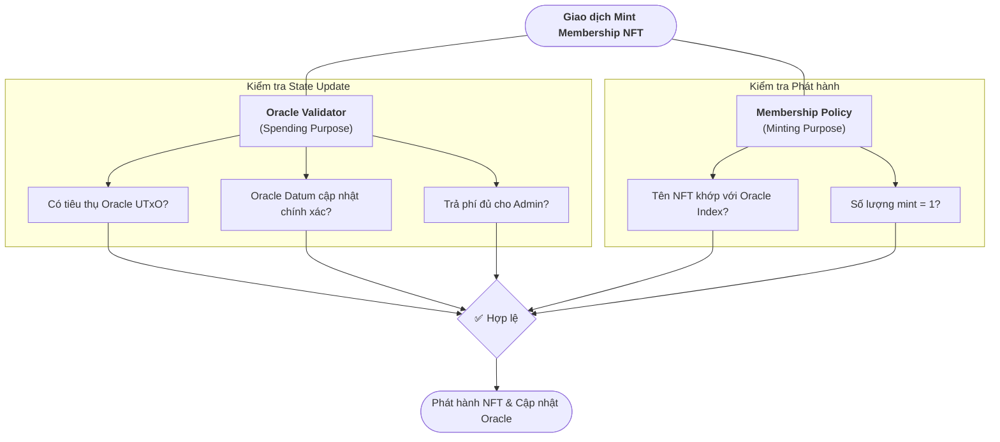

# Kiến trúc Smart Contract

Dự án Membership NFT được thiết kế dựa trên **State Thread Token (STT) Pattern**, để duy trì và cập nhật số thứ tự NFT trong mô hình eUTxO một cách tin cậy và minh bạch. Số thứ tự này được lưu trữ trong một Oracle và tự động tăng lên sau mỗi lần mint Membership NFT thành công.

## 1. Cơ chế Quản lý Trạng thái

### 1.1. State Thread Token (STT) 

Đây là mẫu thiết kế được sử dụng phổ biến trong Cardano khi quản lý một **trạng thái có thể thay đổi** theo từng giao dịch, hoặc thay đổi định kỳ. Dữ liệu trạng thái được lưu trữ ở *datum* của **State UTxO**. Và vì UTxO là bất biến, khi muốn thay đổi dữ liệu trạng thái chúng ta bắt buộc phải chi tiêu nó đi và tạo ra một State UTxO mới với dữ liệu được cập nhật. 

* Vấn đề: Làm sao script biết được UTxO mới chính là "hậu duệ" hợp pháp của UTxO cũ?

→ Giải pháp: **State Thread Token (Sợi chỉ trạng thái)**

Để đảm bảo **State UTxO** không bị "giả mạo", chúng ta gắn một **NFT** vào nó để đánh dấu, NFT này chính là **State Thread Token (STT)**. Hãy tưởng tượng STT như một ***"chiếc gậy tiếp sức"*** trong một cuộc thi chạy tiếp sức. Chỉ người cầm gậy mới được quyền chạy tiếp, và khi chạy xong, họ phải trao gậy cho người tiếp theo. 

Trong dApp này, **State UTxO** là UTxO chứa dữ liệu Oracle (**Oracle UTxO**), và chúng ta gọi State Thread Token là **Oracle NFT**.

### 1.2. One-Shot Minting Policy (`one_shot.ak`)
Một cách thông dụng trong Cardano để tạo ra STT là sử dụng **One-Shot Minting Policy** - hợp đồng tạo NFT thực thụ, minh bạch và có thể kiểm chứng.

- **Cơ chế**: Minting Script được tham số hóa với một UTxO (đại diện bằng `utxo_ref: OutputReference`) cụ thể đang tồn tại trên ví của bạn. Và bắt buộc UTxO này phải bị chi tiêu trong giao dịch mint NFT.
- **Tại sao Policy ID là duy nhất**: Policy ID chính là **mã hash của script đã được tham số hóa**. Do `utxo_ref` là một phần của script, mỗi khi dùng một UTxO khác nhau làm tham số, bạn sẽ nhận được script bytecode khác nhau → và do đó tạo ra Policy ID hoàn toàn khác. Điều này có nghĩa là không ai có thể tạo ra một Oracle Token khác với cùng Policy ID, trừ khi họ dùng đúng UTxO ban đầu đó — nhưng UTxO đó đã bị chi tiêu rồi.
- **Đảm bảo tính "One-Shot"**: Do mỗi UTxO trên Cardano chỉ có thể được tiêu thụ một lần duy nhất, điều này đảm bảo Minting Script này chỉ có thể thực thi thành công đúng một lần trong lịch sử blockchain.

## 2. Validators
DApp hoạt động dựa trên 2 validators chính:

### 2.1. Oracle Validator (`oracle.ak`)
Oracle Validator quản lý "nguồn sự thật" (source of truth) của bộ sưu tập. Dữ liệu được lưu trữ trong Oracle UTxO dưới dạng **Inline Datum**:

```aiken
pub type OracleDatum {
  nft_index: Int,        // Số thứ tự cho NFT kế tiếp sẽ được mint
  min_price: Int,        // Giá tối thiểu người dùng phải trả để mint (Lovelace)
  admin_address: Address // Địa chỉ ví Admin sẽ nhận được phí mint
}
```

Validator kiểm soát trạng thái Oracle theo hai chế độ hành động (Redeemer):

```aiken
pub type OracleRedeemer {
  MintNFT    // Người dùng thực hiện mint NFT → cập nhật index
  StopOracle // Admin thu hồi Oracle → burn Oracle NFT
}
```

**Chế độ `MintNFT`** — ba điều kiện phải thỏa mãn đồng thời:
1. **Continuing Output sạch**: Output trả về Oracle Address chỉ chứa ADA và Oracle NFT. Đây là một điều kiện phụ, đảm bảo Oracle UTxO không bị "lẫn tạp" bởi các token lạ.
2. **Datum cập nhật đúng**: `nft_index` tăng thêm 1; `min_price` và `admin_address` giữ nguyên.
3. **Phí trả đủ**: Tổng ADA gửi đến `admin_address` ≥ `min_price`.

**Chế độ `StopOracle`** — admin thu hồi bộ sưu tập:
1. Oracle NFT phải bị huỷ (burn) trong cùng giao dịch.
2. Giao dịch phải có chữ ký của Admin.


### 2.2. Membership NFT Minting Policy (`nft_mint.ak`)
Membership Minting Policy tập trung vào kiểm tra việc phát hành NFT, nó cũng đảm bảo rằng Oracle validator được thực thi cùng với nó trong một giao dịch.

- **Logic**: Trước tiên, nó kiểm tra **sự hiện diện của Oracle UTxO** (UTxO chứa Oracle NFT) trong danh sách Inputs của giao dịch. Nếu Oracle UTxO đang được chi tiêu (đồng nghĩa với việc `oracle.ak` đang được thực thi và kiểm tra các quy tắc của nó), thì `nft_mint.ak` sẽ coi đó như một "chứng chỉ" hợp lệ để cho phép phát hành 1 NFT mới.

## 3. Sơ đồ Hoạt động (Multi-Validator Interaction)
Một giao dịch Mint thành công phải vượt qua các chốt chặn:

**Unique Minting**: `nft_mint.ak` đảm bảo chỉ có đúng **1 Membership Token** được tạo ra và tên của nó phải khớp với index trong Oracle.

**Payment Validation**: `oracle.ak` kiểm tra xem có một Output chuyển đủ số `min_price` (ADA) tới địa chỉ `admin_address` hay chưa.

**Oracle Datum Validation**: `oracle.ak` đảm bảo `nft_index` trong UTXO đầu ra tăng thêm 1 so với đầu vào; các trường `min_price` và `admin_address` không được thay đổi.



