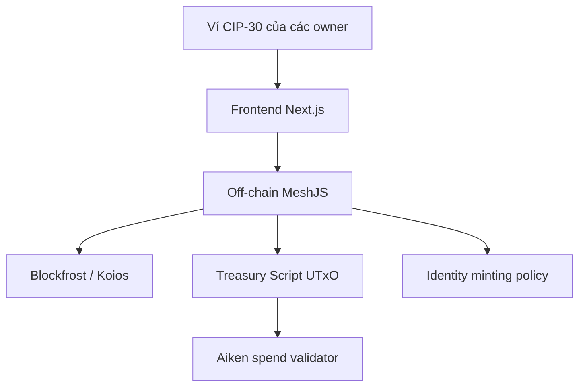

# Kiến trúc Tổng thể (System Architecture)

Tài liệu này mô tả dApp Multisig Treasury: một quỹ dùng chung được bảo vệ bởi danh sách `owners`, số lượng chữ ký tối thiểu `threshold`, và hạn mức giải ngân `allowance`.

## 1. Kiến trúc 3 lớp



- **Frontend**: kết nối ví, hiển thị số dư, owner, signer và receiver; cung cấp các thao tác khởi tạo, nạp tiền, ký và giải ngân.
- **Off-chain**: query UTxO chứa treasury token, giải mã inline datum, dựng giao dịch và yêu cầu ví ký.
- **On-chain**: kiểm tra state transition và chữ ký thật sự có trong `extra_signatories`; không tin dữ liệu do frontend gửi.

## 2. Các thành phần

### Treasury UTxO

Treasury được nhận diện bằng một state token do identity minting policy tạo ra. Inline datum lưu:

```text
Datum {
  receiver: Address,
  owners: List<Address>,
  signers: List<Address>
}
```

ADA và native asset được giữ tại script address. Mỗi thao tác `Deposit` hoặc `Signature` tiêu UTxO cũ và tạo UTxO mới tại cùng địa chỉ.

### Tham số validator

- `threshold`: số owner tối thiểu phải ký trước khi `Execute`.
- `allowance`: số lovelace được phép giải ngân trong một lần.

`receiver` là địa chỉ nhận tiền của proposal hiện tại; `owners` là danh sách cố định trong datum; `signers` là các owner đã chấp thuận proposal.

## 3. Luồng dữ liệu

1. **Khởi tạo**: identity policy mint một state token và gửi token cùng allowance ADA vào treasury UTxO.
2. **Deposit**: người dùng gửi thêm ADA/token, giữ nguyên `receiver`, `owners`, `signers` và tăng số dư lovelace.
3. **Signature**: owner ký giao dịch; validator thêm các chữ ký hợp lệ chưa xuất hiện vào datum mới.
4. **Execute**: khi số signer đạt threshold, allowance ADA được gửi cho receiver. Nếu quỹ còn dư, phần còn lại tạo continuing output và reset signer list.
5. **Kết thúc**: khi giải ngân hết phần allowance cuối cùng, state token có thể bị burn bởi flow kết thúc.

## 4. Ranh giới tin cậy

Wallet chỉ cung cấp chữ ký. Blockfrost/Koios chỉ cung cấp dữ liệu để query. Quyền chi tiêu cuối cùng thuộc về validator và được xác định từ transaction context trên Cardano.
