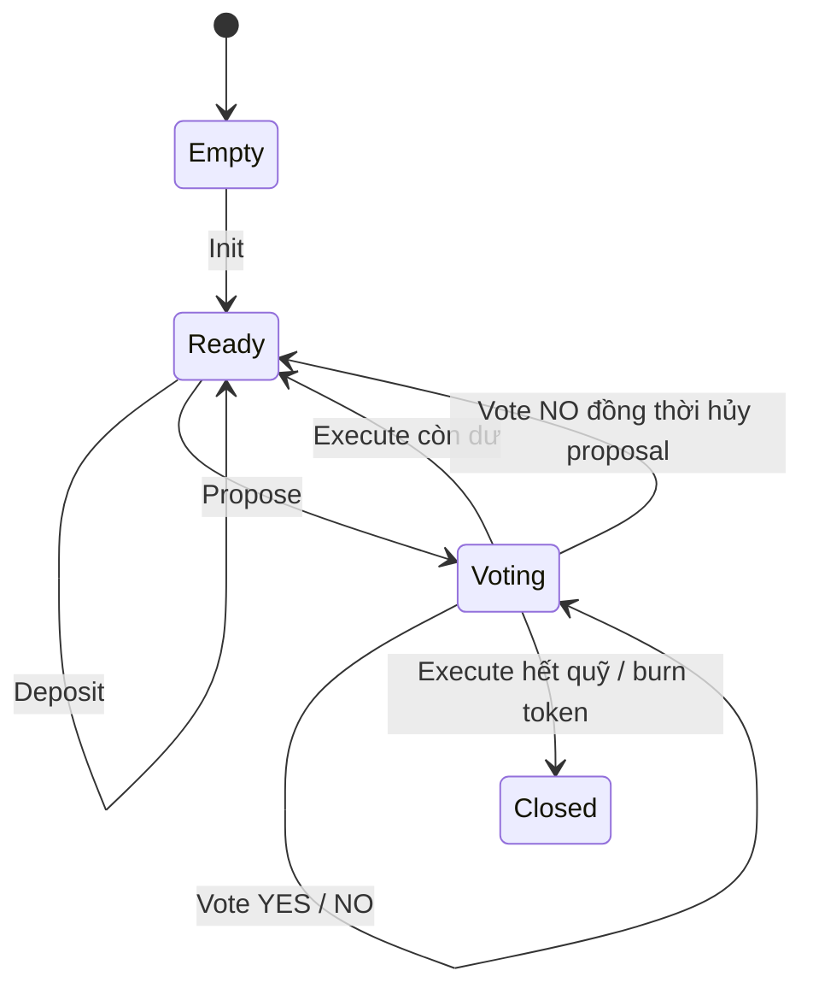
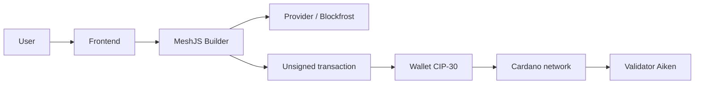

# Bài giảng 1: Tổng quan Multisig Treasury và mô hình EUTxO trên Cardano

> **Khóa học:** Lập trình Smart Contract trên Cardano với Aiken  
> **Module 5:** Multisig Treasury (Quỹ chung đa chữ ký)

---

## Mục lục

1. [Vì sao cần quỹ chung đa chữ ký](#1-vì-sao-cần-quỹ-chung-đa-chữ-ký)
2. [Mô hình M-of-N và vai trò của từng bên](#2-mô-hình-m-of-n-và-vai-trò-của-từng-bên)
3. [Multisig Treasury trong mô hình EUTxO](#3-multisig-treasury-trong-mô-hình-eutxo)
4. [Vòng đời của một proposal](#4-vòng-đời-của-một-proposal)
5. [Kiến trúc ba lớp của dApp](#5-kiến-trúc-ba-lớp-của-dapp)
6. [Ranh giới tin cậy, rủi ro và giới hạn](#6-ranh-giới-tin-cậy-rủi-ro-và-giới-hạn)
7. [Ví dụ thực tế và phân tích luồng](#7-ví-dụ-thực-tế-và-phân-tích-luồng)
8. [Tổng kết và câu hỏi tư duy](#8-tổng-kết-và-câu-hỏi-tư-duy)

---

## 1. Vì sao cần quỹ chung đa chữ ký

Trong các hệ thống tài chính truyền thống, người quản lý ngân quỹ thường là một tổ chức hoặc một cá nhân duy nhất. Nhưng trong web3, đặc biệt khi khai thác tài sản trên blockchain, điều đó gây ra rủi ro rất lớn:

- nếu private key bị lộ, người chiếm đoạt có thể rút toàn bộ quỹ
- nếu một thành viên rời nhóm hoặc mất quyền truy cập, quỹ có thể bị treo
- nếu chỉ có 1 người phê duyệt, không có cơ chế kiểm soát cộng tác
- nếu cần quản lý tài sản theo nhóm, 1 người duy nhất không đủ để chia sẻ trách nhiệm

Multisig Treasury ra đời để giải quyết bài toán này. Thay vì có một khóa duy nhất, quỹ được gắn với một danh sách `owners` và một `threshold`.

Ví dụ:

- 2-of-3: cần có ít nhất 2 trong 3 owner đồng ý mới được rút tiền
- 3-of-5: cần ít nhất 3 trong 5 owner đồng ý
- 4-of-7: càng chậm nhưng càng an toàn

Đây là mô hình rất phù hợp cho:

- DAO treasury
- quỹ cộng đồng
- escrow và thanh toán theo hợp đồng
- quỹ phát triển dự án có nhiều người quản lý
- các tổ chức cần có phân quyền và kiểm soát đa bên

Vấn đề không phải là "ai có quyền khởi tạo quỹ" mà là "quỹ chỉ được chi khi đạt ngưỡng đồng thuận đã định". Cơ chế này làm giảm rủi ro tập trung và tăng tính minh bạch.

### Khác biệt giữa ví đơn ký và treasury multisig

Trong ví đơn ký, có 1 khóa và 1 quyền kiểm soát toàn bộ tài sản. Trong treasury multisig:

- tài sản nằm trong script address, không thuộc về một ví riêng
- quyền chi tiêu nằm trong logic on-chain
- mỗi hành động cần thỏa điều kiện được chương trình kiểm tra
- không thể "bỏ qua" kiểm tra bằng cách chỉnh UI hoặc script phía client

Điều này vừa mang lại an toàn, vừa tạo ra độ phức tạp hơn do phải xử lý nhiều chữ ký, nhiều state transition, và nhiều giao dịch có thể xung đột nhau.

---

## 2. Mô hình M-of-N và vai trò của từng bên

Mô hình M-of-N là tập hợp các Khóa công khai (verification keys) trong danh sách owners và một ngưỡng threshold `M`.

Nếu một treasury có N owners và threshold là M, thì một giao dịch rút tiền chỉ hợp lệ khi số lượng chữ ký được chứng thực từ các owners đủ lớn hoặc bằng M.

### 2.1. Vai trò cơ bản

- **Owner**: thành viên trong danh sách `owners`. Owner có thể có quyền đề xuất, vote, và thực thi nếu điều kiện thỏa mãn.
- **Proposer**: owner tạo một proposal mới. Trong nhiều thiết kế, proposer được tự động tính là một phiếu YES khi proposal được mở.
- **Voter**: owner khác bỏ phiếu YES hoặc NO cho proposal đang mở.
- **Executor**: người gửi transaction `Execute` sau khi đủ ngưỡng YES. Người này không nhất thiết là proposer hay vote cuối cùng.
- **Recipient**: địa chỉ nhận tiền khi proposal được execute.

### 2.2. `threshold` và `allowance`

Có hai khái niệm rất dễ bị nhầm lẫn:

- `threshold`: số phiếu YES tối thiểu để proposal được thực hiện
- `allowance`: số tiền tối đa mà mỗi proposal có thể yêu cầu, thường là giới hạn an toàn cho từng kỳ chi

Ví dụ:

- treasury 3-of-5
- threshold = 3
- allowance = 10000000 lovelace (10 ADA)

Khi đó, không ai được propose số tiền vượt quá 10 ADA trong một proposal, dù quỹ có thể lớn hơn. `allowance` là một rào cản phân quyền và kiểm soát chi tiêu, không phải giá trị “tổng số tiền quỹ”.

### 2.3. Tại sao cần `owners` và `threshold` chốt trong datum?

Quỹ multisig không lưu private key trong smart contract. Smart contract chỉ lưu danh sách `VerificationKeyHash`, không lưu khóa riêng. Khi một người ký giao dịch, thông tin chữ ký đi vào `tx.extra_signatories`.

Validator sẽ so khớp `extra_signatories` với danh sách owners. Nếu khớp, đó là một chữ ký hợp lệ. Nếu không, giao dịch bị từ chối.

Điều này rất quan trọng vì:

- không ai có thể giả mạo chữ ký bằng cách sửa frontend
- chữ ký thuộc về ví user, không thuộc quyền kiểm soát của dApp
- validator mới là nơi xác thực cuối cùng

### 2.4. Các quy tắc kiểm tra khởi tạo

Khi khởi tạo treasury, dữ liệu đầu vào phải thỏa các điều kiện cơ bản:

- danh sách owners không rỗng
- threshold > 0
- threshold <= số lượng owners
- không có owner trùng lặp
- allowance > 0 nếu logic yêu cầu
- proposal đầu tiên phải rỗng
- vote list rỗng

Nếu không thỏa, contract không cho mint identity token hay tạo treasury state.

---

## 3. Multisig Treasury trong mô hình EUTxO

Cardano không lưu trạng thái ngầm trong một biến toàn cục như trên các blockchain account-based. Cardano dùng mô hình EUTxO: mọi tài sản và metadata quan trọng được giữ trong output chưa tiêu.

### 3.1. Mỗi state treasury là một UTxO

Trong ứng dụng này, treasury được biểu diễn bằng một UTxO script có các đặc điểm sau:

1. có trị giá lovelace nhất định
2. có một identity token duy nhất (state token)
3. có inline datum mô tả trạng thái treasury
4. nằm ở script address do validator kiểm soát

Cấu trúc dữ liệu treasury thường có dạng như sau:

```aiken
pub type Datum {
  policy_id: PolicyId,
  owners: List<VerificationKeyHash>,
  threshold: Int,
  allowance: Int,
  signers: List<VerificationKeyHash>,
  no_signers: List<VerificationKeyHash>,
  proposal: Option<Proposal>,
}

pub type Proposal {
  recipient: Address,
  amount: Int,
}
```

Các trường này cho biết:

- `policy_id`: định danh của identity token
- `owners`: danh sách chủ sở hữu
- `threshold`: ngưỡng phê duyệt
- `allowance`: giới hạn mỗi proposal
- `signers`: những owner đã vote YES
- `no_signers`: những owner đã vote NO
- `proposal`: proposal hiện tại đang xử lý, nếu có

### 3.2. Tại sao cần identity token?

Identity token là yếu tố cực kỳ quan trọng. Nó giúp hệ thống biết rằng UTxO nào là state treasury hiện tại và không bị nhầm với các UTxO cũ hay người dùng khác.

Nghĩ đơn giản: nếu quỹ được biểu diễn như một biến state trong thế giới imperative, thì identity token chính là "định danh phiên bản hiện tại" của state. Một treasury mới được tạo ra khi mint 1 identity token; khi đóng quỹ, token đó bị burn.

Dù off-chain có thể query `script address + policy id + token name`, nhưng quyền kiểm soát thật sự nằm ở validator. Việc tìm đúng UTxO là nhiệm vụ của off-chain, còn việc xác thực state transition là nhiệm vụ của on-chain.

### 3.3. Một giao dịch đồng nghĩa với một state transition

Khi treasury thay đổi trạng thái, ta không "sửa" UTxO cũ. Ta thực hiện:

- tiêu UTxO hiện tại
- tạo một UTxO mới tại cùng script address
- giữ identity token
- cập nhật datum
- thêm hoặc bớt lovelace tùy hành động

Vì vậy, mọi hành động như `deposit`, `propose`, `vote`, `execute` đều là một state transition, không phải là một phương thức thay đổi biến trong bộ nhớ.

### 3.4. Tại sao EUTxO lại phù hợp với multisig?

Sự phù hợp ở đây là nhờ vào tính an toàn và có thể phân tích được:

- mỗi quỹ có state rõ ràng
- không có state race condition trong bộ nhớ
- các giao dịch khác nhau có thể cùng tồn tại trên mạng trước khi được xác nhận
- validator kiểm tra toàn bộ trạng thái trước và sau để quyết định hợp lệ

Tuy nhiên, EUTxO cũng đưa ra một thực tế: nếu hai người cùng dùng cùng một state UTxO nhưng không query lại dữ liệu mới nhất, cả hai sẽ xây giao dịch dựa trên cùng một snapshot cũ. Chỉ một trong hai giao dịch sẽ đi qua; giao dịch còn lại sẽ fail do UTxO đã bị tiêu.

Đây là nguyên nhân của các lỗi stale-state rất phổ biến trong dApp Cardano.

---

## 4. Vòng đời của một proposal

### 4.1. State machine cơ bản



### 4.2. Giai đoạn khởi tạo

Bước đầu tiên là `Init`:

- chọn UTxO one-shot từ ví người khởi tạo
- mint identity token
- tạo treasury UTxO chứa balance ban đầu
- lưu datum với owners, threshold, allowance, và các danh sách vote rỗng

Quy trình này đòi hỏi cả minting policy và spending validator cùng chấp nhận. Không thể có treasury mà không có identity token, vì contract sẽ không biết đây là state treasury hợp lệ.

### 4.3. Nạp tiền

`Deposit` đơn giản hơn về logic:

- tìm treasury state hiện tại
- đọc số lovelace hiện tại và balance
- tạo output mới với `balance + amount`
- giữ nguyên owners, threshold, proposal và identity token

Deposit không tạo proposal mới, không góp thêm vote, không thay đổi quyền sở hữu. Chính vì vậy, nó là một thao tác khá an toàn nếu state hiện tại vẫn đúng.

### 4.4. Tạo proposal

`Propose` mở ra một proposal mới:

- người đề xuất phải thuộc owners
- người đề xuất phải ký transaction
- chưa có proposal đang mở
- số tiền `amount` phải dương
- `amount <= allowance`
- `amount <= treasury_balance`

Một proposal điển hình có dạng:

```text
recipient: addr...
amount: 5000000 lovelace
proposer: ownerA
status: open
votes: [ownerA yes]
```

Trong nhiều thiết kế, proposer được xem là YES đầu tiên. Điều này khiến proposal có ít nhất 1 phiếu chấp thuận ngay từ đầu, và validator sẽ tiếp tục kiểm tra rằng số phiếu YES đủ threshold trước khi execute.

### 4.5. Vote YES / NO

Khi proposal mở, các owner còn lại có thể vote.

- `Vote YES`: người đó được thêm vào `signers`
- `Vote NO`: người đó được thêm vào `no_signers`

Những điều kiện bắt buộc:

- voter phải là owner
- voter không được vote hai lần cho cùng proposal
- proposal phải còn open
- voter phải ký tx
- số dư, token và state khác phải không đổi

Nếu vote NO dẫn đến tình huống không còn khả năng đạt threshold, proposal có thể bị reset hoặc hủy. Đây là biện pháp hợp lý vì không cần giữ lại một proposal đã chắc chắn thất bại.

### 4.6. Execute

`Execute` là bước khi proposal được phê duyệt và quỹ được giải ngân.

Validator yêu cầu:

- proposal đang tồn tại
- số phiếu YES đạt threshold
- recipient hợp lệ
- `amount` không vượt allowance và không vượt số dư
- output trả tiền đúng bằng `amount`
- nếu dư quỹ, treasury tiếp tục ở output mới với state reset
- nếu rút hết, treasury đóng và identity token bị burn

Đây là nơi logic on-chain quan trọng nhất: không phải UI quyết định amount, không phải component quyết định "người này đủ quyền", mà là validator xác định mọi điều kiện cuối cùng.

### 4.7. Đóng quỹ

Đóng quỹ thường xảy ra khi proposal thực thi bằng toàn bộ balance. Khi đó:

- không còn continuing treasury output
- identity token burn bằng quantity `-1`
- treasury state kết thúc

Đây là trạng thái cuối cùng của state machine. Sau khi đóng, không còn treasury active. Nếu muốn khởi tạo lại, cần tạo mới một treasury khác với một identity token mới.

---

## 5. Kiến trúc ba lớp của dApp

Một dApp Cardano thành công không chỉ có smart contract, mà còn cần cả lớp off-chain và frontend để người dùng tương tác. Ta có thể nhìn mô hình theo ba lớp:

### 5.1. Lớp on-chain: smart contract

- Aiken validator kiểm tra hành vi của treasury
- kiểm tra `owners`, `threshold`, `signers`, `proposal`, `amount`
- không chấp nhận hành vi sai dù UI có diễn giải như vậy
- là lớp hoạt động như "bộ phận pháp lý" của quỹ

### 5.2. Lớp off-chain: TypeScript + MeshJS

Lớp này chịu trách nhiệm:

- kết nối provider
- query ví và UTxO
- tìm treasury UTxO bằng script address và identity token
- decode datum
- xây dựng transaction unsigned
- thêm signer và redeemer
- trả tx cho wallet ký
- submit lên chain

Người viết code off-chain cần hiểu rõ:

- địa chỉ script, policy id, token name, asset info
- `inline datum` và `PlutusData`
- `redeemer` dành cho action
- `collateral`, `change address`, `extra_signatories`
- order của input/output và transaction balancing

### 5.3. Lớp frontend: trải nghiệm người dùng

Frontend là nơi người dùng thấy quỹ, proposal, lượng phiếu và nút tương tác. Nó có nhiệm vụ:

- hiển thị trạng thái treasury và proposal
- kiểm tra điều kiện sớm như user đã kết nối ví chưa
- cho phép vote, propose, deposit, execute
- show preview transaction trước khi ký

Tuy nhiên, UI chỉ là lớp giản hóa, không phải mức độ bảo mật thực sự. Mọi điều kiện bảo mật đều phải được validator hiện thực hóa.

### 5.4. Luồng dữ liệu thực tế



Quy trình điển hình:

1. Frontend đọc treasury state từ provider
2. Off-chain builder dựng transaction dựa trên state hiện tại
3. Wallet ký tx
4. Tx được submit lên chain
5. Validator kiểm tra tất cả điều kiện
6. Nếu hợp lệ, tx được ghi vào block
7. Frontend refetch state mới và cập nhật UI

---

## 6. Ranh giới tin cậy, rủi ro và giới hạn

### 6.1. Frontend không đáng tin cậy khi bảo vệ tiền

Một UI có thể ẩn nút vote khi user không phải owner, nhưng không thể tự quyết định rằng một giao dịch hợp lệ. Khi tồn tại logic trên frontend, điều đó chỉ là sự tiện lợi cho người dùng, không phải bảo mật thực sự.

Nếu frontend sai hoặc bị lừa, chain vẫn sẽ từ chối nếu logic validator không thỏa.

### 6.2. Stale state và xung đột UTxO

Đây là lỗi rất phổ biến khi làm dApp trên Cardano. Giả sử hai owner cùng xem một treasury UTxO cũ:

- owner A build `Vote YES`
- owner B build `Vote NO`
- cả hai đều dựa trên cùng một snapshot old datum
- chain chỉ nhận một giao dịch, giao dịch còn lại sẽ fail vì UTxO không còn tồn tại

Trường hợp này xảy ra vì on-chain state biến đổi rất nhanh, còn off-chain phải luôn refresh và validate trước khi ký.

### 6.3. Profile của người dùng và chữ ký thật

Một ví không thể ký thay cho người khác. Chữ ký thực đến từ wallet của người dùng và được gắn trong `tx.extra_signatories`. Nếu UI cố gắng đưa một `VerificationKeyHash` không thuộc về ví, validator sẽ không công nhận.

### 6.4. Hạn chế của phiên bản hiện tại

Ứng dụng giáo dục này có giới hạn rõ ràng:

- làm việc với lovelace và identity token, chưa mở rộng native asset khác
- `allowance` là hạn mức nội bộ cho proposal
- không xử lý hết mọi trường hợp xung đột mạng và race condition
- có thể cần thêm cơ chế refresh/retry khi dữ liệu stale
- cần audit thêm nếu triển khai tiền thật trên mainnet

### 6.5. Tại sao phải kiểm tra kỹ cả on-chain và off-chain?

Đây là bài học quan trọng nhất: off-chain builder giúp mọi thứ "trông hợp lệ"; on-chain validator mới là chứng cứ cuối cùng. Có các tình huống:

- UI cho phép vote từ address không phải owner
- UI không kiểm tra proposal đã mở hay chưa
- UI hiển thị amount không đúng nhưng transaction vẫn fail trên chain

Chỉ có chain mới là nơi xác định trạng thái thật.

---

## 7. Ví dụ thực tế và phân tích luồng

Giả sử treasury có 3 owners: A, B, C; threshold = 2; allowance = 10 ADA. Tài sản quỹ có 30 ADA.

### Bước 1: Khởi tạo

- A tạo treasury
- A chọn one-shot UTxO
- mint 1 identity token
- output treasury chứa 30 ADA + token + datum

### Bước 2: Proposal bởi A

A muốn chuyển 6 ADA cho D.

- A build `Propose` với recipient = D, amount = 6 ADA
- proposer A được tự động coi là YES lần đầu
- output treasury mới có proposal open và `signers = [A]`

### Bước 3: B vote YES

B là owner thứ hai, vote YES. B phải:

- thuộc owners
- chưa vote
- ký tx

Datum cập nhật: `signers = [A, B]`, `threshold = 2`, proposal vẫn open.

### Bước 4: Execute

Khi threshold đạt, C hoặc A có thể build `Execute` để chi 6 ADA cho D. Validator kiểm tra:

- `signers` có ít nhất 2 chữ ký
- amount = 6 ADA <= allowance
- amount <= balance
- output recipient đúng 6 ADA
- treasury output còn lại 24 ADA nếu chưa rút hết
- proposal reset về `None` sau khi execute

### Bước 5: Dữ liệu stale

Nếu B build tx vote dựa trên data cũ, nhưng A vừa execute trước đó, B sẽ nhận lỗi vì treasury state đã đổi. Điều này là bình thường trên EUTxO. Ứng dụng phải refresh và thử lại.

---

## 8. Tổng kết và câu hỏi tư duy

### Tóm tắt

1. Multisig treasury là một cơ chế kiểm soát tài sản bằng nhiều chữ ký, không phải một khóa đơn lẻ.
2. Mô hình M-of-N giúp giảm rủi ro tập trung và tăng tính minh bạch, nhưng tăng độ phức tạp về giao dịch.
3. Trong EUTxO, treasury là một UTxO với identity token và inline datum, không phải một biến trong bộ nhớ.
4. Proposal, vote, execute toàn bộ là các state transition trên chain.
5. Validator Aiken là lớp thực thi luật cuối cùng; frontend và off-chain chỉ hỗ trợ người dùng.
6. Cơ chế identity token, `threshold`, `allowance`, và `extra_signatories` là bốn chiếc chìa khóa của hệ thống.

### Câu hỏi tư duy

1. Nếu treasury 2-of-3, điều gì sẽ xảy ra nếu một owner không còn truy cập vào ví? Có cách nào khác ngoài thay đổi danh sách owners không?
2. Vì sao `allowance` khác với `threshold` và không nên nhầm lẫn giữa hai khái niệm này?
3. Nếu một proposal được tạo với amount bằng 100 ADA nhưng quỹ chỉ có 30 ADA, vì sao validator vẫn từ chối dù UI có thể “cho phép”?
4. Tại sao stale state là vấn đề thực sự trong Cardano EUTxO, thay vì chỉ là lỗi UI đơn thuần?
5. Một người không phải owner có thể vào frontend, nhấn nút vote, rồi ký giao dịch. Điều gì ngăn giao dịch này được ghi lên chain?
6. Tại sao không thể dựa vào kết quả query UI làm nguồn sự thật, mà phải query lại dữ liệu từ chain trước khi build transaction?

### Bài tập thực hành

1. Viết sơ đồ lifecycle của một proposal từ `Init` tới `Execute`, mô tả rõ mỗi transition và state tương ứng.
2. Tính toán ví dụ 3-of-5 với 5 owners, số lượng vote YES/NO và tình huống proposal bị hủy sớm.
3. So sánh 1-of-1 và 2-of-3 về rủi ro, độ phức tạp và trải nghiệm người dùng.
4. Lấy một ví dụ cụ thể: 4 owners, threshold 3, proposal 5 ADA, quỹ 20 ADA, và mô tả chuỗi vote YES/NO dẫn đến execute.
5. Xác định rõ trong một transaction, phần nào của dApp là off-chain và phần nào là on-chain, và vì sao không thể gộp hai phần đó vào một lớp duy nhất.

---

> Lưu ý: Đây là bài giảng nền tảng. Nếu hiểu rõ mô hình M-of-N, state transition và EUTxO, bạn sẽ dễ dàng hiểu sâu hơn các bài tiếp theo về validator Aiken và off-chain MeshJS.
