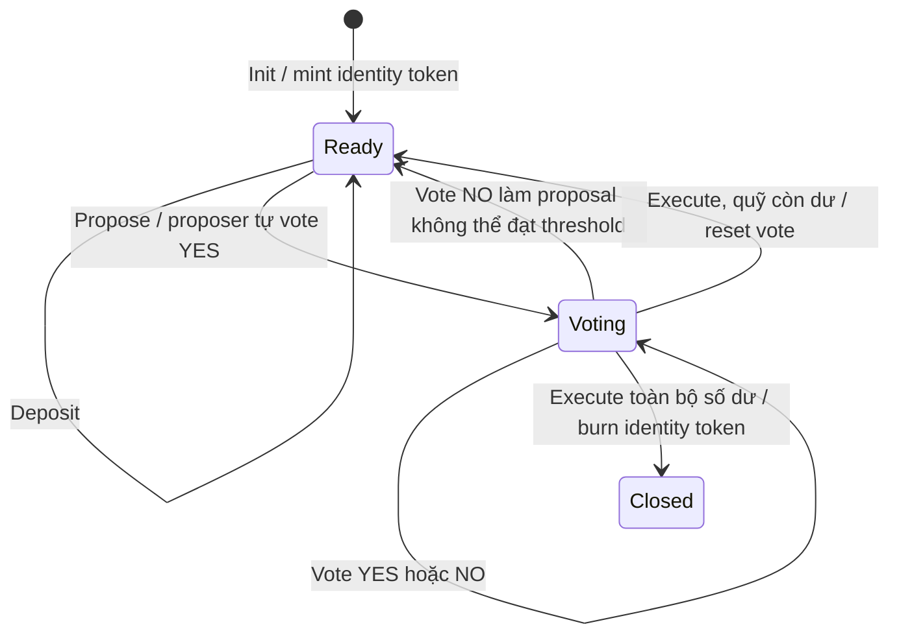
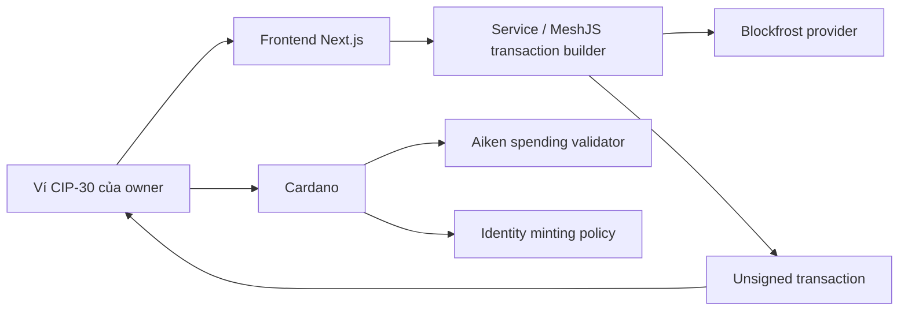

# Bài giảng 1: Tổng quan Multisig Treasury và mô hình EUTxO trên Cardano

> **Khóa học:** Lập trình Smart Contract trên Cardano với Aiken  
> **Module 5:** Multisig Treasury (Quỹ chung đa chữ ký)

---

## Mục lục

1. [Bài toán quản lý quỹ chung](#1-bài-toán-quản-lý-quỹ-chung)
2. [Mô hình M-of-N và vai trò các bên](#2-mô-hình-m-of-n-và-vai-trò-các-bên)
3. [Treasury dưới góc nhìn EUTxO](#3-treasury-dưới-góc-nhìn-eutxo)
4. [Vòng đời một proposal](#4-vòng-đời-một-proposal)
5. [Kiến trúc ba lớp của dApp](#5-kiến-trúc-ba-lớp-của-dapp)
6. [Ranh giới tin cậy và các giới hạn](#6-ranh-giới-tin-cậy-và-các-giới-hạn)
7. [Tổng kết và câu hỏi tư duy](#7-tổng-kết-và-câu-hỏi-tư-duy)

---

## 1. Bài toán quản lý quỹ chung

Một tổ chức, nhóm phát triển hoặc DAO thường cần nhiều người cùng kiểm soát ngân quỹ. Nếu quỹ nằm trong một ví đơn chữ ký, một khóa riêng bị mất hoặc bị lộ có thể khiến toàn bộ tài sản gặp rủi ro.

Multisig Treasury thay đổi quy tắc chi tiêu: một giao dịch chỉ được giải ngân sau khi đạt đủ số owner chấp thuận. Ví dụ quỹ 2-of-3 có ba owner, nhưng cần tối thiểu hai phiếu YES để thực hiện một khoản chi.

| Mô hình | Ý nghĩa                           | Hạn chế chính                                    |
| :------ | :-------------------------------- | :----------------------------------------------- |
| 1-of-1  | Một khóa có toàn quyền chi        | Điểm lỗi tập trung                               |
| 2-of-3  | Hai trong ba owner phải thông qua | Cần phối hợp và quản lý proposal                 |
| 3-of-5  | Ba trong năm owner phải thông qua | Tăng khả năng chịu lỗi, nhưng quy trình chậm hơn |

Trong dự án này, một owner tạo proposal gồm địa chỉ nhận và số lovelace. Khi tạo proposal, chữ ký của người đề xuất đồng thời được ghi nhận là phiếu YES đầu tiên.

## 2. Mô hình M-of-N và vai trò các bên

- **Owner:** Chủ thể có Verification Key Hash nằm trong danh sách `owners`. Owner có thể tạo proposal và bỏ phiếu.
- **Proposer:** Owner mở proposal. Theo logic hiện tại, proposer tự động ghi nhận phiếu YES khi proposal được tạo.
- **Voter:** Owner bỏ một phiếu YES hoặc NO cho proposal đang mở. Mỗi owner chỉ được vote một lần cho mỗi proposal.
- **Executor:** Người gửi giao dịch `Execute` sau khi đủ phiếu YES. Người execute không cần là người vote cuối cùng; quyền hợp lệ được quyết định bởi validator và trạng thái on-chain.
- **Recipient:** Địa chỉ nhận tiền được cố định trong proposal.

Hai tham số quan trọng được lưu trong treasury datum:

- `threshold`: số phiếu YES tối thiểu để execute.
- `allowance`: số lovelace tối đa được phép xin cho mỗi proposal. Đây là hạn mức mỗi lần chi, không phải số tiền tối đa có thể nạp vào quỹ.

Nếu có $N$ owner, ngưỡng $M$ cần thỏa $1 \le M \le N$. Factory kiểm tra `threshold > 0`, danh sách owner không trùng lặp và số owner ít nhất bằng threshold khi khởi tạo.

## 3. Treasury dưới góc nhìn EUTxO

Cardano dùng mô hình EUTxO: tài sản và datum được giữ trong các output chưa tiêu. Khi thay đổi trạng thái treasury, giao dịch tiêu UTxO cũ và tạo UTxO mới tại cùng script address. Validator kiểm tra mối quan hệ giữa trạng thái trước và sau.

Treasury UTxO giữ:

1. Lovelace cùng identity token; invariant hiện tại không cho phép native asset khác trong treasury UTxO.
2. Một identity token duy nhất dùng để nhận diện đúng treasury.
3. Inline datum chứa policy ID, owners, threshold, allowance, proposal và hai danh sách phiếu.

Mô hình datum khái quát:

```aiken
pub type Datum {
  policy_id: PolicyId,
  owners: List<VerificationKeyHash>,
  threshold: Int,
  allowance: Int,
  signers: List<VerificationKeyHash>,
  no_signers: List<VerificationKeyHash>,
  proposal: Option<Proposal>,
}

pub type Proposal {
  recipient: Address,
  amount: Int,
}
```

`signers` là các owner đã vote YES; `no_signers` là các owner đã vote NO. Hai danh sách thuộc về proposal hiện tại và được reset khi proposal được thực thi hoặc bị hủy do không thể đạt threshold.

Identity token được tạo bởi minting policy kiểu one-shot. Off-chain có thể dùng policy ID và asset name để tìm treasury UTxO, nhưng quyền kiểm soát tài sản vẫn nằm ở spending validator.

## 4. Vòng đời một proposal



### Khởi tạo và nạp tiền

`Init` tạo identity token và treasury UTxO kèm datum ban đầu. `Deposit` tiêu treasury UTxO rồi tạo state UTxO mới với cùng datum, identity token và số lovelace tăng lên.

### Tạo và bỏ phiếu cho proposal

`Propose` chỉ hợp lệ khi chưa có proposal đang mở. Proposer phải là owner và chữ ký phải thực sự nằm trong `tx.extra_signatories`. Số tiền phải dương, không vượt allowance và không vượt số dư treasury.

Khi vote NO, contract xét số phiếu YES tối đa còn có thể đạt:

$$\text{YES tối đa} = \text{số owners} - \text{số phiếu NO sau lần vote này}$$

Nếu giá trị đó nhỏ hơn threshold, proposal được xóa ngay trong giao dịch vote NO; không cần hành động hủy riêng.

### Thực thi

`Execute` yêu cầu đủ phiếu YES, thanh toán đúng số lovelace đến đúng recipient và tuân thủ allowance. Nếu treasury còn tiền, continuing output giữ số dư còn lại và reset proposal/vote. Nếu proposal chi hết số dư, giao dịch không tạo continuing treasury output và phải burn identity token để đóng quỹ.

## 5. Kiến trúc ba lớp của dApp



- **On-chain, Aiken:** Kiểm tra quyền owner, chữ ký, ngưỡng, state transition, số tiền và identity token.
- **Off-chain, TypeScript/MeshJS:** Tìm UTxO, đọc datum, tạo datum/redeemer, dựng giao dịch và yêu cầu ví ký.
- **Frontend, Next.js:** Hiển thị quỹ, proposal, phiếu và cung cấp thao tác cho owner.
- **Provider:** Truy vấn blockchain và gửi giao dịch. Provider cung cấp dữ liệu/kết nối, không thay thế việc xác thực của validator.

Luồng giao dịch thông thường là: frontend yêu cầu dựng giao dịch → off-chain tạo unsigned transaction → ví owner ký → giao dịch được submit → UI truy vấn lại state mới.

## 6. Ranh giới tin cậy và các giới hạn

- Frontend có thể ẩn hoặc hiện nút theo owner, nhưng đó chỉ là tiện ích UX. Validator vẫn phải xác minh chữ ký và quyền owner.
- Danh sách `signers` trong datum là trạng thái đã xác thực bởi validator, không phải một danh sách do giao diện tự tin tưởng.
- EUTxO là tài nguyên tiêu một lần: hai giao dịch cùng dùng một treasury UTxO sẽ cạnh tranh; chỉ giao dịch được đưa vào chain trước mới tiêu được state đó. Owner cần làm mới dữ liệu nếu giao dịch báo UTxO đã bị tiêu.
- Bản hiện tại giới hạn treasury vào lovelace và identity token; native asset khác chưa được hỗ trợ. Muốn mở rộng cần sửa invariant kiểm tra value, logic execute và kiểm thử conservation/payment.
- Đây là ứng dụng giáo dục/testnet. Trước khi dùng tài sản thật cần audit validator, policy, builder, giới hạn phí, chính sách nâng cấp và quy trình khôi phục.

## 7. Tổng kết và câu hỏi tư duy

### Tóm tắt

1. Multisig thay quyền chi từ một khóa đơn lẻ bằng ngưỡng biểu quyết của nhiều owner.
2. Proposal và phiếu được biểu diễn bằng datum trong treasury UTxO; mỗi cập nhật là một state transition mới.
3. Identity token giúp định danh treasury; spending validator vẫn là nơi quyết định giao dịch có hợp lệ hay không.
4. `threshold` đặt số phiếu YES tối thiểu, còn `allowance` đặt hạn mức cho từng proposal.

### Câu hỏi tư duy

1. Với quỹ 2-of-3, điều gì xảy ra nếu một owner mất khóa? Điều gì xảy ra nếu hai owner không thể phối hợp?
2. Vì sao proposer được ghi nhận YES ngay khi tạo proposal? Rủi ro UX nào xuất hiện nếu owner không đọc kỹ recipient và amount?
3. Tại sao frontend không thể tự quyết định rằng một chữ ký là hợp lệ?
4. Nếu một proposal bị vote NO đến mức không thể đạt threshold, tại sao contract có thể hủy proposal ngay trong giao dịch vote đó?
