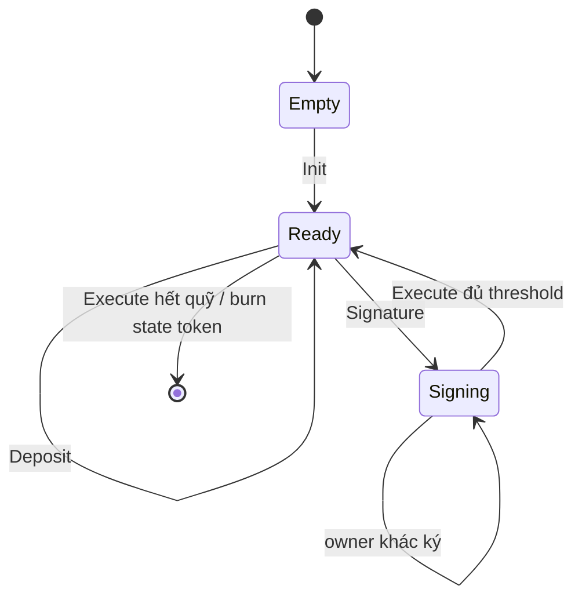

# Module: Multisig Treasury

## Bài 1: Từ single-signature đến M-of-N

Một wallet thông thường yêu cầu một private key. Treasury multisig thay thế giả định đó bằng danh sách `owners` và ngưỡng `threshold`: ví dụ 2 trong 3 owner phải chấp thuận trước khi quỹ chi tiền.

Trên Cardano, chữ ký không phải là một file state lưu trong contract. Mỗi owner ký một transaction; các verification key hash xuất hiện trong `extra_signatories`. Validator đọc chúng rồi chuyển state `signers` sang UTxO mới.

## Bài 2: State machine của treasury

Một proposal thực tế cần chọn `receiver`, sau đó các owner lần lượt gọi `Signature`. Khi đủ threshold, một owner bất kỳ có thể gửi `Execute`; người thực thi không nhất thiết phải là người ký cuối cùng.

## Bài 3: Đọc transaction builder

Off-chain thực hiện các việc mà validator không nên làm: tìm treasury UTxO, giải mã datum, chọn collateral, tạo inline datum và gắn redeemer. Ví ký transaction sau khi builder hoàn tất. `mConStr0`, `mConStr1`, `mConStr2` tương ứng với `Deposit`, `Execute`, `Signature`.

## Bài tập

1. Thử tạo transaction `Signature` với owner đã ký và quan sát validator từ chối.
2. Thử thay đổi receiver trong continuing output.
3. Dựng proposal 2-of-3, lần lượt ký bằng hai ví và execute allowance.
4. Bổ sung kiểm tra native asset trong nhánh execute nếu muốn hỗ trợ treasury đa tài sản.
