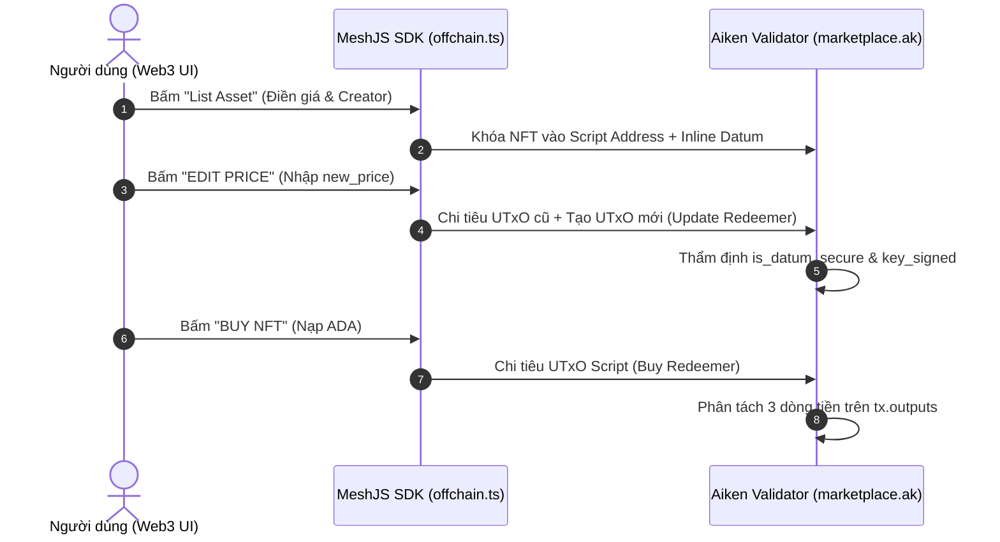

# Lesson Plans / Instructor Notes

## Glossary
| Thuật ngữ (Term) | Định nghĩa (Definition) | Lần đầu xuất hiện |
|------|-----------|-----------------|
| **Parameterized Validator** | Validator nhận các tham số toàn cục khi khởi tạo (vd: ví admin, tỷ lệ phí). | Bài 6.2 |
| **`inputs_at`** | Hàm kiểm tra đếm số lượng UTxO từ một địa chỉ cụ thể bị chi tiêu trong giao dịch. | Bài 6.2 |
| **`value_geq`** | Toán tử kiểm tra giá trị (value) xem có lớn hơn hoặc bằng mức yêu cầu không. | Bài 6.2 |
| **Double Satisfaction** | Lỗ hổng khi kẻ tấn công gom nhiều UTxO vào cùng một transaction để gian lận thanh toán. | Bài 6.2 |
| **Output Validation** | Kỹ thuật thẩm định tính toàn vẹn của Datum và Output mới sinh ra tại Script Address. | Bài 6.2 |

## Module 6: Marketplace Smart Contract

### Bài 6.2: Phân Tích Chi Tiết Mã Nguồn Aiken `marketplace.ak` & Demo UI

**Mục tiêu bài học**: Giúp học viên nắm vững từng dòng code Aiken On-chain trong file `validators/marketplace.ak`, hiểu sâu cách thẩm định dữ liệu trên Cardano EUTxO, giải mã kỹ thuật bảo mật Output Validation, tóm tắt 7 bài Unit Tests và trải nghiệm các nút bấm tương tác trên giao diện Web3.
**Thời lượng dự kiến**: 22 - 25 phút
**Tài liệu & Công cụ**: Source code `marketplace.ak`, Giao diện dApp Next.js.

---

## 1. Khai Báo Cấu Trúc Dữ Liệu (`MarketplaceDatum` & `MarketplaceRedeemer`)

```aiken
pub type MValue =
  Pairs<PolicyId, Pairs<AssetName, Int>>

pub type MarketplaceDatum {
  MarketplaceDatum {
    seller: Address,
    price: Int,
    nft: MValue,
    royalty_recipient: Option<Address>,
    royalty_rate: Int,
  }
}

pub type MarketplaceRedeemer {
  Buy
  Update { new_price: Int }
  Cancel
}
```

---

## 2. Mổ Xẻ Chi Tiết Logic Mã Nguồn Aiken On-Chain (`validators/marketplace.ak`)

### 🟢 1. Hành Động `Buy` (Mua NFT & Phân Tách 3 Dòng Tiền)

#### 📝 Code Snippet Nhánh `Buy`:

```aiken
validator marketplace(owner: Address, platform_fee_rate: Int) {
  spend(
    datum_opt: Option<MarketplaceDatum>,
    redeemer: MarketplaceRedeemer,
    input: OutputReference,
    tx: Transaction,
  ) {
    expect Some(datum) = datum_opt

    when redeemer is {
      Buy -> {
        expect Some(own_input) = find_input(tx.inputs, input)
        let own_address = own_input.output.address

        // a. Chống lỗi Double Satisfaction
        let is_only_one_input_from_script =
          when inputs_at(tx.inputs, own_address) is {
            [_] -> True
            _ -> False
          }

        // b. Tính toán 3 khoản tiền
        let royalty_amount = datum.price * datum.royalty_rate / 10000
        let platform_fee_amount = datum.price * platform_fee_rate / 10000
        let seller_amount = datum.price - royalty_amount - platform_fee_amount

        // c. Kiểm tra tiền gửi về ví Seller
        let is_seller_paid =
          get_all_value_to(tx.outputs, datum.seller)
            |> value_geq(from_lovelace(seller_amount))

        // d. Kiểm tra Phí Sàn gửi về ví Admin Owner
        let is_platform_paid =
          if platform_fee_amount > 0 {
            get_all_value_to(tx.outputs, owner)
              |> value_geq(from_lovelace(platform_fee_amount))
          } else {
            True
          }

        // e. Kiểm tra Phí Bản Quyền gửi về ví Creator
        let is_royalty_paid =
          when datum.royalty_recipient is {
            Some(creator) ->
              if royalty_amount > 0 {
                get_all_value_to(tx.outputs, creator)
                  |> value_geq(from_lovelace(royalty_amount))
              } else {
                True
              }
            None -> True
          }

        is_only_one_input_from_script && is_seller_paid && is_platform_paid && is_royalty_paid
      }
```

#### 🔍 Phân Tích Chi Tiết Logic Hành Động `Buy`:
1. **Phòng chống Lỗ hổng Double Satisfaction (`is_only_one_input_from_script`)**:
   - Hàm `inputs_at(tx.inputs, own_address)` đếm toàn bộ UTxO từ địa chỉ Script bị chi tiêu trong cùng giao dịch.
   - Bằng cách dùng pattern matching `[_]`, hợp đồng bắt buộc mỗi giao dịch `Buy` chỉ được chi tiêu **duy nhất 1 UTxO từ Script**. 
   - Nếu hacker gom 2 UTxO niêm yết NFT vào 1 giao dịch nhưng chỉ nạp tiền đủ cho 1 NFT, điều kiện này sẽ trả về `False` và hủy giao dịch ngay lập tức.
2. **Tính toán phân tách dòng tiền theo Basis Points**:
   - `royalty_amount`: Phí tác giả = `datum.price * datum.royalty_rate / 10000` (vd: `500` = `5%`).
   - `platform_fee_amount`: Phí sàn = `datum.price * platform_fee_rate / 10000` (vd: `200` = `2%`).
   - `seller_amount`: Số tiền thực nhận của ví người bán = `datum.price - royalty_amount - platform_fee_amount`.
3. **Thẩm định 3 khoản thanh toán trên `tx.outputs`**:
   - `is_seller_paid`: Sử dụng `get_all_value_to(tx.outputs, datum.seller)` cộng dồn tất cả ADA gửi về địa chỉ `datum.seller` và dùng `value_geq(from_lovelace(seller_amount))` đảm bảo người bán nhận đủ tiền net.
   - `is_platform_paid`: Thẩm định nếu `platform_fee_amount > 0` thì địa chỉ `owner` (Admin Sàn) phải nhận đủ phí sàn.
   - `is_royalty_paid`: Kiểm tra nếu `datum.royalty_recipient` mang giá trị `Some(creator)` và `royalty_amount > 0`, transaction bắt buộc phải chuyển đủ phí bản quyền về ví `creator`.

---

### 🟡 2. Hành Động `Update` (Cập Nhật Giá Niêm Yết & Output Validation)

#### 📝 Code Snippet Nhánh `Update`:

```aiken
      Update { new_price } -> {
        // a. Bắt buộc có chữ ký của Seller
        expect Some(seller_pkh) = address_pub_key(datum.seller)
        let is_signed_by_seller = key_signed(tx.extra_signatories, seller_pkh)

        // b. Truy xuất Output gửi về lại Script Address
        expect Some(own_input) = find_input(tx.inputs, input)
        let script_address = own_input.output.address
        expect Some(output) =
          list.find(tx.outputs, fn(out) { out.address == script_address })

        // c. Bóc tách và ép kiểu InlineDatum mới
        expect InlineDatum(raw_datum) = output.datum
        expect output_datum: MarketplaceDatum = raw_datum

        // d. Output Validation: Đảm bảo chỉ có price thay đổi, dữ liệu khác giữ nguyên
        let is_datum_secure =
          output_datum.seller == datum.seller &&
          output_datum.nft == datum.nft &&
          output_datum.royalty_recipient == datum.royalty_recipient &&
          output_datum.royalty_rate == datum.royalty_rate &&
          output_datum.price == new_price

        is_signed_by_seller && is_datum_secure
      }
```

#### 🔍 Phân Tích Chi Tiết Logic Hành Động `Update`:
1. **Xác thực chữ ký hợp lệ của người bán (`is_signed_by_seller`)**:
   - Trích xuất `seller_pkh` từ `datum.seller` bằng `address_pub_key(datum.seller)`.
   - Dùng `key_signed(tx.extra_signatories, seller_pkh)` kiểm tra chữ ký số của ví người bán trong danh sách ký của giao dịch.
2. **Kỹ thuật Output Validation triệt hạ lỗ hổng Price & Address Manipulation**:
   - Bản chất hành động `Update` trên EUTxO là chi tiêu UTxO cũ tại Script và tạo ra một UTxO mới đính kèm Inline Datum mới tại chính Script Address đó.
   - `list.find(tx.outputs, ...)` tìm Output mới sinh ra có địa chỉ trùng khớp với `script_address`.
   - Ép kiểu `output.datum` về `MarketplaceDatum`.
   - Biến `is_datum_secure` kiểm tra tính toàn vẹn dữ liệu:
     - `output_datum.seller == datum.seller`: Địa chỉ nhận tiền người bán PHẢI giữ nguyên 100%.
     - `output_datum.nft == datum.nft`: Danh sách NFT PHẢI giữ nguyên, không bị rút bớt tài sản.
     - `output_datum.royalty_recipient` & `royalty_rate`: Thông tin tác giả PHẢI giữ nguyên.
     - `output_datum.price == new_price`: Thông số duy nhất ĐƯỢC PHÉP THAY ĐỔI chính là mức giá mới khớp với `new_price` truyền trong Redeemer.
   - *Ý nghĩa bảo mật*: Ngăn chặn hoàn toàn kịch bản Hacker can thiệp tráo địa chỉ `seller` thành ví Hacker khi người bán thao tác Edit Price.

---

### 🔴 3. Hành Động `Cancel` (Hủy Niêm Yết Rút NFT)

#### 📝 Code Snippet Nhánh `Cancel`:

```aiken
      Cancel -> {
        expect Some(seller_pkh) = address_pub_key(datum.seller)
        key_signed(tx.extra_signatories, seller_pkh)
      }
    }
  }

  else(_) {
    fail
  }
}
```

#### 🔍 Phân Tích Chi Tiết Logic Hành Động `Cancel`:
1. **Kiểm duyệt quyền sở hữu thông qua chữ ký số**:
   - Trích xuất `seller_pkh` từ `datum.seller`.
   - Kiểm tra `key_signed(tx.extra_signatories, seller_pkh)`. Chỉ duy nhất địa chỉ ví đã niêm yết bán NFT mới có quyền hủy lệnh niêm yết.
2. **Cơ chế giải phóng UTxO**:
   - Khi điều kiện chữ ký thỏa mãn, Smart Contract mở khóa UTxO.
   - Giao dịch Off-chain tự động thu hồi NFT và tiền min-UTxO hoàn trả về ví cá nhân của Seller.

---

## 3. Ma Trận 7 Bài Unit Test On-Chain (`aiken check`)

| Tên Bài Test | Kịch Bản Thử Nghiệm On-Chain | Trạng Thái Mong Đợi |
| :--- | :--- | :--- |
| `buy_success` | Người mua thanh toán đầy đủ 3 khoản ADA hợp lệ. | `ok` (PASS) |
| `buy_fail_insufficient_seller_amount` | Người mua nạp thiếu tiền cho Seller. | `fail` (REJECT) |
| `buy_fail_insufficient_platform_fee` | Giao dịch gian lận thiếu Phí Sàn Admin. | `fail` (REJECT) |
| `update_price_success` | Seller cập nhật giá niêm yết đúng quy định Output Validation. | `ok` (PASS) |
| `update_price_fail_changed_seller` | Hacker can thiệp tráo ví Seller trong Datum mới khi Update. | `fail` (REJECT) |
| `cancel_success` | Seller xuất trình đúng chữ ký để hủy niêm yết thành công. | `ok` (PASS) |
| `cancel_fail_unsigned` | Kẻ gian tự ý hủy niêm yết không có chữ ký của Seller. | `fail` (REJECT) |

---

## 4. Quy Trình Ánh Xạ Giữa Smart Contract & Thao Tác UI Next.js


