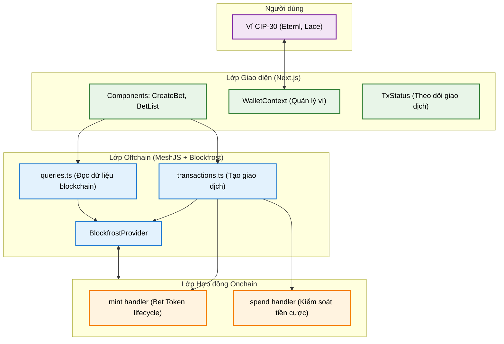
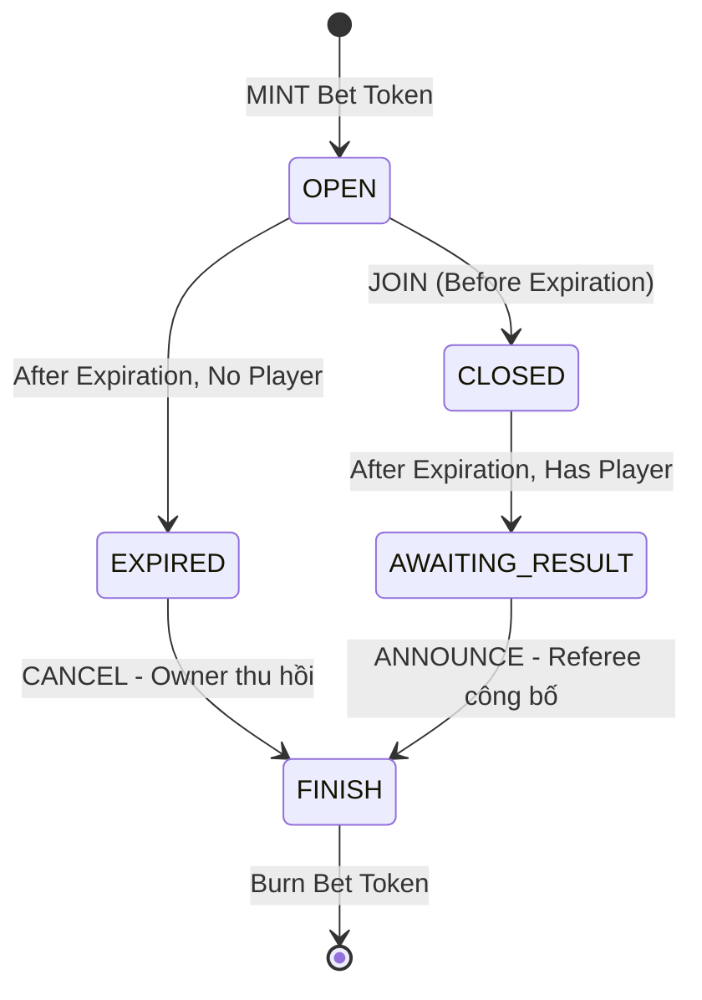

# Kiến trúc Tổng quát Hệ thống (System Architecture)

Tài liệu này cung cấp cái nhìn tổng quan về kiến trúc của hệ thống Cardano Betting dApp, bao gồm ba thành phần chính: Frontend, Off-chain và On-chain.

## 1. Sơ đồ Kiến trúc Mức cao (High-Level Architecture)



Hệ thống được tổ chức thành **monorepo** gồm 3 package độc lập. Mỗi layer có trách nhiệm rõ ràng và chỉ giao tiếp với layer liền kề:

| Package | Công nghệ | Trách nhiệm |
|---|---|---|
| `onchain/` | Aiken (Plutus V3) | Định nghĩa luật hợp lệ, biên dịch ra Plutus CBOR |
| `offchain/` | TypeScript, MeshJS | Đọc blockchain, tạo & ký giao dịch |
| `frontend/` | Next.js, Tailwind CSS V4 | Giao diện người dùng, kết nối ví |

## 2. Lớp Giao diện (Frontend)

Frontend được phát triển bằng **Next.js** (App Router) và **Tailwind CSS V4**.

### 2.1 Cấu trúc thư mục

```
frontend/src/
├── app/
│   └── page.tsx              # Entry point
├── components/
│   ├── BetList.tsx          # Hiển thị danh sách bet, xử lý JOIN/ANNOUNCE/CANCEL
│   ├── CreateBet.tsx        # Form tạo bet mới
│   └── TxStatus.tsx        # Hiển thị trạng thái giao dịch
├── context/
│   └── WalletContext.tsx    # Quản lý kết nối ví, địa chỉ
└── config.ts                # Biến môi trường
```

### 2.2 Quản lý Trạng thái Giao dịch Bất đồng bộ

Cardano không xác nhận giao dịch ngay lập tức sau khi submit. `TxStatus.tsx` chia quá trình thành các trạng thái cụ thể:

```
building → signing → submitting → confirming → success
                                       ↓ (sau 2 phút chuỗi chưa xác nhận)
                                   submitted
```

- `building`: Off-chain đang gom UTxO và xây dựng giao dịch.
- `signing`: Chờ người dùng ký qua ví CIP-30.
- `submitting`: Đang gửi lên mạng lưới qua Blockfrost.
- `confirming`: Polling Blockfrost mỗi 5 giây, tối đa 30 lần (~2.5 phút).
- `submitted`: Giao dịch đã được gửi nhưng chưa confirm — thông báo người dùng kiểm tra Explorer.
- `success`: Blockfrost xác nhận giao dịch đã có trong block.

### 2.3 Giới thiệu các Component chính

- **`CreateBet.tsx`**: Form giao diện để người dùng tạo bet. Xử lý việc nhập thông tin, gọi logic build transaction và hiển thị tiến trình qua `TxStatus`.
- **`BetList.tsx`**: Component cốt lõi của ứng dụng, hiển thị tất cả các kèo bet đang có trên hệ thống. Nó tự động nhận diện vai trò người dùng (Owner, Player, Referee) để hiển thị các nút tương tác tương ứng.
- **`TxStatus.tsx`**: Một portal/overlay hiển thị trạng thái thời gian thực của giao dịch, giúp người dùng theo dõi từ giai đoạn xây dựng đến khi xác nhận trên blockchain.

## 3. Lớp Off-chain (Off-chain Library)

Thư mục `offchain/src/` gồm các module TypeScript, sử dụng **MeshJS SDK** để tương tác với blockchain.

### 3.1 Cấu trúc thư mục

```
offchain/src/
├── config.ts         # SCRIPT_CBOR, SCRIPT_ADDRESS, POLICY_ID, TOKEN constants
├── types.ts          # BetDatum, ParsedBetDatum type definitions
├── queries.ts        # getAllBets(), parseBetDatum(), fetchBetMessage()
└── transactions.ts   # createBetTx(), joinBetTx(), announceWinnerTx(), cancelBetTx()
```

### 3.2 Vai trò Off-chain trong mô hình Cardano EUTxO

Khác với EVM nơi Smart Contract tự thực thi và thay đổi trạng thái, trên Cardano **Smart Contract chỉ kiểm tra tính hợp lệ** của giao dịch. Toàn bộ logic xây dựng giao dịch — chọn UTxO đầu vào, định hình đầu ra, tính toán giá trị, đính kèm Datum và Redeemer — do Off-chain thực hiện. Nếu Off-chain xây dựng sai, On-chain sẽ từ chối.

### 3.3 Đọc dữ liệu từ Blockchain

`queries.ts` cung cấp hai hàm chính:

- **`getAllBets(provider)`**: Lấy tất cả UTxO tại địa chỉ script, lọc UTxO có chứa Bet Token và có cấu trúc datum hợp lệ, giải mã Datum CBOR thành `ParsedBetDatum`.
- **`fetchBetMessage(betUtxo, datum)`**: Truy xuất nội dung bet từ Transaction Metadata (CIP-20, label `674`). Khi bet đã có người tham gia (player != null), cần truy ngược TxHash của giao dịch CREATE thông qua Blockfrost API.

### 3.4 Các giao dịch cốt lõi (`transactions.ts`)

- **`createBetTx`**: Khởi tạo bet mới. Thực hiện đúc (mint) 1 Bet Token để định danh bet và khóa tiền đặt cược (ADA) vào địa chỉ Script cùng với Datum ban đầu.
- **`joinBetTx`**: Cho phép người chơi thứ hai tham gia bet. Giao dịch tiêu thụ Bet UTxO hiện tại, yêu cầu người chơi nạp thêm ADA bằng lượng chủ kèo đã đặt và cập nhật địa chỉ Player vào Datum của Bet UTxO mới.
- **`announceWinnerTx`**: Giao dịch công bố kết quả của Referee. Dựa trên kết quả, toàn bộ ADA trong quỹ cược được gửi về địa chỉ Winner, đồng thời thực hiện đốt (burn) Bet Token để kết thúc vòng đời bet.
- **`cancelBetTx`**: Cho phép chủ kèo rút tiền cược nếu hết thời hạn mà chưa có ai tham gia. Giao dịch này cũng thực hiện đốt Bet Token.

## 4. Lớp Hợp đồng Thông minh (On-chain)

Validator được viết bằng **Aiken** và biên dịch ra Plutus V3 bytecode. File `onchain/plutus.json` (Plutus Blueprint) được Off-chain tham chiếu qua `config.ts`.

Dự án sử dụng thiết kế **Multi-Purpose Validator** — một validator duy nhất đảm nhiệm cả mint và spend logic, chia sẻ cùng một `policy_id/script_hash`. Chi tiết về các điều kiện kiểm tra của validator được phân tích trong tài liệu [Kiến trúc Smart Contract](./smart-contract-architecture.md).

## 5. Vòng Đời Của một Bet (Bet Lifecycle)

Các quy tắc chuyển đổi trạng thái được kiểm tra và thực thi bởi Aiken Validator. Mốc `Expiration` là yếu tố quyết định trạng thái nào được phép chuyển tiếp.



| Trạng thái | Mô tả | Hành động hợp lệ |
|---|---|---|
| `OPEN` | Bet vừa được tạo, chưa có người tham gia | JOIN (nếu T < Expiration) |
| `CLOSED` | Đã có người tham gia | _(chờ hết hạn)_ |
| `EXPIRED` | Hết hạn, không có người tham gia | CANCEL |
| `AWAITING_RESULT` | Hết hạn, đã có người tham gia | ANNOUNCE_WINNER |
| `FINISH` | Bet kết thúc, Bet Token đã bị đốt | _(terminal)_ |
