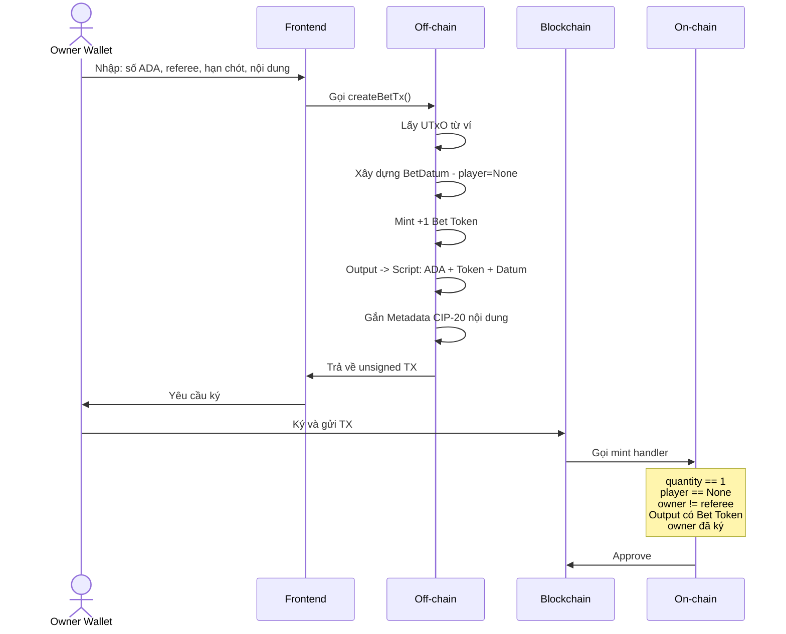
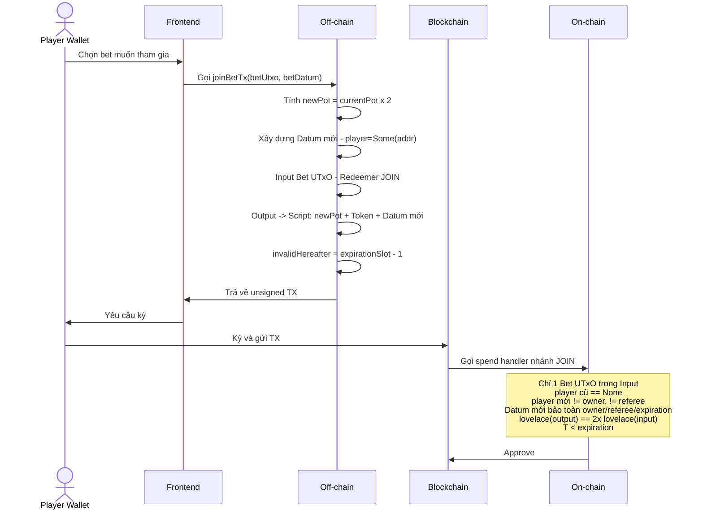
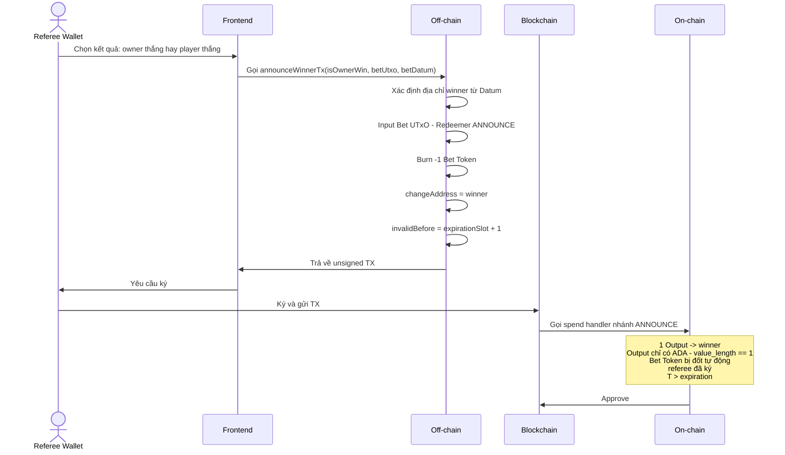
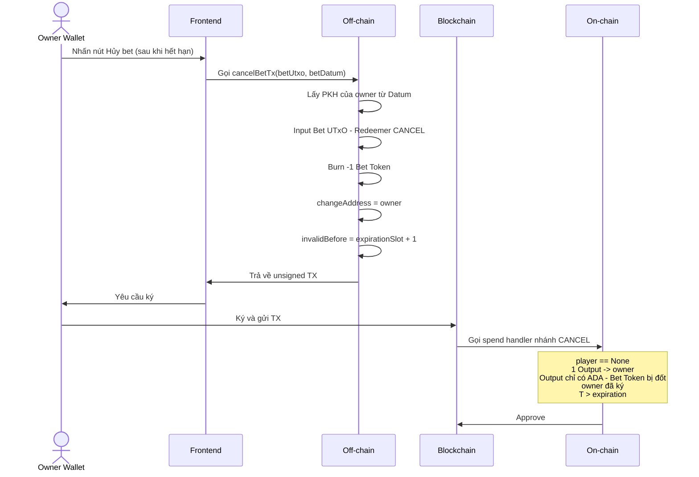
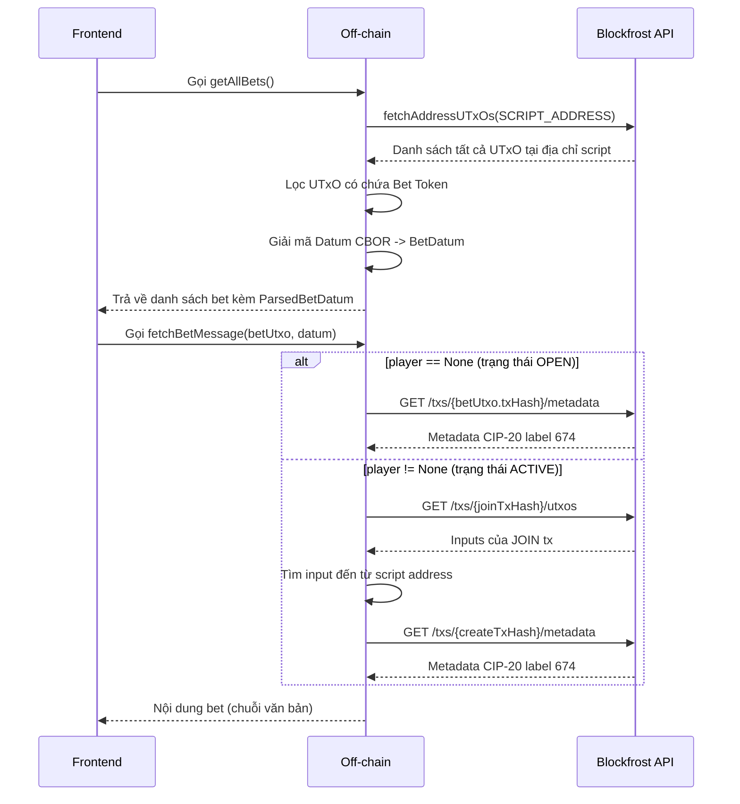

# Kiến trúc Smart Contract & Off-Chain

Tài liệu này phân tích chi tiết logic của hệ thống cá cược phi tập trung, tập trung vào sự tương tác giữa On-chain (Plutus/Aiken) và Off-chain (TypeScript/MeshJS).
---

## 1. Mẫu thiết kế: Multi-Purpose Validator

### 1.1 Hai mô hình thiết kế Smart Contract Cardano phổ biến

Trong hệ sinh thái EUTxO, một quy trình có vòng đời phức tạp (như tạo Token, khóa Token, và chi tiêu/thu hồi) thường được tiếp cận qua hai cách:

**Mô hình hai Validator độc lập**

Mã nguồn được tách thành `Minting Policy` và `Spend Validator` riêng biệt. Hai validator có script hash khác nhau nhưng thường phối hợp trong cùng một giao dịch.

Để thiết lập sự ràng buộc giữa hai validator, một bên sẽ nhận script hash của bên còn lại làm tham số (parameterized). Tuy nhiên sự tham chiếu này chỉ có thể diễn ra **một chiều** — bên A biết bên B, nhưng bên B không thể biết bên A — do ràng buộc vòng tròn khi biên dịch (vấn đề gà-trứng).

**Mô hình Multi-Purpose Validator (Được sử dụng trong dự án)**

Trong hợp đồng `bet.ak`, cả hai logic `mint` và `spend` được định nghĩa trong cùng một validator:

```rust
validator bet {
  mint(_redeemer: Data, policy_id: ByteArray, transaction: Transaction) { ... }
  spend(datum: Option<BetDatum>, action: Action, own_output_ref: OutputReference, transaction: Transaction) { ... }
}
```

Vì cùng chung một validator, `mint` và `spend` có cùng script hash. Đây là lợi ích cốt lõi của thiết kế này: cả hai hành động đều có thể tham chiếu lẫn nhau theo **hai chiều** — `spend` có thể kiểm tra xem `mint` có đang được thực thi trong cùng giao dịch hay không và ngược lại, điều mà mô hình hai validator độc lập không thể thực hiện được.

Ngoài ra, việc triển khai một script duy nhất cũng giúp giảm chi phí lưu trữ reference script trên chain và giảm kích thước giao dịch khi tương tác.

## 2. Cấu trúc Dữ liệu On-chain
### 2.1 BetDatum — Trạng thái của một bet

Toàn bộ dữ liệu quyết định trạng thái của một bet được lưu trong Datum của UTxO tại địa chỉ script.

```rust
pub type BetDatum {
  owner: Address,            // Địa chỉ của người tạo bet
  player: Option<Address>,   // Địa chỉ của người tham gia (None khi khởi tạo)
  referee: Address,          // Địa chỉ của trọng tài phân xử
  expiration: Int,           // Thời hạn của bet (POSIX ms)
}
```

`player = None` đại diện cho trạng thái OPEN (chưa có người tham gia). Khi `player = Some(addr)`, bet ở trạng thái ACTIVE.

### 2.2 Nội dung cược lưu ở đâu?

Nội dung cược dạng văn bản (ví dụ: "Đội A chấp Đội B") không được lưu vào Datum vì sẽ làm tăng kích thước UTxO, ảnh hưởng phí MinUTxO và phí giao dịch.

Dự án sử dụng **Transaction Metadata** theo chuẩn CIP-20. Nội dung được đính kèm vào giao dịch `createBetTx` dưới label `674`. Frontend truy xuất nội dung này thông qua Blockfrost Metadata API bằng TxHash của giao dịch tạo bet.

### 2.3 Định dạng thời gian (`expiration: Int`)

Thời gian được biểu diễn dưới dạng POSIX Time Milliseconds. Aiken thực hiện phép so sánh với `validity_range` của giao dịch:
- JOIN: `valid_before(validity_range, expiration)` — đảm bảo tham gia trước hạn.
- CANCEL / ANNOUNCE: `valid_after(validity_range, expiration)` — đảm bảo thực thi sau hạn.

### 2.4 Action — Redeemer điều hướng logic

```rust
pub type Action {
  JOIN
  ANNOUNCE_WINNER { is_owner_win: Bool }
  CANCEL
}
```

Khi Off-chain gửi giao dịch spend, Redeemer chứa Action tương ứng để On-chain biết cần thực thi nhánh logic nào.

---

## 3. Tương tác On-chain & Off-chain theo từng giao dịch

### 3.1 Tạo bet (CREATE)



**Vai trò Off-chain (hàm `createBetTx`):**
- Tạo BetDatum theo định dạng Plutus Data dùng hàm `buildBetDatum()`.
- Gắn `requiredSignerHash` của owner để validator kiểm tra chữ ký.
- Đính kèm metadata CIP-20 label `674` chứa nội dung bet.
- Chỉ định Output tới địa chỉ script với đúng lượng ADA và 1 Bet Token.

**Vai trò On-chain (mint handler):**
- Kiểm tra quantity của token vừa đúc đúng bằng `1`.
- Đảm bảo chỉ có đúng 1 Output gửi về địa chỉ script (Bet UTxO).
- Đọc Datum từ Output đó, kiểm tra `player == None` và `owner != referee`.
- Xác nhận Bet UTxO chứa đúng Bet Token được đúc trong cùng giao dịch.
- Yêu cầu chữ ký của owner (Payment Key Hash từ Datum.owner).

---

### 3.2 Tham gia bet (JOIN)



**Vai trò Off-chain (hàm `joinBetTx`):**
- Đọc `currentPot` từ UTxO và tính `newPot = currentPot * 2n`.
- Build Datum cập nhật với `player = Some(playerAddr)`.
- Thiết lập `invalidHereafter = expirationSlot - 1` để giao dịch không thể được submit sau hạn chót.
- Player phải bỏ thêm đúng `currentPot` ADA vào giao dịch (MeshJS tự chọn từ UTxO của ví).

**Vai trò On-chain (spend handler - nhánh JOIN):**
- Kiểm tra chỉ có đúng 1 Input đến từ địa chỉ script để chống Double Satisfaction.
- Xác nhận `player` cũ trong Datum là `None` (ghế chưa có người).
- Kiểm tra `player` mới không trùng với `owner` hoặc `referee`.
- Xác nhận Datum mới bảo toàn nguyên vẹn các trường `owner`, `referee`, `expiration`.
- Kiểm tra `lovelace(output) == 2 * lovelace(input)` để bảo đảm pot được nạp đủ.
- Xác nhận thời điểm giao dịch nằm trước `expiration` (dùng `validity_range`).

---

### 3.3 Công bố kết quả (ANNOUNCE_WINNER)



**Vai trò Off-chain (hàm `announceWinnerTx`):**
- Đọc địa chỉ `referee` và `owner/player` từ ParsedBetDatum (đọc từ on-chain Datum), **không** đọc từ Change Address của ví — đây là điểm quan trọng để hỗ trợ ví HD Multi-address.
- Thiết lập `changeAddress = winnerAddress` giúp MeshJS tự động routing toàn bộ ADA còn lại về Winner.
- Burn `-1` Bet Token — On-chain kiểm tra điều kiện `value_length == 1` để đảm bảo đầu ra duy nhất chỉ chứa ADA.
- Thiết lập `invalidBefore = expirationSlot + 1` để giao dịch không thể submit trước hạn.

**Vai trò On-chain (spend handler - nhánh ANNOUNCE_WINNER):**
- Kiểm tra đúng 1 Output duy nhất trong toàn bộ giao dịch (`expect [output] = transaction.outputs`).
- Xác nhận Output này gửi đến đúng địa chỉ của winner (lấy từ Datum dựa vào `is_owner_win`).
- Kiểm tra `value_length(output.value) == 1`, tức là Output chỉ chứa ADA
- Yêu cầu chữ ký của `referee` (lấy Payment Key Hash từ `Datum.referee`).
- Xác nhận thời điểm giao dịch nằm sau `expiration` (dùng `validity_range`).

---

### 3.4 Hủy bet (CANCEL)



**Vai trò Off-chain (hàm `cancelBetTx`):**
- Đọc địa chỉ `owner` trực tiếp từ ParsedBetDatum, không dùng Change Address — tương tự `announceWinnerTx`, để hỗ trợ HD wallet.
- Thiết lập `changeAddress = betDatumData.ownerAddress` để ADA hoàn về đúng ví người tạo bet.
- Thiết lập `invalidBefore = expirationSlot + 1` để đảm bảo chỉ thực hiện được sau khi hết hạn.

**Vai trò On-chain (spend handler - nhánh CANCEL):**
- Kiểm tra `player == None` để đảm bảo chưa có người tham gia (không thể hủy khi đã ghép cặp).
- Kiểm tra đúng 1 Output duy nhất gửi ADA về `owner`.
- Yêu cầu chữ ký của `owner` (lấy Payment Key Hash từ `Datum.owner`).
- Xác nhận thời điểm giao dịch nằm sau `expiration` (dùng `validity_range`).

---

### 3.5 Truy xuất dữ liệu (Đọc danh sách Bet)

Ngoài việc tạo và thực thi giao dịch, Off-chain còn đảm nhiệm thêm luồng **đọc dữ liệu** từ blockchain để hiển thị danh sách bet lên giao diện. Luồng này không yêu cầu ký hay submit giao dịch, chỉ cần gọi API của Blockfrost.



**`getAllBets`:**
- Gọi `provider.fetchAddressUTxOs(SCRIPT_ADDRESS)` để lấy toàn bộ UTxO tại địa chỉ script.
- Lọc lấy các UTxO có chứa Bet Token (`POLICY_ID + TOKEN_NAME_HEX`) và datum đúng định dạng để loại bỏ UTxO rác.
- Với mỗi UTxO hợp lệ, gọi `parseDatumCbor()` để giải mã Plutus Data CBOR thành `BetDatum`.
- Gọi `parseBetDatum()` để chuyển đổi các trường `PubKeyAddress` sang địa chỉ bech32 (`serializeAddressObj`) phục vụ hiển thị và so sánh.

**`fetchBetMessage`:**

Nội dung bet không nằm trên Datum mà nằm trong Metadata của giao dịch CREATE. Tuy nhiên UTxO hiện tại có thể là output của giao dịch JOIN (khi đã có người tham gia), nên cần xác định đúng TxHash của giao dịch CREATE trước khi đọc Metadata:

- Nếu `datum.player == null`: UTxO hiện tại là output của CREATE → đọc Metadata trực tiếp từ `betUtxo.input.txHash`.
- Nếu `datum.player != null`: UTxO hiện tại là output của JOIN → truy ngược qua Blockfrost API (`/txs/{joinTxHash}/utxos`) để tìm Input đến từ địa chỉ script, từ đó lấy được TxHash của giao dịch CREATE ban đầu.

---


## 4. Các quyết định thiết kế
### 4.1 `JOIN` — Chống Double Satisfaction

**Vấn đề:** Kẻ tấn công có thể gom nhiều Bet UTxO (có datum giống nhau) vào cùng một giao dịch để thỏa mãn toàn bộ các bet này bằng 1 đầu ra duy nhất.

**Giải pháp trên On-chain:**
```rust
let join_only_one_bet =
    list.count(inputs, fn(input) { input.output.address == own_input.output.address }) == 1
```
Đếm số Input đến từ địa chỉ script. Nếu có nhiều hơn 1, giao dịch bị từ chối.

### 4.2 Đốt Bet Token và đối tượng trả phí giao dịch

**Vấn đề:** Khi bet kết thúc, Referee/Owner có thể giữ lại token để dùng cho mục đích khác. Do đó Bet Token cần được đốt sau khi kết thúc bet.

**Giải pháp trên On-chain:**
```rust
expect [output_to_winner] = transaction.outputs
...
value_length(output_to_winner.value) == 1
```
Thay vì kiểm tra trường `mint`, ta kiểm tra số lượng output và giá trị của output đó. Giao dịch kết thúc bet (ANNOUNCE_WINNER và CANCEL) chỉ cho phép một Output duy nhất và chỉ chứa ADA. Vì giao dịch tiêu thụ Bet Token từ Input nhưng không có Output nào chứa nó, theo quy tắc bảo toàn giá trị của EUTxO, cách duy nhất để cân bằng giao dịch là burn token đó (`mint = -1`).

Phương án kiểm tra này cũng xuất phát từ một lý do khác: phí giao dịch trên Cardano không cố định và chỉ được xác định tại thời điểm build TX. Nếu validator kiểm tra cứng giá trị Output (ví dụ phải bằng giá trị `pot` ở thời điểm công bố), thì phí giao dịch bắt buộc phải trích từ ví của Referee (người ký giao dịch). Bằng cách chỉ ràng buộc một Output duy nhất và set `changeAddress = winner`, MeshJS sẽ tự động tính toán và routing toàn bộ số ADA còn lại (sau phí) về địa chỉ người thắng. Kết quả là phí giao dịch được khấu trừ từ chính quỹ cược, không phải từ ví của Referee.

Cách tiếp cận này cũng mở ra khả năng gộp nhiều giao dịch ANNOUNCE_WINNER hoặc CANCEL vào cùng 1 TX. Hãy thử sức với bài tập này trong phần thực hành.

### 4.3 Xác thực chữ ký từ Datum, không từ Change Address

Ở `announceWinnerTx` và `cancelBetTx`, khóa yêu cầu ký được lấy từ địa chỉ lưu trong Datum:

```typescript
const refereePkh = resolvePaymentKeyHash(betDatumData.refereeAddress); // ← từ Datum
// Không phải:
// const refereePkh = resolvePaymentKeyHash(await wallet.getChangeAddress());
```

Điều này đảm bảo tính đúng đắn khi người dùng dùng ví ở chế độ multi-address có nhiều địa chỉ con — Change Address hiện tại của ví có thể khác với địa chỉ đã đăng ký trong Datum.
