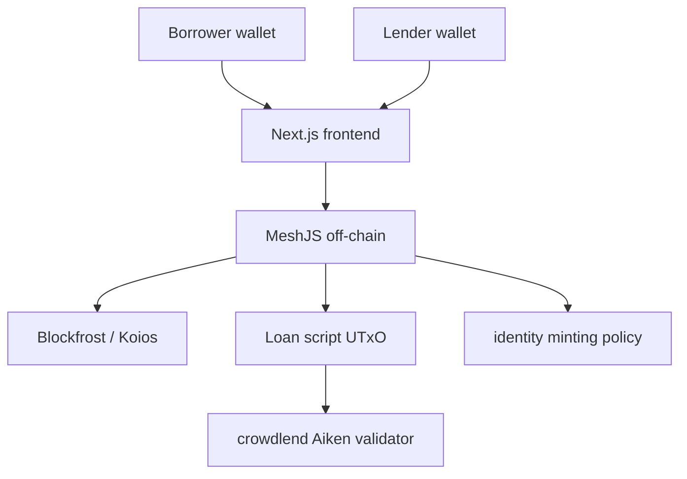

# Kiến trúc Tổng thể (System Architecture)

P2P Lending là dApp nối borrower và lender bằng một loan UTxO. UTxO giữ principal và collateral, còn datum lưu điều khoản vay cùng trạng thái hiện tại.

## 1. Kiến trúc 3 lớp



Frontend hiển thị loan và yêu cầu ký. Off-chain tìm loan UTxO, tạo validity range và các output cho borrower/lender. Validator là nơi kiểm tra quyền ký, trạng thái, số tiền và thời gian.

## 2. Mô hình dữ liệu

```text
Datum {
  borrower, lender?, principal, interest_rate,
  loan_duration, due_date?, collateral_policy_id,
  collateral_asset_name, status
}
```

Collateral trong bản demo là một native asset xác định bởi `collateral_policy_id` và `collateral_asset_name`. `Pending` chưa có lender; `Active` có `funded_at` và `due_date`.

## 3. Luồng nghiệp vụ

1. Borrower tạo loan: mint state token, khóa collateral và tạo datum `Pending`.
2. Lender fund: gửi principal, ký giao dịch; datum chuyển sang `Active` và tính `due_date`.
3. Borrower repay: trước due date, trả principal cộng interest cho lender và nhận collateral.
4. Borrower cancel: khi còn `Pending`, borrower lấy lại collateral.
5. Liquidate: sau due date, lender ký và nhận collateral.

Mỗi hành động đều tiêu loan UTxO hiện tại. Việc cùng lúc fund hoặc repay không tạo double spend vì Cardano chỉ chấp nhận một giao dịch tiêu cùng UTxO.

## 4. Thời gian

Validator dùng `validity_range`, không dùng đồng hồ frontend. Funding lấy `lower_bound` làm thời điểm hiện tại; repayment yêu cầu `lower_bound < due_date`; liquidation yêu cầu `lower_bound > due_date`.
