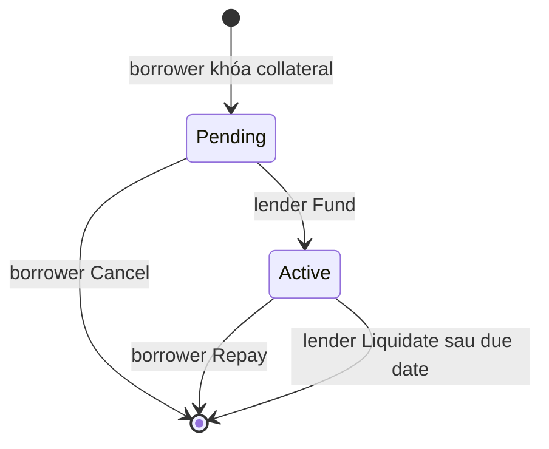

# Module: P2P Lending

## Bài 1: Khoản vay là một state machine

Loan UTxO là nơi giữ tài sản và datum. Không có database trung tâm; trạng thái mới xuất hiện khi giao dịch tiêu UTxO cũ và tạo output hợp lệ.

## Bài 2: Điều khoản và thời gian

`principal` là số tiền vay, `interest_rate` là lãi suất theo basis point, `loan_duration` là khoảng thời gian tính từ lúc funding. `due_date` không nên do borrower tùy ý đặt lại; validator tính nó từ validity range của giao dịch fund.

Validity interval là bằng chứng thời gian mà node dùng để kiểm tra giao dịch. Frontend chỉ giúp chọn slot; nó không thể vượt qua điều kiện on-chain.

## Bài 3: Đọc off-chain builder

Builder tạo state token khi loan mới, khóa collateral, rồi dùng redeemer tương ứng cho `Fund`, `Repay`, `Cancel` hoặc `Liquidate`. Builder cũng phải gắn collateral của ví để Plutus script có thể được đánh giá và yêu cầu đúng signer.

## Bài tập

1. Fund một loan với lender không ký và quan sát lỗi.
2. Thử fund loan đã `Active`.
3. Repay sau due date và so sánh với liquidation.
4. Viết test kiểm tra principal và collateral không bị thay đổi sau funding.
