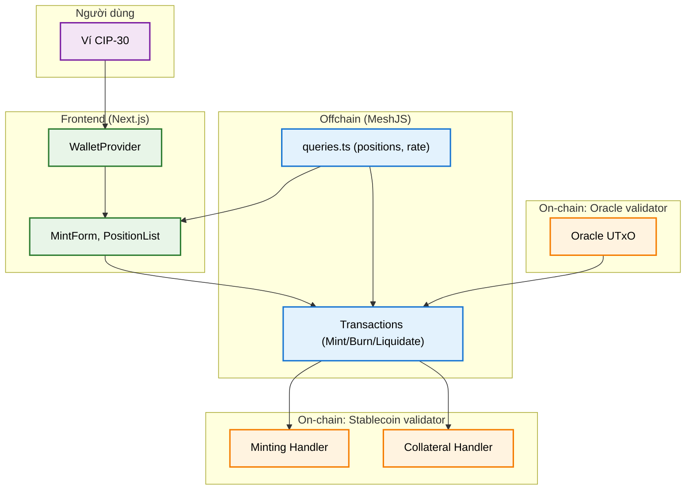
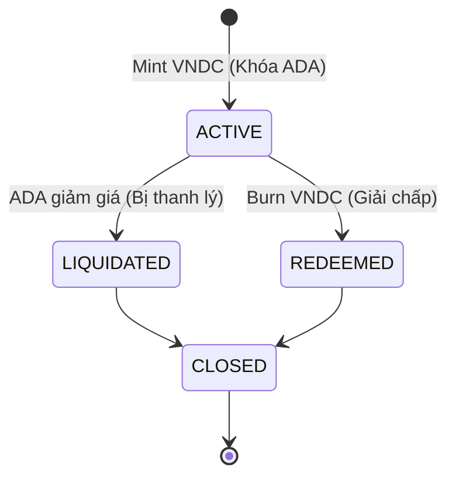

# Kiến trúc Tổng quát Hệ thống (System Architecture)

Tài liệu này cung cấp cái nhìn tổng quan về kiến trúc của hệ thống Cardano Stablecoin (VNDC).

## 1. Sơ đồ Kiến trúc Mức cao (High-Level Architecture)



## 2. Cấu trúc thư mục

Hệ thống được tổ chức thành monorepo bao gồm các thành phần chính sau:

```text
stablecoin/
├── onchain/                  # Hợp đồng thông minh (Aiken)
│   ├── validators/
│   │   └── stablecoin.ak     # Validator cốt lõi (Mint/Spend)
├── offchain/                 # SDK TypeScript (MeshJS)
│   └── src/
│       ├── transactions-user.ts # Logic giao dịch Mint/Burn
│       ├── queries.ts           # Truy vấn Collateral UTxO
│       └── config.ts            # Cấu hình Policy ID, tham số mạng
├── frontend/                 # Giao diện Web3 (Next.js)
```

## 3. Các thành phần chính

| Package | Công nghệ | Trách nhiệm |
|---|---|---|
| `onchain/` | Aiken (Plutus V3) | Thực thi luật thế chấp (150%), thu phí dev, xác thực tỉ giá Oracle. |
| `offchain/` | TypeScript, MeshJS | Xây dựng giao dịch, xử lý Reference Inputs từ Oracle, tính toán phí. |
| `frontend/` | Next.js, Tailwind CSS | Giao diện quản lý các vị thế thế chấp, theo dõi tỉ giá và trạng thái giao dịch. |

## 4. Quy trình Giao dịch Đặc thù

### 4.1 Giao dịch Mint (Mở vị thế thế chấp)
Giao dịch này thực hiện các hành động sau:
1.  **Mint VNDC**: Đúc token VNDC gửi về ví người dùng.
2.  **Lock ADA**: Chuyển số ADA thế chấp vào địa chỉ Script để làm tài sản bảo đảm.
3.  **Reference Input**: Đọc dữ liệu từ Oracle UTxO để làm bằng chứng về tỉ giá tại thời điểm đúc.

*Giao dịch Mint không thu phí dev để khuyến khích người dùng mở vị thế.*

### 4.2 Giao dịch Burn (Giải chấp)
1.  **Burn VNDC**: Người dùng gửi VNDC vào giao dịch để đốt bỏ.
2.  **Unlock ADA**: Validator cho phép rút ADA từ Script về ví người dùng.
3.  **Dev Fee**: Hệ thống thu phí 0.1% trên số ADA được rút ra.

### 4.3 Giao dịch Liquidate (Thanh lý)
Khi giá ADA giảm mạnh khiến tỉ lệ thế chấp thấp hơn mức an toàn (150%), bất kỳ ai cũng có quyền thanh lý vị thế đó:
1.  **Burn VNDC**: Người thanh lý (Liquidator) dùng VNDC của mình để trả nợ cho vị thế bị thanh lý.
2.  **Unlock ADA**: Toàn bộ ADA collateral được giải phóng khỏi script.
3.  **Dev Fee**: Thu phí 0.1% lovelace tương tự giao dịch Burn.
4.  **Refund Owner**: Nếu giá trị ADA thanh lý vẫn còn dư một phần nhỏ (sau khi đã khấu trừ nợ và phí), phần dư này sẽ được gửi trả lại cho chủ vị thế cũ.
5.  **Liquidator Reward**: Người thanh lý nhận được phần lớn số ADA còn lại như một phần thưởng cho việc giúp hệ thống duy trì tính ổn định.

### 4.4 Tối ưu chi phí với Reference Script
Để giảm thiểu tối đa chi phí giao dịch, hợp đồng thông minh được triển khai on-chain dưới dạng **Reference Script**.
- Các giao dịch Mint và Burn không cần phải đính kèm toàn bộ mã nguồn (bytecode) của hợp đồng vào thân giao dịch.
- Thay vào đó, giao dịch chỉ cần trỏ tới UTxO chứa Reference Script thông qua `.mintTxInReference()`, giúp giảm đáng kể kích thước giao dịch (tx size) và phí thực thi (execution fee).

## 5. Vòng Đời Của Một Vị Thế Thế Chấp (Lifecycle)

Quy trình quản lý một vị thế thế chấp tuân theo một vòng đời khép kín:



- **`ACTIVE`**: Vị thế được mở khi người dùng gửi ADA vào hợp đồng để đúc VNDC. Tài sản thế chấp bị khóa tại địa chỉ script.
- **`REDEEMED`**: Người dùng hoàn trả (đốt) số VNDC đã đúc để rút lại ADA thế chấp, kết thúc vị thế một cách chủ động.
- **`LIQUIDATED`**: Vị thế bị ép buộc đóng bởi bên thứ ba khi tài sản thế chấp không còn đủ an toàn, đảm bảo tính thanh khoản cho hệ thống.

## 6. Testing

Dự án sử dụng **`OfflineEvaluator`** kết hợp với **`OfflineFetcher`** trong bộ test off-chain.
- **Xác thực logic Local**: Toàn bộ script Aiken được thực thi trên môi trường máy ảo Plutus tại local trước khi gửi.
- **Protocol Parameters**: Sử dụng các tham số kỷ nguyên Conway (như `minFeeRefScriptCostPerByte`) để đảm bảo tính toán phí và budget chính xác.
- **Negative Testing**: Bộ test bao gồm các trường hợp cố tình vi phạm (thiếu collateral, sai tỉ giá) để đảm bảo Validator hoạt động đúng.

## 7. Vai trò của Oracle

Để phục vụ cho mục đích giảng dạy, hệ thống sử dụng Oracle giả lập, vận hành bằng tay. Tỷ giá ADA/VNDC được lưu trữ trong 1 reference UTxO trên blockchain, được quản lý bởi Oracle validator. 

### 7.1 Cách triển khai (Deploy)
Oracle được khởi tạo thông qua một tập lệnh (script) triển khai riêng biệt:
- Script này đúc ra một **Oracle Auth Token** (NFT) để định danh duy nhất cho Oracle.
- Đồng thời, script tạo ra một UTxO khóa Auth Token đó lại, kèm theo **Datum** chứa thông tin tỉ giá ADA/VNDC hiện tại. Việc cập nhật tỉ giá bản chất là việc tiêu thụ UTxO này và tạo ra UTxO mới với Datum mới.

### 7.2 Tích hợp vào Giao dịch
- Off-chain có nhiệm vụ tìm UTxO mang Oracle Auth Token này và đưa vào giao dịch dưới dạng **Reference Input**. 
- On-chain sẽ đọc dữ liệu từ UTxO đó để tính toán số lượng VNDC tối đa được phép đúc. Mọi giao dịch cố tình dùng UTxO giả mạo (không có Auth Token) đều sẽ bị từ chối.
