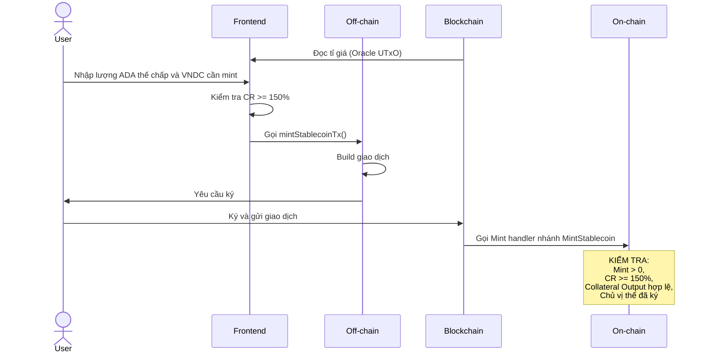
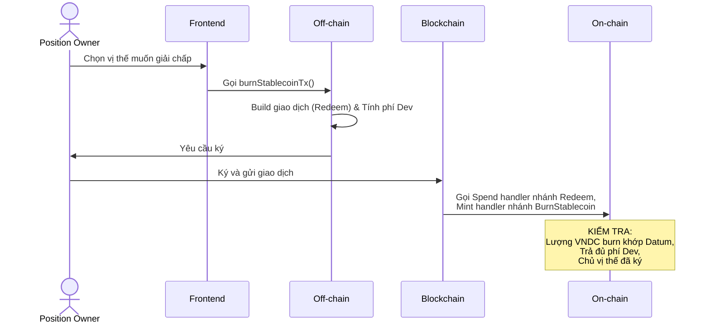
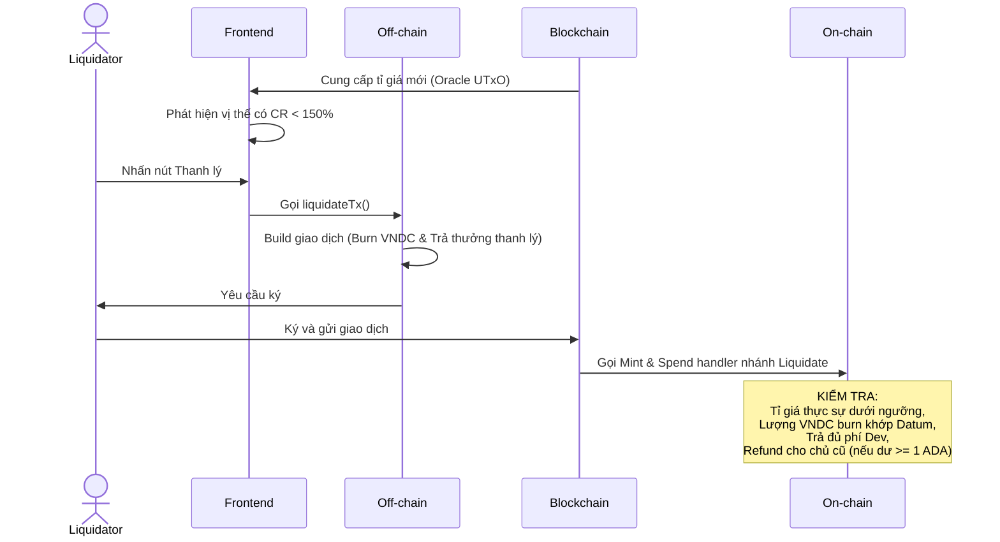
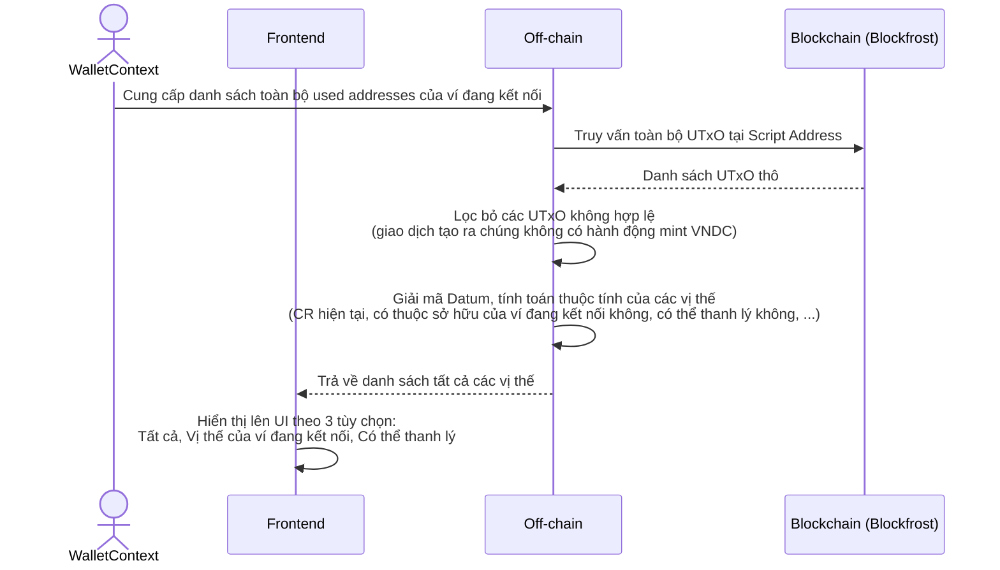
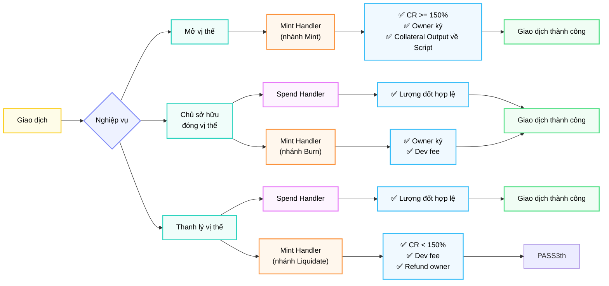

# Kiến trúc Smart Contract

Tài liệu này phân tích chi tiết logic của hệ thống Stablecoin VNDC, tập trung vào mô hình thế chấp và cơ chế xác thực tỉ giá.

---

## 1. Mẫu thiết kế: Multi-Purpose Validator

Dự án sử dụng một validator duy nhất (`stablecoin.ak`) cho hai mục đích:

1.  **Minting VNDC**: Kiểm soát việc đúc và đốt token stablecoin.
2.  **Collateral Management**: Kiểm soát việc khóa và giải phóng ADA tài sản thế chấp.

Vì cả hai hành động cùng nằm trong một validator, chúng chia sẻ cùng một `Script Hash` (cũng chính là `Policy ID` của VNDC). Điều này tạo ra khả năng tham chiếu chéo giữa 2 action:
- **Mint action** kiểm tra xem có đúng 1 Output gửi ADA về địa chỉ script không.
- **Spend action** kiểm tra xem có đúng lượng VNDC tương ứng đang bị đốt (burn) trong giao dịch hay không.

## 2. Cơ chế Thế chấp (Collateral Logic)

### 2.1 Tỉ lệ thế chấp tối thiểu (MCR)
Hệ thống áp dụng tỉ lệ **150%**. 
Công thức tính số VNDC tối đa có thể mint:
`max_vndc = (ada_amount * oracle_rate) / 1.5`

### 2.2 Phí phát triển (Dev Fee)
Để duy trì hệ thống, phí phát triển (0.1% giá trị thế chấp) được thu khi người dùng đóng vị thế hoặc khi vị thế bị thanh lý.
- **Giao dịch Mint**: Không thu phí dev để khuyến khích người dùng tham gia.
- **Giao dịch Burn & Liquidate**: Phí được tính theo công thức:
  `dev_fee = math.max(1_000_000, collateral_lovelace / 1000)`

*Lưu ý:* Phí tối thiểu là 1 ADA (min_utxo_lovelace) để đảm bảo đầu ra phí dev luôn hợp lệ trên blockchain.

### 2.3 Cơ chế Hoàn trả (Owner Refund)
Trong trường hợp thanh lý (Liquidate), hệ thống ưu tiên tính minh bạch và công bằng:
- Nếu toàn bộ ADA collateral được chuyển hết cho người thanh lý (Liquidator) thì sẽ gây thiệt hại nặng cho chủ vị thế.
- **Cơ chế**: Sau khi thanh lý nợ (stablecoin value), trả thưởng cho liquidator (tối đa 2% tổng tài sản thế chấp) và trừ phí dev; nếu số ADA còn dư lớn hơn 1 ADA, hệ thống **bắt buộc** phải hoàn trả số dư này về cho chủ vị thế cũ (`owner`).
- Nếu số dư quá nhỏ (< 1 ADA), người thanh lý sẽ nhận luôn phần này để bù đắp chi phí giao dịch.

## 3. Cấu trúc Dữ liệu On-chain

### 3.1 OracleDatum
Dữ liệu từ Oracle cung cấp tỉ giá ADA/VNDC.
```rust
pub type OracleDatum {
  rate: Int, 
}
```

### 3.2 CollateralDatum
Lưu trữ thông tin vị thế tại địa chỉ script.
```rust
pub type CollateralDatum {
  /// Địa chỉ chủ vị thế (dùng để xác minh chữ ký khi Redeem).
  owner: Address,
  /// Số lượng stablecoin đã mint tương ứng với vị thế này.
  stablecoin_amount: Int,
}
```

---

## 4. Tương tác On-chain & Off-chain theo từng giao dịch

### 4.1 Đúc Stablecoin (MINT)



### 4.2 Giải chấp (BURN)



### 4.3 Thanh lý (LIQUIDATE)



### 4.4 Truy vấn vị thế (QUERY POSITIONS)

Luồng này không tạo giao dịch, chỉ thực hiện đọc và lọc dữ liệu từ Blockchain.



---

## 5. Các quyết định thiết kế quan trọng

### 5.1 Hỗ trợ ví Multi-address
Các loại ví HD (Hierarchical Deterministic) hoạt động ở chế độ multi-address có thể tạo ra nhiều địa chỉ con khác nhau, khiến cho địa chỉ ví có thể thay đổi sau mỗi lần tương tác với hệ thống. Mỗi khi kết nối ví, hệ thống sẽ quét toàn bộ danh sách địa chỉ đã được sử dụng (`getUsedAddresses`) thay vì chỉ sử dụng địa `changeAddress` trong ví. Sau đó danh sách này sẽ được sử dụng để lọc ra các vị thế thuộc sở hữu của ví đang kết nối.

### 5.2 Sử dụng Reference Scripts
Reference Scripts được sử dụng để giảm kích thước giao dịch.

### 5.3 Chống Fake Collateral UTxO
**Vấn đề:** Trên Cardano, bất kỳ ai cũng có thể gửi ADA kèm Datum giả mạo đến một địa chỉ Script mà không cần thông qua Validator. 

Ví dụ: Kẻ xấu gửi 5 ADA vào địa chỉ hợp đồng nhưng đính kèm Datum khai báo nợ tới 1.000.000 VNDC. Hành động này hoàn toàn không mang lại lợi ích kinh tế (kẻ tấn công mất trắng 5 ADA vì Spend handler sẽ chặn giao dịch rút nếu không trả đủ 1.000.000 VNDC thật). 

Mục tiêu khả dĩ nhất của kiểu tấn công này là "spam" để làm chậm quá trình quét (query) vị thế của hệ thống Off-chain, mặc dù việc rải rác spam như vậy cũng khá tốn kém phí mạng lưới cho kẻ tấn công.

**Giải pháp hiện tại:** 
Hệ thống xử lý vấn đề rác này ở lớp Off-chain. 

Đặc điểm của thiết kế hiện tại là hành động mint phải diễn ra đồng thời với hành động gửi tài sản thế chấp khi mở vị thế. Do đó, bất kỳ Collateral UTxO nào hợp lệ cũng phải được sinh ra trong cùng giao dịch với hành động mint VNDC. Vì vậy, sau khi lấy toàn bộ UTxO tại địa chỉ script, Off-chain sẽ lọc các UTxO bằng cách truy ngược lại giao dịch tạo ra chúng. Nếu giao dịch đó không hề đúc token VNDC, hệ thống sẽ kết luận đó là UTxO rác và loại bỏ ngay lập tức khỏi giao diện người dùng.

**Đề xuất giải pháp khác (Position Token):** 
Việc truy ngược lịch sử giao dịch Off-chain giải quyết được vấn đề nhưng đòi hỏi nhiều truy vấn API, đặc biệt khi phát triển dApp lên cho phép giải chấp từng phần tài sản thế chấp. Một giải pháp an toàn và tối ưu hiệu suất hơn là sử dụng **Position Token**. 

Trong mô hình này, Stablecoin Validator sẽ được thiết kế để đúc thêm 1 token định danh (Position Token) và đảm bảo nó được gửi kèm vào Collateral UTxO mỗi khi mở vị thế. Nhờ vậy, khâu truy vấn Off-chain trở nên cực kỳ đơn giản: chỉ những UTxO nào đang nắm giữ Position Token mới là vị thế hợp lệ.

---

## 6. Phân tích chi tiết Stablecoin Validator

### 6.1 Tổng quan hai Handler

Khi một giao dịch vừa **tiêu thụ** Collateral UTxO (kích hoạt Spend Handler) lại vừa **đốt** token VNDC (kích hoạt Mint Handler), mạng lưới Cardano sẽ gọi **cả hai handler song song và độc lập**. Giao dịch chỉ được chấp nhận khi **cả hai** đều trả về `True`.

```
                                   ┌─────────────────────────────┐
  TX chi tiêu từ Script Address →  │  Stablecoin Validator       │
                                   │  ├─ Spend Handler (UTxO)    │ ← Kiểm tra lượng đốt Token
                                   │  └─ Mint Handler  (Token)   │ ← Kiểm tra nghiệp vụ  
                                   │       ↓ cả hai phải Pass    │
                                   └─────────────────────────────┘
```

### 6.2 Spend Handler – "Người gác cổng tài sản"

**Chức năng duy nhất**: Mọi giao dịch muốn lấy ADA ra khỏi Script (tiêu thụ Collateral UTxO) đều phải chứng minh rằng một lượng VNDC bằng đúng `stablecoin_amount` trong Datum đang bị đốt trong cùng giao dịch đó.

```
stablecoin_burn_qty == -stablecoin_amount
```

**Nó không quan tâm đến:**
- Ai là người gửi giao dịch
- Đây là Burn hay Liquidate
- Tỷ giá Oracle hiện tại là bao nhiêu

**Spend Handler dường như đang thực hiện logic kiểm tra của Mint Handler?** Đây là cốt lõi của mô hình **Multi-purpose Validator**. Bằng cách đọc trường `mint` của giao dịch, Spend Handler xác định được liệu có token *VNDC* đang được đốt trong giao dịch hay không. Nếu có, điều đó đồng nghĩa với việc Mint Handler của cùng script **phải được kích hoạt và thông qua** trong giao dịch này. Nhờ vậy, Spend Handler có thể **ủy quyền** toàn bộ logic nghiệp vụ còn lại (xác thực danh tính, kiểm tra tỷ giá, phân phối phí) cho Mint Handler đảm nhiệm, giữ cho chính nó ở mức tối giản.

### 6.3 Mint Handler – "Người phân loại nghiệp vụ"

Mint Handler có 3 nhánh, mỗi nhánh chịu trách nhiệm một loại nghiệp vụ:

#### Nhánh `Mint` - Đúc Stablecoin, mở vị thế thế chấp
| Kiểm tra | Mô tả |
|----------|-------|
| `mint_quantity > 0` | Phải đúc (dương), không được burn |
| `stablecoin_amount == mint_quantity` | Số VNDC trong Datum phải khớp với lượng đúc thực tế |
| `max_mint_amount(...) >= stablecoin_amount` | CR tại thời điểm mint phải >= 150% |
| `key_signed(owner)` | Chủ vị thế phải ký (địa chỉ ví được lưu trong Datum) |
| Output về Script | Đúng 1 Output kèm InlineDatum hợp lệ |

*Tham chiếu đến Spend Handler*: Giao dịch Mint **không** kích hoạt Spend Handler (không tiêu thụ UTxO script nào), chỉ Mint Handler hoạt động một mình.

#### Nhánh `Burn` - Đốt Stablecoin, đóng vị thế bởi chủ sở hữu
| Kiểm tra | Mô tả |
|----------|-------|
| `mint_quantity < 0` | Phải đốt (âm) |
| Có đúng 1 script input | Chống Double Satisfaction <br/> Đảm bảo Spend handler được kích hoạt trong cùng giao dịch |
| `key_signed(owner)` | Chỉ chủ vị thế mới được giải chấp |
| `dev_paid` | Phí dev phải được chuyển đến `dev_address` |

*Phối hợp với Spend Handler*: Logic của nhánh `Burn` không cần kiểm tra số lượng VNDC được đốt nữa vì Spend Handler đã thay nó kiểm tra rồi.

#### Nhánh `Liquidate` - Thanh lý vị thế bởi bất kỳ ai
| Kiểm tra | Mô tả |
|----------|-------|
| `mint_quantity < 0` | Phải đốt (âm) |
| Có đúng 1 script input | Chống Double Satisfaction <br/> Đảm bảo Spend handler được kích hoạt trong cùng giao dịch |
| `is_liquidatable` | CR phải < 150% theo tỷ giá Oracle hiện tại |
| `dev_paid` | Phí dev phải được trả |
| `owner_refunded` | Nếu dư >= 1 ADA, phải hoàn trả về Owner |
| `collateral >= liquidator_receives` | ADA trong collateral đủ để trả thưởng |

*Phối hợp với Spend Handler*: Logic của nhánh `Liquidate` không cần kiểm tra số lượng VNDC được đốt nữa vì Spend Handler đã thay nó kiểm tra rồi.

`Liquidate` **không yêu cầu chữ ký** vì bất kỳ ai cũng có thể là liquidator.

### 6.4 Sơ đồ phân công trách nhiệm



---

## 7. Một số lưu ý

### 7.1 Owner có thể đóng vị thế của mình bằng nhánh `Liquidate` nếu CR < 150%

**Mô tả:** Chủ vị thế (owner) không bắt buộc phải dùng nhánh `Burn` để đóng vị thế. Họ có thể tự gọi nhánh `Liquidate` trên chính vị thế của mình.

**Phân tích điều kiện:**
- Khi vị thế **an toàn (CR >= 150%)**: Nhánh `Liquidate` kiểm tra `is_liquidatable` sẽ `False` → **Giao dịch bị từ chối**. Không có vấn đề gì.
- Khi vị thế **dưới ngưỡng (CR < 150%)**: Owner *có thể* gọi `Liquidate` thành công và không cần cung cấp chữ ký.

**Hệ quả:** Owner tự thanh lý chính mình không mang lại lợi ích hay thiệt hại kinh tế so với hành động `Burn`. Tổng lượng ADA nhận về sau khi trừ phí Dev là như nhau (phần thưởng liquidator thực chất quay lại ví của chính họ). Tuy nhiên, hành động `Burn` vẫn là lựa chọn tối ưu về mặt thao tác vì không cần phân bổ ADA thành nhiều Output phức tạp.

> [!NOTE]
> **Đánh giá rủi ro: THẤP.** Điều này không ảnh hưởng đến bảo mật và mô hình kinh tế của giao thức. Nếu muốn bắt buộc owner dùng nhánh `Burn`, có thể thêm kiểm tra `!key_signed(owner)` vào nhánh `Liquidate`. Tuy nhiên trong thiết kế hiện tại, điều này là không quá cần thiết.

---

### 7.2 Chỉ xử lý 1 Collateral UTxO trong nhánh `Burn` và `Liquidate`

**Mô tả:** Nhánh `Burn` và `Liquidate` của Mint Handler giới hạn chỉ xử lý đúng 1 input từ script trong 1 giao dịch. Nếu muốn chạy theo batch (xử lý nhiều vị thế trong cùng lúc), giao dịch sẽ `fail`.

**Phân tích:** Đây là giới hạn thiết kế hiện tại. Nếu muốn chạy theo batch, cần refactor lại logic của các nhánh này.

> [!NOTE]
> Điều này gây giới hạn hiệu suất (1 vị thế/giao dịch), nhưng đảm bảo an toàn cho người dùng và hệ thống.

